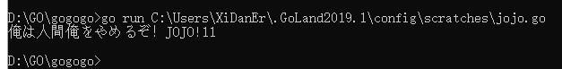
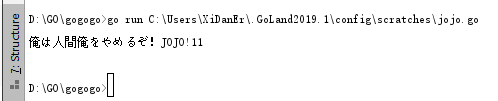

# go入门

## 1.1输出一个值

```go
package main  

import "fmt"    \\系统自带的主包可以运行简单的程序
func main() {
	jojo.println("俺は人間俺をやめるぞ！JOJO!")

}
```


Go语言提供的工具都通过一个单独的命令go调用.go命令有一系列子命令。最简单的一个子命令就是run。

>main包比较特殊。它定义了一个独立可执行的程序，而不是一个库。在main里的main 函数 也很特殊，它是整个程序执行时的入口


>进入cmd中 把需要go的文件路径给复制一下<br>

在cmd中输入:






        go build helloworld.go


这个命令生成一个名为helloworld的可执行的二进制文件（译注：Windows系统下生成的可执行文件是
helloworld.exe，增加了.exe后缀名），之后你可以随时运行它（译注：在Windows系统下在命令行直接输入helloworld.exe命令运行）


