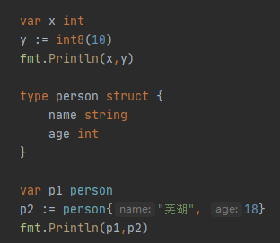
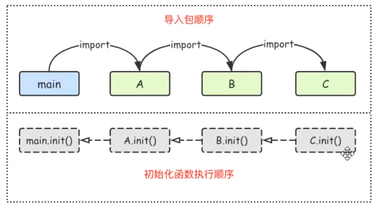
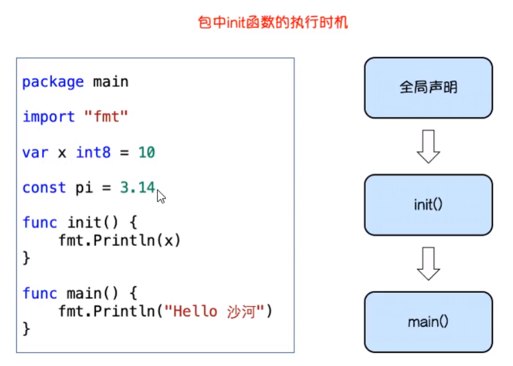

# GO 学习第二章


<p align="center">
    
</p>

<p align="center">👴 In rock we trust, it's rock or bust</p>
<p align="center"><a href="https://music.163.com/#/song?id=29499638&userid=262256866"><font>《Rock or Bust》</font></a> </p>
<p align="center">专辑：Rock or Bust</p>
<p align="center">歌手：AC/DC</p>

# 进阶学习

## 结构体
###  结构体的匿名字段和结构体嵌套

使用结构体的匿名字段 实例：

```go
package main

import "fmt"

// 结构体中的匿名字段必须唯一

type person struct {
	string
	int
}

func main() {
	p1 := person{
		"芜湖",
		20,
	}
	fmt.Println(p1)
	fmt.Println(p1.string)
}
```

适用场景
1. 结构体中的匿名字段必须唯一
2. 字段比较少也比较简单的场景

为了防止嵌套的冲突，将类型写全即可

### 构造体模拟实现继承

在 go 语言中没有继承这种方法，但是使用 结构体也可以实现其他编程语言中的面对对象的继承。

```go
package main

import (
	"fmt"
)

// 结构体模拟实现其他语言中的“继承”

type animal struct {
	name string
}

func (a animal)move()  {
	fmt.Printf("%s会动!",a.name)
}

// 狗类
type dog struct {
	feet uint8
	animal
}

func (d dog) wang()  {
	fmt.Printf("%s叫？是炫狗在叫？",d.name)
}

func main() {
	d1 := dog{
		animal:animal{name: "炫狗"},
		feet: 4,
	}
	fmt.Println(d1)
	d1.wang()
	d1.move()
}
```

### 结构体与 JSON

1. 序列号：  将go语言中的结构体变量  --> json格式的字符串
2. 反序列化：将json格式的字符串  --> go语言中能识别的结构体变量

```go
package main

import (
	"encoding/json"
	"fmt"
)

type person struct {
	Name string
	Age int
}

func main()  {
	p1 := person{
		Name: "芜湖",
		Age: 18,
	}
	b,err := json.Marshal(p1)
	if err != nil {
		fmt.Printf("error! %v",err)
		return
	}
	// json 序列化
	fmt.Printf("%#v\n",string(b))

	// 反序列化
	str := `{"Name":"芜湖","Age":18}`
	var p2 person
	json.Unmarshal([]byte(str),&p2) // 传指针为了在json.Unmarshal内部修改p2的值
	fmt.Printf("%#v\n",p2)
}
```

## 内容回顾

### 结构体

基本的数据结构类型：表示现实中的物件有局限性
编程是代码解决现实生活中的问题

```go
var name = "大司马"
```

结构体是一种数据类型，一种我们自己造的可以保存多个维度数据的类型。
示例：

```go
type person struct {
	name string
	age int
	id int64
	addr string
}
```

匿名结构体（没有名字的结构体）
多用于临时场景：

```go
var a = struct {
	x int
	y int
}{10,20}
```



### 结构实体化

**三种方法**

1. 第一种

> 先创建对象然后赋值

```go
var p1 person
p1.name = "芜湖"
p1.age = 18
```

2. 第二种

简化写法

```go
p2 := person{"大司马",18}
p3 := person{"销户",20}
```

3. 第三种

调用构造函数生成 person 类型变量

```go
p4 := newPerson("theshy",18)
```

## 结构体版本管理系统

包含文件函数

```go
	smr = studentMgr{
		allStudent: make(map[int64]student,100),
	}
```
此时main函数就包含了`student_mgr`中的值


**main文件**

```go
package main

import (
	"fmt"
	"os"
)

var (
	smr studentMgr //声明一个全局变量
)

func showMenu()  {
	fmt.Println("welcome")
	fmt.Println(`
	1.查看所有学生
	2.添加学生
	3.修改学生
	4.删除学生
	5.退出`)
}


func main()  {
	smr = studentMgr{
		allStudent: make(map[int64]student,100),
	}
	for  {
		showMenu()
		fmt.Print("请输入序号:")
		var choice int
		fmt.Scanln(&choice)
		fmt.Println("你输入的是:",choice)
		switch choice {
		case 1:
			smr.showStudents()
		case 2:
			smr.addStudent()
		case 3:
			smr.editStudent()
		case 4:
			smr.deleteStudent()
		case 5:
			os.Exit(1)
		default:
			fmt.Println("你选你🐎呢")
		}
	}
}
```

**student_Mgr**

```go
package main

import "fmt"

// 结构体的学生管理系统
// 一个物件：
// 1. 他保留了一些数据 --> 结构体的字段
// 2. t它有三个功能 --> 结构体的方法

type student struct {
	id int64
	name string
}

// 学生管理者
type studentMgr struct {
	allStudent map[int64]student

}


//查看学生
func (s studentMgr) showStudents(){
	// 从s.allstudent这个map中把所有学生逐个拎出来
	for _,stu := range s.allStudent {
		fmt.Printf("学号:%d 姓名:%s\n",stu.id,stu.name)

	}
}


//增加学生
func (s studentMgr) addStudent(){
	// 1.更具用户输入的内容创建一个新的学生
	// 2.把新的学生放到s.allstudent这个map中
	var(
		stuID int64
		stuName string
	)
	fmt.Print("请输入学号：")
	fmt.Scanln(&stuID)
	fmt.Print("请输入姓名：")
	fmt.Scanln(&stuName)
	// 获取用户输入
	newStu := student{
		id: stuID,
		name: stuName,
	}
	// 2. 将新的学生放到s.allstudent这个map中
	s.allStudent[newStu.id] = newStu
	fmt.Println("添加成功")
}
//修改学生
func (s studentMgr) editStudent(){
	// 1.获取学号
	var stuID int64
	fmt.Println("请输入学号：")
	fmt.Scanln(&stuID)
	// 2.展示改学号的学生信息，没有就查无此人
	stuObj,ok := s.allStudent[stuID]
	if !ok {
		fmt.Println("查无此人")
		return
	}
	fmt.Printf("你要修改的学生信息如下：学号：%d 姓名:%s\n",stuObj.id,stuObj.name)
	// 3.请输入修改后的学生名
	fmt.Print("请输入新名字:")
	var newName string
	fmt.Scanln(&newName)
	// 4.更新学生信息
	stuObj.name = newName
	s.allStudent[stuID] = stuObj
}

//删除学生
func (s studentMgr) deleteStudent(){
	// 1 请用户输入要删除的学生ID
	var stuID int64
	fmt.Print("请输入你要删除的学生学号:")
	fmt.Scanln(&stuID)
	// 2。去map找有没有这个学生，如果没有就打印查无此人
	_,ok := s.allStudent[stuID]
	if !ok {
		fmt.Println("查无此人")
		return
	}
	delete(s.allStudent,stuID)
	fmt.Println("删除成功！")
}
```

## 复习内容

**接口(interface)**

接口是一种特殊的类型，它规定了变量有哪些方法。

我们不用去关心一个变量是什么类型，我们只需要关系能通过什么方式去调用它

**接口的定义**

```go
type 接口名 interface{
	方法名1(参数1，参数2...)(返回值1，返回值2)
}
...
```
用来给变量\参数\返回值等设置类型

**接口的实现**


例如：

```go
package main

import (
	"fmt"
)

type speaker interface { // interface关键词
	//规定定义方法
	speak()
}
type cat struct {}
type dog struct {}
type person struct {}
func (c cat) speak() {
	fmt.Println("喵喵喵~")
}
func (d dog) speak() {
	fmt.Println("芜湖芜湖")
}
func (p person) speak() {
	fmt.Println("鞣儋珫畿")
}
func da(x speaker)  {
	 x.speak()
}
func main() {
	var c1 cat
	var d1 dog
	var p1 person

	da(c1)
	da(d1)
	da(p1)
}
```

给 struct函数接收一个 interface的类型变量。

**值接收者和指针接收者实现接口的区别**：

当使用值接收者实现接口和使用指针接收者实现接口有什么区别？
一个 `move` 接口和一个 `dog` 结构体
示例：
```go
type Mover interface {
	move()
}

type dog strust {
	dog()
}
```

### 接口和类别的关系

```go
package main

import "fmt"

type animal interface {
	move()
	eat(string)
}

type mover interface {
	move()
}

type eater interface {
	eat(string)
}

// 使用值接收者实现了接口的所有方法
type cat struct {
	name string
	feet int8
}

// 方法使用值接收者
func (c *cat) move() {
	fmt.Println("走猫步...")
}

func (c *cat) eat(food string)  {
	fmt.Printf("猫吃%s...",food)
}

func main() {
	var a1 animal
	c1 := cat{"tom",4}
	c2 := &cat{"伞兵一号",4}

	a1 = &c1 // 实现animal 这个接口的是cat的指针
	fmt.Println(a1)
	a1 = c2
	fmt.Println(a1)
}
```

### 空接口

**空接口的定义**

想要判断空接口中的值这个时候就可以使用类型断言，其语法格式是：

```
x.(T)
```

其中：
- x：表示为 interface{}的变量
- T：表示断言 x可能是的类型

该语法返回两个参数，第一个参数是 `x` 转化为`T`类型后的变量，第二个值是一个布尔值，若`true`则表示断言成功，为`false`则表示断言失败。

```go
package main

import "fmt"

// 空接口

// interface：关键字
// interface{}：空接口类型

// 新建一个空指针作为函数
func show(a interface{})  {
	fmt.Printf("type:%T value:%v\n",a,a)
}

func main() {
	var m1 map[string]interface{}
	m1 = make(map[string]interface{},16)
	m1["name"] = "芜湖"
	m1["age"] = 20
	m1["merried"] = true
	m1["hobby"] = [...]string{"芜湖","起飞","健身三年的减脂练习生"}
	fmt.Println(m1)

	show(false)
	show(nil)
	show(m1)
}
```


**使用接口判断数据类型**

示例：

```go
package main

import "fmt"

// 空接口

// interface：关键字
// interface{}：空接口类型

// 新建一个空指针作为函数
func assign(a interface{}){
	fmt.Printf("%T\n",a)
	str,ok:= a.(string)
	//fmt.Println(str)
	if !ok{
		fmt.Println("猜错了")
	}else {
		fmt.Println("传进来的是一个字符串：",str)
	}
}

func assign2(a interface{}){
	fmt.Printf("%T\n",a)
	switch t:= a.(type) {
	case string:
		fmt.Println("是一个字符串",t)
	case int:
		fmt.Println("是一个int",t)
	case int64:
		fmt.Println("是一个int64",t)
	case bool:
		fmt.Println("是一个bool",t)
	}
	//fmt.Println(str)
}

func main() {
	//assign(100)
	assign2(true)
	assign2("芜湖")
	assign2(int64(200))
}
```


### 包(package)

- `import`包含其他的包，包的路径从 `GOPATH/src` 后面的路径开始写起，路径分隔符用`/`
- 想被别的包调用的标识符都要首字符大写！
- 单行导入和多行导入
- 导入别名/匿名导入
- 导入包的时候可以指定别名
- 导入包的时候不想使用包内部的标识符，需要使用匿名导入
- 每个包导入时候会自动执行一个名为 `init()` 的函数，它没有参数也没有返回值也不能手动调用函数。
- 多个包中都定义了 `init()`函数，则它们的执行顺序见下图：

**导入包的顺序**

Go语言包会从 `main` 包开始检查其导入的所有包，每个包中又可能导入了其他的包。GO编译器由此构建出一个树状的包引用关系，再根据引用顺序决定编译顺序，依据编译这些包的代码。
在运行时，被最后导入的包会最先初始化并调用其 `init()` 函数



当导入一个包
示例：

```go
package main

import (
"fmt"
"github.com/calc" // 举例为从github文件夹中到导入calc包
)


// 包中的标识符(变量名,函数名，结构体，接口等)如果首字母是小写的，那么表示私有(只能在当前这个包中使用)
// 首字母包中大写的标识符可以被外部的包调用 例如：fmt中，Print的首字母一直是大写的
func add(x,y int) int {
	return x + y
}

func main() {
	ret := calc.Add(10,20) // 举例为文章导入的包
	fmt.Println(ret)
}
```

**自定义包名**

```go
import 别名 "包的路径"
```

单行导入方式定义别名：

```go
import "fmt"
import  m"github.com/calc" // 举例为从github文件夹中到导入calc包
```

多行导入方式定义别名：

```go
import ("fmt"
m"github.com/calc")
```

### 匿名导入包

如果只希望导入包，而不使用包内的数据时，可以使用匿名导入包，具体的格式如下：

```go
import _ "包的路径"
```
使用匿名函数导入的包与其他方式导入的包一样会被编译到可执行文件中。

### init()初始化函数

**init()函数介绍**


在 GO语言程序执行时导入包语句会自动触发包内部 `init()` 函数的调用。需要注意的是：`init()` 函数没有参数也没有返回值。 `init()` 函数在程序运行时自动被调用执行，不能在代码中主动调用它。




## 简单的web服务

Go语言的官方扩展包"`golang.org/x/sys/windows`"以及其子包对Windows服务提供了必要的支持。不过这个扩展包比较偏向底层使用比较繁琐，为了简化Windows服务的开发作者在此基础上封装了一个简化的"`github.com/chai2010/winsvc`"包。通过封装的winsvc包我们可以很容易构造一个windows服务。

因为Windows服务一般是在后台长时间运行的程序，为了便于演示我们先构造一个简单的现实当前服务器时间的http服务程序。

```go
package main
import (
	"context"
	"net"
	"net/http"
	"time"
)
var (
	server *http.Server
)
func main() {
	StartServer()
}
func StartServer() {
	log.Println("StartServer, port = 8080")
	http.HandleFunc("/", func(w http.ResponseWriter, r *http.Request) {
		fmt.Fprintln(w, "winsrv server", time.Now())
	})
	server = &http.Server{Addr: ":8080"}
	server.ListenAndServe()
}
func StopServer() {
	if server != nil {
		server.Shutdown(context.Background()) // Go 1.8+
	}
	log.Println("StopServer")
}
```

其中，`StartServer`和`StopServer`函数分别对应服务的启动和停止操作。在这个程序中，`StopServer`函数并没有用到，我们只需要通过`CTRL+C`强制停止服务就可以了。但是对于`Windows`服务程序，我们不能用暴力的方式强制终止程序，因此需要封装一个程序可以主动停止的函数。

---

## 文件操作

### 打开文件读取内容

**读取指定字符内容**

```go
package main

import (
	"fmt"
	"os"
)

func main() {
	// 打开文件
	fileObj,err := os.Open("./ip.txt")
	if err != nil{
		fmt.Println("打开文件失败：%v",err)
		return
	}
	// 关闭文件
	defer fileObj.Close()

	// 读取文件内容
	// var tmp = make([]byte,128) 指定读的长度
	var tmp [128]byte // 控制读取长度
	n,err := fileObj.Read(tmp[:])
	if err != nil{
		fmt.Println("读取文件失败：%v",err)
		return
	}
	fmt.Printf("读了%d个字节\n",n)
	fmt.Println(string(tmp[:n]))
}
```

**bufio读取文件**

bufio是在file的基础上封装了一层API，支持更多的功能

```go
package main

import (
	"bufio"
	"fmt"
	"io"
	"os"
)

func main() {
	// 打开文件
	fileObj,err := os.Open("./ip.txt")
	if err != nil{
		fmt.Println("打开文件失败：%v",err)
		return
	}
	// 关闭文件
	defer fileObj.Close()
	reader := bufio.NewReader(fileObj)
	for  {
		line,err := reader.ReadString('\n')
		if err == io.EOF{
			fmt.Println("文件读完了")
			break
		}
		if err != nil {
			fmt.Println("读取文件出错：",err)
			return
		}
		fmt.Print(line)
	}
}
```

循环读取文件直到文件结束


**此时将两种方法做对比**

```go
package main

import (
	"bufio"
	"fmt"
	"io"
	"os"
)

func readFromFile() {
	// 打开文件
	fileObj,err := os.Open("./ip.txt")
	if err != nil{
		fmt.Println("打开文件失败：%v",err)
		return
	}
	// 关闭文件
	defer fileObj.Close()

	// 读取文件内容
	// var tmp = make([]byte,128) 指定读的长度
	var tmp [128]byte // 控制读取长度
	for{
	n,err := fileObj.Read(tmp[:])
	if err != nil{
		fmt.Println("读取文件失败：%v",err)
		return
	}
	fmt.Printf("读了%d个字节\n",n)
	fmt.Println(string(tmp[:n]))
	if n < 128 {
		return
	}
}}

// 利用bufio读取整个文件内容
func ReadFromFileByBufio()  {
	// 打开文件
	fileObj,err := os.Open("./ip.txt")
	if err != nil{
		fmt.Println("打开文件失败：%v",err)
		return
	}
	// 关闭文件
	defer fileObj.Close()
	reader := bufio.NewReader(fileObj)
	for  {
		line,err := reader.ReadString('\n')
		if err == io.EOF{
			fmt.Println("文件读完了")
			break
		}
		if err != nil {
			fmt.Println("读取文件出错：",err)
			return
		}
		fmt.Print(line)
	}
}

func main() {
	//readFromFile()
	ReadFromFileByBufio()
}
```

---

## go简单的文件写入

对于
`os.OpenFile()` 函数能够以指定模式打开文件，从而实现文件写入相关功能

```go
func OpenFile(name string,flag int,perm FileMode) (*File,error) {

}
```

文件写入代码示例：

```go
package main

import (
	"bufio" //缓存IO
	"fmt"
	"io"
	"io/ioutil" //io 工具包
	"os"
)

func check(e error) {
	if e != nil {
		panic(e)
	}
}

/**
 * 判断文件是否存在  存在返回 true 不存在返回false
 */
func checkFileIsExist(filename string) bool {
	var exist = true
	if _, err := os.Stat(filename); os.IsNotExist(err) {
		exist = false
	}
	return exist
}

/**
  from: http://www.isharey.com/?p=143
*/

func main() {
	var wireteString = "测试n"
	var filename = "./output1.txt"
	var f *os.File
	var err1 error
	/***************************** 第一种方式: 使用 io.WriteString 写入文件 ***********************************************/
	if checkFileIsExist(filename) { //如果文件存在
		f, err1 = os.OpenFile(filename, os.O_APPEND, 0666) //打开文件
		fmt.Println("文件存在")
	} else {
		f, err1 = os.Create(filename) //创建文件
		fmt.Println("文件不存在")
	}
	check(err1)
	n, err1 := io.WriteString(f, wireteString) //写入文件(字符串)
	check(err1)
	fmt.Printf("写入 %d 个字节n", n)

	/*****************************  第二种方式: 使用 ioutil.WriteFile 写入文件 ***********************************************/
	var d1 = []byte(wireteString)
	err2 := ioutil.WriteFile("./output2.txt", d1, 0666) //写入文件(字节数组)
	check(err2)

	/*****************************  第三种方式:  使用 File(Write,WriteString) 写入文件 ***********************************************/
	f, err3 := os.Create("./output3.txt") //创建文件
	check(err3)
	defer f.Close()
	n2, err3 := f.Write(d1) //写入文件(字节数组)
	check(err3)
	fmt.Printf("写入 %d 个字节n", n2)
	n3, err3 := f.WriteString("writesn") //写入文件(字节数组)
	fmt.Printf("写入 %d 个字节n", n3)
	f.Sync()

	/***************************** 第四种方式:  使用 bufio.NewWriter 写入文件 ***********************************************/
	w := bufio.NewWriter(f) //创建新的 Writer 对象
	n4, err3 := w.WriteString("bufferedn")
	fmt.Printf("写入 %d 个字节n", n4)
	w.Flush()
	f.Close()
}
```

**使用bufio获取用户输入**

```go
package main

import (
	"bufio"
	"fmt"
	"os"
)

func useScan()  {
	var s string
	fmt.Print("请输入内容：")
	fmt.Scanln(&s)
	fmt.Printf("你输入的内容是：%s\n",s)
}

func useBufio()  {
	var s string
	reader := bufio.NewReader(os.Stdin)
	s,_ = reader.ReadString('\n')
	fmt.Printf("你输入的内容是：%s\n",s)
}


func main() {
	useScan()
	useBufio()
}
```


**在文件中插入内容**

```go
package main

import (
	"fmt"
	"os"
)

func f2()  {
	fileObj,err := os.OpenFile("./ip.txt",os.O_RDWR,0644)
	if err != nil{
		fmt.Printf("读取文件失败:%v\n",err)
		return
	}
	defer fileObj.Close()
	fileObj.Seek(1,0)
	var s []byte
	s = []byte{'c'}
	fileObj.Write(s)

	var ret [1]byte

	n,err := fileObj.Read(ret[:])
	if err != nil{
		fmt.Printf("读取文件失败:%v\n",err)
		return
	}
	fmt.Println(string(ret[:n]))
	var s []byte
	s = []byte{'c'}
	fileObj.Write(s)
}

func main() {
f2()
}
```

### Time 包


## Windows服务的运行环境

如果要提供Windows服务模式的支持, main需要做适当调整:

```go
var (
	appPath string
	flagServiceName = flag.String("service-name", "myserver", "Set service name")
	flagServiceDesc = flag.String("service-desc", "myserver service", "Set service description")
	flagServiceInstall   = flag.Bool("service-install", false, "Install service")
	flagServiceUninstall = flag.Bool("service-remove", false, "Remove service")
	flagServiceStart     = flag.Bool("service-start", false, "Start service")
	flagServiceStop      = flag.Bool("service-stop", false, "Stop service")
)
func init() {
	// change to current dir
	var err error
	if appPath, err = winsvc.GetAppPath(); err != nil {
		log.Fatal(err)
	}
	if err := os.Chdir(filepath.Dir(appPath)); err != nil {
		log.Fatal(err)
	}
}
func main() {
	flag.Parse()
	// install service
	if *flagServiceInstall {
		if err := winsvc.InstallService(appPath, *flagServiceName, *flagServiceDesc); err != nil {
			log.Fatalf("installService(%s, %s): %v\n", *flagServiceName, *flagServiceDesc, err)
		}
		fmt.Printf("Done\n")
		return
	}
	// remove service
	if *flagServiceUninstall {
		if err := winsvc.RemoveService(*flagServiceName); err != nil {
			log.Fatalln("removeService:", err)
		}
		fmt.Printf("Done\n")
		return
	}
	// start service
	if *flagServiceStart {
		if err := winsvc.StartService(*flagServiceName); err != nil {
			log.Fatalln("startService:", err)
		}
		fmt.Printf("Done\n")
		return
	}
	// stop service
	if *flagServiceStop {
		if err := winsvc.StopService(*flagServiceName); err != nil {
			log.Fatalln("stopService:", err)
		}
		fmt.Printf("Done\n")
		return
	}
	// run as service
	if !winsvc.InServiceMode() {
		log.Println("main:", "runService")
		if err := winsvc.RunAsService(*flagServiceName, StartServer, StopServer, false); err != nil {
			log.Fatalf("svc.Run: %v\n", err)
		}
		return
	}
	// run as normal
	StartServer()

```

假设程序构成的目标文件为`myserver.exe`，那么我们现在可以通过以下命令来分别注册服务、启动和停止服务、删除服务：


