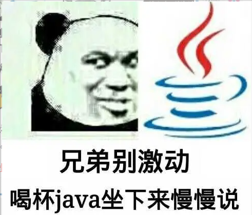
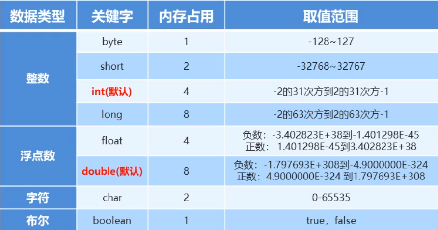
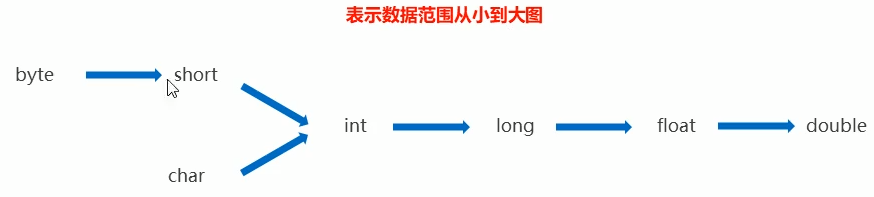
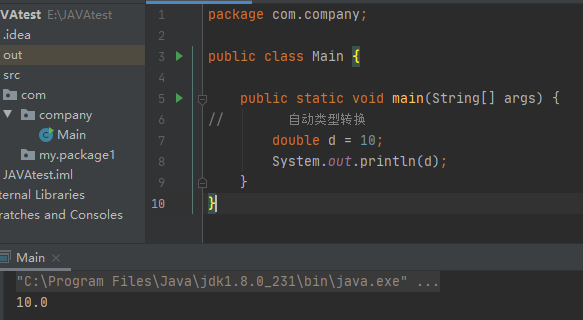
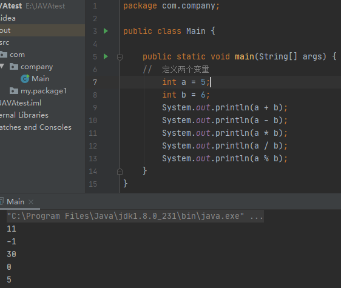
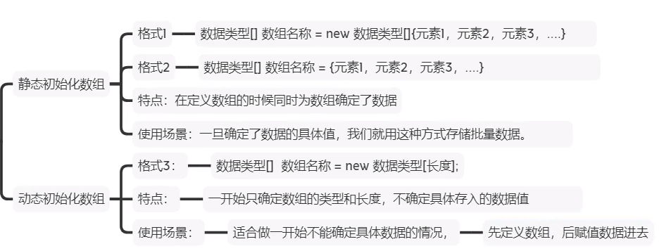

# JAVA

'''
java 学习笔记
'''



<p align="center">
    
</p>

<p align="center">👴 如果黑夜不再点亮,我会奔向你迷失的方向.</p>
<p align="center"><a href="http://music.163.com/song?id=1824450519"><font>《自发光》</font></a> </p>
<p align="center">专辑：自发光</p>
<p align="center">歌手：南游记乐队</p>

> 最近比较喜欢的一首歌...

IDEA 使用教程: https://www.cnblogs.com/zyx110/p/10666082.html

## 第一个程序

### 打印函数

```java
package com.company;

public class Main {

    public static void main(String[] args) {
	// write your code here
        System.out.println("hello world");
    }
}
```

## 常数

**常量**: 在程序运行过程中，其值不可以发生改变的量。

| **常量的分类**   | 表示含义                            |
| ---------------- | ----------------------------------- |
| **字符串常量：** | 用双引号括起来的内容，"Hello world" |
| **整数常量：**   | 不带小数的数字。'666-888'           |
| **小数常量：**   | 带小数的数字。 13.14，1.12          |
| **字符常量：**   | 用单引号括起来的内容。'A','0','我'  |
| **布尔常量：**   | 布尔值，表示真假。true，false       |
| **空常量：**     | 一个特殊的值，空值                  |

基本数据类型：

- 整形

  - byte:字节整形:内存中占 1 个字节
  - short:短整型:内存中占 2 个字节
  - int:整型:内存中占 4 个字节
  - long:长整型:内存中占 8 个字节

- 浮点型

  - float:单精度:4 个字节
  - double:双精度:8 个字节

- 字符型

  - char:内存中占 2 个字节

- 布尔型
  - boolean:内存中占 1 个字节

#### 常见字符串类型



#### 变量

**变量定义**

```java
数据类型    变量名  =   变量值
int         a      =    10;
```

**基本数据类型**

```
byte,short,int,long,float,double,char,boolean
```

**变量的使用**

取值格式：变量名
修改格式：变量名 = 变量值；

**自动类型转换**



把一个表述数据`范围小的数值`或者`变量`赋值给另外一个表示数据 `范围大的变量`

```java
package com.company;

public class Main {

    public static void main(String[] args) {
//        自动类型转换
        double d = 10;
        System.out.println(d);
    }
}
```



**定义 byte 类型的变量**

```java
    public static void main(String[] args) {
//        定义byte 类型的变量
        byte b = 10;
        short s = b;
        int i = b;
    }
```

数据类型不兼容时无法进行转换

**强制类型转换**

```java
package com.company;

public class Main {

    public static void main(String[] args) {
//            强制类型转换
        int k = (int)88.88;
        System.out.println(k);
    }
}
```

> 将浮点型数据类型转换为 int 型

### 运算符和表达式

常见的 `加减乘除取余`



```java
package com.company;

public class Main {

    public static void main(String[] args) {
    //  定义两个变量
        int a = 5;
        int b = 6;
        System.out.println(a + b);
        System.out.println(a - b);
        System.out.println(a * b);
        System.out.println(a / b);
        System.out.println(a % b);
    }
}
```

`严格的数据类型校验` 当整数相除时只能得到整数，如果想要得到小数，此时必须有浮点型的参与。

#### 字符串的 + 操作

```java
package com.company;

public class Main {

    public static void main(String[] args) {
    //  定义两个变量
        int i = 10;
        int b = 99;
        // 字符串使用 + 号时就是直接拼接
        System.out.println("芜湖"+"起飞");

        // 当字符串 + 整数时，如果字符串在前则直接拼接在后方
        System.out.println("芜湖塔台"+ i);

        // 当有字符串在前，后面就算整数之间使用+号也是 字符串拼接
        System.out.println("芜湖塔台"+ b + i);

        // 当先是显示整数时，就先做运算后做字符串拼接
        System.out.println(i + b + "年后EDG夺冠");
    }
}
```

> 输出结果

```
芜湖起飞
芜湖塔台10
芜湖塔台9910
109年后EDG夺冠
```

**结论**

当 + 操作中出现字符串时，这个 "+" 是字符串连接符，而不是算术运算符。

```java
System.out.println("芜湖塔台"+ b + i);
```

在 + 操作中，如果出现了字符串，就是连接运算符，否则就是算术运算符。当连续进行 + 操作时，从左到右逐个进行。

```java
System.out.println(i + b + "年后EDG夺冠");
```

#### 赋值运算符

| 符号 | 作用       | 说明                     |
| ---- | ---------- | ------------------------ |
| =    | 赋值       | a=10,将 10 赋值给变量 a  |
| +=   | 加后赋值   | a+=b,将 a+ b 的值给 a    |
| -=   | 减后赋值   | a-=b,将 a-b 的值给 a     |
| `*=` | 乘后赋值   | a`*=`b,将 a x b 的值给 a |
| /=   | 除后赋值   | a/=b,将 a+ b 的商给 a    |
| %=   | 取余后赋值 | a%=b,将 a+ b 的余数给 a  |

#### 自增自减运算符

| 符号 | 作用 | 说明         |
| ---- | ---- | ------------ |
| ++   | 自增 | 变量的值加 1 |
| --   | 自减 | 变量的值减 1 |

**注意事项:**

- `++`和`--`既可以放在变量的后边，也可以放在变量的前边。
- 单独使用的时候， `++`和`--`无论是放在变量的前边还是后边，结果是一样的。
- 参与操作的时候， 如果放在变量的后边，先镎变量参与操作,后拿变量做`++`或者`--`。
- 参与操作的时候，如果放在变量的前边,先拿量做`++`或者`--`,后拿变量参与操作。

#### 逻辑运算符

| 符号 | 介绍     | 说明                                                                        |
| ---- | -------- | --------------------------------------------------------------------------- | ------------------------------- | ------------ | ----------------------------------------- |
| &    | 逻辑与   | 必须都是 true，结果才是 true；只要有一个是 false 那么结果一点是 false       |
| `    | `        | 逻辑或                                                                      | 只要有一个为 true 结果就是 true |
| !    | 逻辑非   | 逻辑反，理解为你真我假，你假我真。                                          |
| ^    | 逻辑异或 | 如果个条件都是 false 或者都是 true 则为 false 如果两个条件不同结果就是 true |
| &&   | 短路与   | 判断结果与`&`一样 `过程是左边为 false ，右边不执行。`                       |
| `    |          | `                                                                           | 短路或                          | 判断结果与 ` | ` 一样。`过程是左边为 true，右边不执行。` |

**三元运算符**

执行流程：首先计算`关系表达式的值`，如果值为`true`，返回`值为1`，如果为`false`，返回`值2`

```java
package com.test.type;

public class TypeDem{
    public static void main(String[] args) {
        double score = 15;
        String rs = score >= 60 ? "通过":"挂科";
        System.out.println(rs);

        // 需要从2个整数中找出较大值
        int a = 129319;
        int b = 123112;
        int max = a > b ? a:b;
        System.out.println(max);

    }
}
```

#### 示例：键盘录入技术 API

**键盘录入功能实现的三个步骤**:

- 导包: 告诉程序去 JDK 的哪个包中寻找扫描器的技术

- 对象: 写一行代码代表得到键盘扫描器对象

- 交互: 等待接收用户输入数据

首先右键导入数据包，输入包名后写入

```java
package com.test.type.scanner;
import java.util.Scanner;

// 1. 导包操作(并不需要自己写的，以后通过工具进行导入更方便)

public class ScannerDemo{
    public static void main(String[] args) {
        //目标：学会使用键盘输入技术
        //2.得到一个键盘输入对象

        Scanner sc = new Scanner(System.in);

        // 将输入的数据拿到并进行处理
        // 等待用户输入的数据，直到用户输入完数据并嗯回车之后就回将数据拿到

        System.out.println("请输入年龄: ");
        int age = sc.nextInt();
        System.out.println("年龄是: "+age);

        System.out.println("请输入名称:");
        String name = sc.next();
        System.out.println("欢迎:"+name);
    }
}
```

### 总结

- 类型转换
  - 原因：开发中会存在不同类型的变量或者数据赋值给其他类型的变量，也存在不同类型的数据以前运算，结果类型要确定下来。
  - 自动类型转换
    - 原理:小范围类型的变量可以直接赋值给大范围类型的数据变量
    - 转换顺序:
      - byet-->short-->int-->long-->float-->double
      - 形式
        - `byte a = 20;`
        - `int b = a;`
      - 表达式的自动类型转换
        - 含义:在表达式中，小范围类型的变量会自动提升成大范围运算
        - 结论:表达式的最终结果数据类型是由表达式在红的最高数据类型决定,最高数据类型是什么，其结果数据的类型就是什么
        - 注意: `byte short char` 在表达式中，直接提升成 int 运算
        - 面试笔试题；`byte = 21;byte b2 = 22;byte b3 = b1+b2;(错误)`
      - 强制类型转换
        - 含义:对于大范围类型的数据变量不能直接赋值给小范围类型的变量，否则将会报错。必须进行强制类型转换才可以。
        - 格式:数据类型 变量=（数据类型）其他类型的变量/数据
        - 注意:强制类型转换可能出现数据丢失。
          - `int a = 1500;`
          - `byte b = (byte)a;`
        - 注意:浮点型类型的变量或者数据强制转换成整型，保留整数部分返回的，小数部分直接不要了
          - `double a =99.5`
          - `int i = (int)a; // i==99`
    - 键盘导入技术(接收用户输入)
      - java 自己提供的接口给程序员调用
      - API 文档:应用程序编程接口，技术说明书，告诉我们该怎么使用 java 的程序
      - 如何接收用户输入
        - 导包(自动导包):`import java.util.Scanner;`
        - 创建一个扫描器对象:`Scanner sc = new Scanner;`
        - 等待接收用户的数据:`int age = sc.nextlnt();`
        - 等待接收用户的数据:`String name = sc.next();`

---

## 程序默认流程控制

**IF**

最简单的判断

```java
// 是否及格
int i = 80;
if(i > 60 && i < 100){
  System.out.println("恭喜及格");
}
```

**IF...else**

格式:

```
if(条件表达式){代码...}else{代码...}
```

```java
    public static void main(String[] args) {
        int i =563;
        if(i >=1314){
            System.out.println("别说了 打钱吧你");
        }else{
            System.out.println("宁余额可不够了！");
        }
    }
```

**IF...else if**

格式:

```
if(条件表达式){代码...}else if{代码...}else if{代码...}else{代码...}
```

成绩判断系统

```java
public class IfDem{

    public static void main(String[] args) {
       int score = 99;
       if(score >0 && score < 60){
           System.out.println("您的成绩是:C");
       }else if (score >=60 && score < 80){
           System.out.println("您的成绩是:B");
       }else  if (score >=80 && score < 90){
           System.out.println("您的成绩是:A");
       }else if (score >=90 && score < 100){
           System.out.println("您的成绩是:A+");
       }
       else {
           System.out.println("您的成绩是不是有点大毛病");
       }
    }
}
```

#### switcg 分支结构，理解流程

**switch 注意事项**

1. 表达式类型`只能是 byte、short、int、char`,从 JDK5 开始支持枚举，JDK7 开始支持 String、**不支持:double、float、long！**
2. 不要忘记写 break，否则会出现穿透现象。

```java
public class IfDem{

    public static void main(String[] args) {
    int weekday = 1;
    switch (weekday){
        case 1:
            System.out.println("周一周一，你妈隔壁！");
            break;
        case 2:
            System.out.println("周二:群里摸鱼");
            break;
        case 3:
            System.out.println("周三:群里摸鱼");
            break;
        case 4:
            System.out.println("你看你垂头丧气哪个b养，今天是肯德基疯狂星期四");
            break;
        case 5:
            System.out.println("今天星期五呀明天星期六！");
            break;
        case 6:
            System.out.println("嘎嘎乱杀");
            break;
        case 7:
            System.out.println("郁郁寡欢，准备上班");
            break;
    }
    }
}
```

### 总结

- switch 和 if 之间的区别
  - if 其实在功能上远远大于 switch
    - 因为 if 不但可以做值匹配，还可以做区间匹配
    - switch 适用于匹配分支选择、代码美观易读

#### for 循环

案例 1

求 1-5 之间数据的和，并把求和结果输出在控制台。

```java
public class fordem{
    // 学会for循环并理解执行流程
    public static void main(String[] args) {
    // 需求 计算1-5的和
        int sum = 0;
        for (int i = 0; i <=5; i++) {
            // i 2 3 4 5
            // 将数据循环累加给sum变量
            sum += i;
        }
        System.out.println(sum);
    }
}
```

案例 2

求所有 1-10 之间奇数的和,通过 if 筛选出所有的奇数

方法 1：

```java
public class fordem{
    // 学会for循环并理解执行流程
    public static void main(String[] args) {
        int sum = 0;
        for (int i = 0; i <=10; i++) {
            if (i % 2 == 1){
                sum += i;
            }
        }
        System.out.println(sum);
    }
}
```

方法 2：

```java
public class fordem{
    // 学会for循环并理解执行流程
    public static void main(String[] args) {
        int sum = 0;
        for (int i = 1; i <=10; i+=2) {// 当for循环 +=2后就会直接变成奇数
            sum += i ;

            }
        System.out.println(sum);
    }
}
```

方法 3：

数 100-999 中的水仙花数

```java
    public static void main(String[] args) {
        int sum = 0;
        for (int i = 100; i <=999; i++) {
            int a = i % 10;
            int b = i /10%10;
            int c = i /100;
            if (a * a * a + b*b*b+c*c*c==i){
                System.out.print(i+"\t");
            }
            }
    }
```

#### while 循环格式与流程控制

语法:

```
初始化语句;
while(循环条件){
    循环体语句(被重复执行的代码);
    迭代语句;
}
```

示例：

```java
public class WhileDem{
    public static void main(String[] args) {
        // 目标：学会使用while循环，并理解流程
        int i = 0;
        while (i<3){
            System.out.println(i);
            i++;
        }
    }
}
```

什么时候使用 for 循环，什么时候使用 while 循环

- 在功能上是完全一样，for 循环能解决的 while 也能解决，反之亦然。
- 使用规范为:知道循环几次:`使用for循环`；不知道循环几次:`使用while循环`。

例如：假设世界最高山峰珠穆朗玛峰为 8848 米，如果我有一张足够大的纸，并且不考虑是否能够折叠。厚度为 0.1 毫米，此时需要折叠多少次才能折成珠穆朗玛峰的高度

> 对于此场景可以使用 while 实现。

```java
    public static void main(String[] args) {
        // 目标：学会使用while循环，并理解流程
        int count = 0;
        double peakheight = 88488860; // 山的高度
        double paperThickness = 0.1;  // 纸的厚度

        while (paperThickness<peakheight){
            paperThickness *=2;
            count++;
        }
        System.out.println(count);
    }
}
```

**do...while**

第一步先执行运算，后执行代码中示例。

```java
    public static void main(String[] args) {
        // 目标:学会使用dowhile循环，并理解其他执行流程
        int i = 0;
        do {
            System.out.println("hello world");
            i ++;
        }while (i < 1);
    }
```

#### 循环嵌套

使用 for 循环嵌套

```java
    public static void main(String[] args) {
        // 目标:理解嵌套循环的执行流程
        // 假设你立了个flag，EDG夺冠后倒立写代码
        for (int i = 0; i < 5; i++) {
            for (int j = 0; j < 3; j++) {
                System.out.println("EDG牛逼");
            }
            System.out.println(41+23+23+12+7+1);
        }
    }
```

**break\continue**

理解 break、continue 的区别

> break、continue 的嵌套循环

```java
    public static void main(String[] args) {
        // 目标:理解嵌套循环的执行流程
        // 假设你立了个flag，EDG夺冠后倒立写代码
        for (int i = 0; i < 4; i++) {
            System.out.println("疯狂星期4");
        if(i == 2){
            System.out.println("累了累了");
            System.out.println("---------------");
            break;// 跳出当前循环的执行

        }
        }
        // continue 跳出当前循环的执行，进入循环的下一次
        // 连续喊三次，第四次不用喊 但是继续喊
        for (int i = 0; i < 5; i++) {
            System.out.println("疯狂星期4");
            if(i == 3){
                System.out.println("累了累了");
                continue;// 只能在循环中执行，立即跳出当前循环，进入下次一循环
            }
            System.out.println("疯狂星期4");
        }
    }
```

**随机数示例**

java 官方库中存在随机数库，导入库

- Random 随机数步骤
  - 1. 导包
  - 2. 写一行代码表示得到随机数对象
  - 3. 调用随机数的功能获取 0-9 的随机数

注意：`nextlnt(n)`功能只能生成：0 至 n-1 之间的随机数，不包含 n。

```java
package com.test.type.scanner;
import java.util.Random;

public class Rando{
    public static void main(String[] args) {
        // 目标 学会使用java提供的random
        //  1. 导包
        //  2. 创建随机数对象
        Random r = new Random();

        //  3. 调用nextInt功能可以返回一个整型的随机数给你
        for (int i = 0; i < 5; i++) {
            int number = r.nextInt(10)+1; //0-9需要+1
            System.out.println("随机数是:"+number);
        }
        System.out.println("------------------");
        }
}
```

**猜数字游戏**

需求: 随机生成一个 1-100 之间的数据，提示用户猜测，猜测提示过大，提示过小。直到猜中结束游戏。

```java
    // 随机生产业一个1-100之间的数据
    // 使用死循环让用户不断提示用户猜测直到正确为止。
    public static void main(String[] args) {
        // 目标 学会使用java提供的random

        // 2. 创建随机数对象
        Random r = new Random();

        // 3. 调用一个死循环让用户不断猜测
        int data = r.nextInt(100) + 1;
        Scanner cs = new Scanner(System.in);
        while (true){
            System.out.println("请输入猜测的数据");
            int GuessData = cs.nextInt();

            // 3.判断猜测的数据与随机数的大小
            if(GuessData > data){
                System.out.println("猜的太大");
            }else if (GuessData < data){
                System.out.println("猜的太小");
            }else{
                System.out.println("666");
                break;
            }

        }
    }
```

### 总结

- 程序流程控制

  - 分支结构

    - if
    - switch
      - 作用:根据表达式的值来进行值匹配选择对应的分支执行
      - 区别:
        - 都是做分支操作的
        - if 的功能更加强大-适合做区间匹配。
        - 如果是值匹配的操作建议用 switch，格式清晰。
    - switch 注意事项
      - 表达式类型`只能是 byte、short、int、char`,从 JDK5 开始支持枚举，JDK7 开始支持 String、**不支持:double、float、long！**
      - 不要忘记写 break，否则会出现穿透现象。
    - switch 的穿透性
      - 当 swich 遇到 break 才会跳出判断
      - 适合做对多个值的 case 块的处理操作。可以穿透到一个位置集中处理，这样可以提高开发效率，降低代码重复。

  - 循环结构- 控制一段代码多次重复执行
    - for
    - while
    - do while
  - 区别
    - for 和 while 都是先判断再执行，do while 第一次是先执行然后再进行判断
    - 在功能上是完全一样，for 循环能解决的 while 也能解决，反之亦然。
    - 使用规范为:知道循环几次:`使用for循环`；不知道循环几次:`使用while循环`。

- 跳转 break、continue
- 案例:随机数 random 类

## 数组

理解为将一堆数据捆绑到一个整体，此时通过静态初始化数组对其进行访问。

```java
    // 目标:学习使用静态初始化的方式定义数组
    // 数据类型[] 数组名称 = new 数据类型[]{元素1,元素2,.....}

    public static void main(String[] args) {
        double[] scores = new double[]{99.5,88.0,131.2};// 常规写法

        int[] ages = {12,24,36,11}; // 简化写法

        String[] names = new String[]{"芜湖","起飞"};
    }
```

**获取数组中的值**

- 数据类型[] 数组名称 = new 数据类型[]{元素 1,元素 2,.....}
  - 获得数组的长度
  - 数组取值

```java
    // 目标:学习使用静态初始化的方式定义数组
    // 数据类型[] 数组名称 = new 数据类型[]{元素1,元素2,.....}

    public static void main(String[] args) {
        double[] scores = new double[]{99.5,88.0,131.2};// 常规写法

        // 提取数组中的数据
        System.out.println(scores[0]);
        System.out.println(scores[1]);
        System.out.println(scores[2]);

        // 取值：数组名称[索引] = 数据;
        scores[2]=100.0;
        System.out.println(scores[2]);

        // 访问数组长度
        System.out.println(scores.length);
    }
}
```

> 数组注意事项

```java
    public static void main(String[] args) {
        // 目标: 理解数组的注意事项
        // 1、数据类型[] 数组名称 也可以写成 数组类型 数组名称[]

        int[] ages = {11,22,33};

        // int ages1[] = {11,22,33};

        // 2、什么数据类型的数组只能存放什么类型的元素
        // string[] names = {"芜湖","起飞",11};

        // 3、数组一旦定义出来，类型和长度就固定了
        int[] ages2 = {11,22,33};
        System.out.println(ages2[2]);
    }
```

什么类型的数组存放什么类型的数据，否则就会报错。


**数组遍历、元素求和**

```java
    public static void main(String[] args) {
        // 目标: 学会进行数组元素的遍历
        int[] arr = {12,24,12,35,98};

        // 原始遍历方式
        System.out.println(arr[0]);

//        for (int i = 0; i < 5; i++) {
//            System.out.println(arr[i]);
//        }

        // 终极数组遍历的形态
        for (int i = 0; i < arr.length; i++) {
            System.out.println(arr[i]);
        }
    }
```

> 数组求最大值

```java
public class ArrayDemo1 {
    public static void main(String[] args) {
        // 目标: 数组元素求最大值
        // 1. 定义一个静态初始化变量，存储一批数组
        int[] ages = {11,22,33,44,55,66};

        int max = ages[0];

        for (int i = 0; i < ages.length; i++) {
            if(ages[i] > max){
                max = ages[i];
            }
        }
        System.out.println("数组的最大值为:" + max);

    }
}

// 数组的最大值为:66
```

**求最值、猜数字、随机排名、冒泡排序**

- 实现步骤
  - 动态初始化数组，存入5个随机的1-20之间的数据
  - 定义一个死循环，不断的猜数据，遍历数组，判断数据是否在数组中，如果在，则进行对应提示并结束死循环；如果没有猜中，提示继续。

```java
 public static void main(String[] args) {
        // 需求: 5个1-20之间的随机数，让用户猜，猜中要提示猜中，还要输出该数据在数组中第一次出现的索引，并打印出内容
        // 没有猜中则继续

        // 1. 定义一个动态初始化的数组存储5个随机1-20之间的数据
        int[] data = new int[5];
        // 2、动态的生成5个 1-20之间的随机数并存入到数组中去
        Random r = new Random();
        for (int i = 0; i < data.length; i++) {
            // i = 0，1，2，3，4，5
            data[i] = r.nextInt(20) + 1;
        }

        // 3. 使用一个死循环让用户进行猜测
        Scanner sc = new Scanner(System.in);
        OUT:
        while (true){
            System.out.println("请输入一个1-20之间的整数进行猜测: ");
            int guessData = sc.nextInt();

            // 4.遍历数组中的每个数据看看是否匹配。相同就表示猜中，给出提示
            for (int i = 0; i < data.length; i++) {
                if(data[i] == guessData){
                    System.out.println("您已经猜中了该数据，您猜中的数据索引" + i);
                    break OUT; // 结束死循环
                }
            }
            System.out.println("当前猜测的数据在数组中不存在，请重新猜测");
        }

        // 5. 输出数组的全部元素，让用户查看自己确实猜中了某个数据
        for (int i = 0; i < data.length; i++) {
            System.out.println(data[i]);
        }
    }
```

**随机排名**

先依次录入数据，然后展示出一组随机的排名顺序。

- 存储数据后进行随机录入-->使用数组。
- 依次遍历数组中的每个元素，随机一个索引数据，让当前元素与该索引位置处的元素进行交换.

```java
    public static void main(String[] args) {
       // 键盘录入工号，最后随机输出一组出来作为排名
        // 1、动态初始化一个数组，存储5个工号
        int[] codes = new int[5];

        // 2、定义一个循环，循环5次，依次录入一个工号存入对应的位置
        Scanner sc = new Scanner(System.in);
        for (int i = 0; i < codes.length; i++) {
            // 正式录入工号
            System.out.println("请您输入第" + ( i + 1 ) + "个员工工号");
            int code = sc.nextInt();

            // 存入到数组中去
            codes[i] = code;
        }
        // 3、遍历数组中的每个元素，然后随机一个索引出来，让该元素与索引位置处的位置值进行交换
        // codes = [12,36,28,45,99]
        Random r = new Random();
        for (int i = 0; i < codes.length; i++) {
            // 当前遍历的元素值:codes[i]
            // 随机一个索引出来： codes[index]
            int index = r.nextInt(codes.length);

            // 定义一个临时变量index 位置处的值
            int temp = codes[index];
            codes[index] = codes[i];
            codes[i] = temp;
        }
        // 4.遍历数组元素输出的就是随机排名的结果
        for (int i = 0; i < codes.length; i++) {
            System.out.println(codes[i]+"\t");
        }
    }
```

实现随机排名
- 定义一个动态初始化的数组用于录入数据。
- 遍历数组中的每个元素，每次随机一个索引值，让当前元素与该索引位置处的元素进行交换。
- 遍历输出数组中的内容即可。

### 数组排序

- 数组的排序
  - 冒泡排序
  - 选择排序
  - 快速排序
  - 插入排序
- 数组搜索相关的技术
  - 二分搜索
  - 分块查找
  - 哈希表查找

冒泡排序的实现步骤

```java
    public static void main(String[] args) {
        // 冒泡排序
        // 1. 定义一个数组，存储一些数据
        int[] arr = { 5 , 2 , 3 , 56 , 1 };
        // 通过冒泡排序，定义一个循环，控制比较的轮数

        for (int i = 1; i <= arr.length - 1; i++) {
            // i == 1 比较的次数 3  j = 0 1 2
            // i == 2 比较的次数 2
            // i == 3 比较的次数 1
            for (int j = 0; j < arr.length - i ; j++) {
                // 判断j当前的位置元素值 是否 大于 后以为的一个位置 若较大 则交换位置
                if(arr[j] > arr[j+1]){
                    int temp = arr[j+1];
                    arr[j+1] = arr[j];
                    arr[j] = temp;
                }
            }
        }

        for (int i = 0; i < arr.length; i++) {
            System.out.println(arr[i]+"\t");
        }
    }
```

- 冒泡排序的思想
 - 从头开始两两比较，把较大的元素与较小的元素进行交换
 - 每轮把当前最大的一个元素存入到数组当前的末尾。
- 冒泡排序的实现步骤
  - 定义一个外部循环控制总共需要几轮：数组长度-1
  - 定义一个内部循环，控制每轮依次往后比较几个位置：数组长度-i-1.

### JAVA 内存分配

`java`中内存的分配，从方法区生成main函数后，发送到栈内存，`new` 出一个对象后，在堆内存中存放。

两个数组变量指向同一个数组对象

```java
    public static void main(String[] args) {
        int[] arr1 = {11 , 22 , 33};
        int[] arr2 = arr1;
        System.out.println(arr1);
        System.out.println(arr2);

        arr2[1] = 99;
        System.out.println(arr1[1]);
        System.out.println(arr2[1]);
    }
```

> 在数据类型中，内存的开辟。

```java
    public static void main(String[] args) {
        int[] arr1 = {11 , 22 , 33};
        System.out.println(arr1[0]);
        System.out.println(arr1[1]);
        System.out.println(arr1[2]);
//        System.out.println(arr1[3]); // 出现异常
        System.out.println("------------------");

        arr = null;
        System.out.println(arr);
        System.out.println(arr[0]);

        System.out.println("--------");
    }
```
## 数组

**数组的定义**

- 静态数组的初始化
  - 数组的访问
  - 数组的注意事项
- 动态初始化数组
  - 动态初始化数组的元素默认值
- 数组的遍历
- 数组的案例
- 数组的内存图
- 数组使用的常见问题





**数组的访问**

- 格式
  - 数组名称[索引]
- 取值
  - `int data = arr[1];`
- 赋值
  - `arr[1] = 222;`
- 长度
  - `arr.length`

---

## 方法

学习方法，提高代码的复用性，让程序的逻辑更加清晰。

方法的语法结构:

```java
    public static void main(String[] args) {
        // 定义
        int c = sum(10 , 30);
        System.out.println(c);

    }
    public static int sum(int a, int b){
         a += b;
        return a;
    }
```

方法注意点:
- 方法的修饰符:暂时都使用 public static 修饰。
- 方法申明了具体的返回值类型，内部必须使用return返回对应类型的数据。
- 形参列表可以有多个，甚至可以没有；如果有多个形参，多个形参之间必须用","隔开，并且不能给初始化值。

> 如果方法中不需要返回结果，不需要接收参数。则使用无参数无返回的方法值。

```java
    public static void main(String[] args) {
        // 目标： 学会方法定义的其他形式，并理解其流程
        print();
        System.out.println("----------------");
        print();
    }

    //无参数无返回的方法
    public static void print(){
        for (int i = 0; i < 3; i++ ) {
            System.out.println("hello world");
        }
    }
```

- 方法不需要返回结果，则申明返回值类型为void；方法不需要参数，则形参列表可以不写。
- 方法没有申明返回类型，则内容不能使用return返回数据。
- 有数据类型的返回值语句，一定要有return返回，而且返回的数据类型必须为对应数据类型。int就不能返回string。
- 有返回值的数据类型，需要用对应的数据类型去接收参数。
- 无返回值的数据类型直接调用即可。
- return语句下面，不能编写代码。因为永远执行不到，属于无效代码
- 方法不调用就不执行，调用时必须严格匹配方法的参数情况。


方法实现判断数据是奇数还是偶数

```java
    public static void main(String[] args) {
        // 判断一个整数是奇数害是偶数并进行结果输出，使用方法完成
        Scanner cs = new Scanner(System.in);
        System.out.println("请输入需要检测的数据");
        int number = cs.nextInt();
        check(number);
    }
    public static void check(int n){
        if (n %2  == 0) {
            System.out.println(n+"是一个偶数");
        }else {
            System.out.println(n+"是一个奇数");
        }
    }
```

JAVA的参数传递机制:值传递

- 在传输实参给方法的形参的时候，并不是传输实参遍历本身，而是传输实参变量中存储的值，这就是值传递。

注意:
- 实参：如在方法内部定义的变量。
- 形参：如在`定义方法`时，"()" 中所申明的变量参数。

**方法重载**

- 在同一个类中，多个方法的名称相同，形参列表不同。

```java
    public static void main(String[] args) {
        // 识别方法重载的形式并理解其调用流程。知道使用方法重载的好处
    fire();
    fire("芜湖");
    // 依次调用方法对其重载。此时方法直接不会冲突

    }
    public static void fire(){
        System.out.println("1111111"+"------");
    }
    public static void fire(String location){
        System.out.println("2222222"+location+"------");
    }
```

方法重载的识别技巧

- 只要是一个类中，方法名称相同、形参列表不同，那么他们就是重载的方法，其他都不管。
(如：修饰符，返回值类型都无所谓)

```java
    public static void main(String[] args) {
        // 识别方法重载的形式并理解其调用流程。知道使用方法重载的好处

    }
    // 新方法
    public static void open(){

    }
    // 重载方法
    public  static void open(int a){

    }
    // 重载方法
    static void open(int a, int b){

    }
```

方法重载，使程序逻辑更加清晰。

## 实例

**机票价格**

- 机票价格按照淡季旺季、头等舱、和经济舱收费、输入机票原价、月份和头等舱或经济舱区别。
- 按照如下规则计算机票价格：旺季（5-10月）头等舱9折，经济舱8.5折，淡季（11月到来年4月） 头等舱7折，经济舱6，5折。

分析:
- 键盘录入机票原价、月份和机舱类型。
- 使用if判断月份是是旺季还是淡季，使用switch分支判断是头等舱还是经济舱。
- 选择对应的折扣进行计算并返回计算的结果。

```java
    public static void main(String[] args) {
        // 识别方法重载的形式并理解其调用流程。知道使用方法重载的好处
        Scanner sc = new Scanner(System.in);
        System.out.println("机票原价：");
        double price = sc.nextDouble();
        System.out.println("仓位类型（头等舱、经济舱）：");
        String type = sc.next();
    }
    public static double calc(double money, int month, String type){
        // 判断月份打几折
        if(month >= 5 && month <= 10){
            // 旺季
            switch (type){
                case "经济舱":
                    money *= 0.85;
                case "头等舱":
                    money *= 0.9;
                    break;
                default:
                    System.out.println("你嗦你🐎呢");
                    money = -1;
            }
        }else if (month == 11 || month == 12 || month >= 1 && month <= 4){
            // 旺季
            switch (type){
                case "经济舱":
                    money *= 0.65;
                case "头等舱":
                    money *= 0.7;
                    break;
                default:
                    System.out.println("你嗦你🐎呢");
                    money = -1;
            }
        }else {
            System.out.println("月份有问题");
            money = -1;
        }
        return money;
    }
```

**找素数**

- 说明
  - 素数:如果除了1和它本身以外,不能被其他正整数整除，就叫素数。
- 分析
  - 101 -200之间的数据可以采用循环依次拿到;每拿到一个数,判断该数是否是素数。
  - 判断规则是:从2开始遍历到该数的一半的数据，看是否有数据可以整除它,有则不是素数，没有则是素数。


```java
    public static void main(String[] args) {
        for(int i = 101;i <= 200;i++){
// 信号位: 标记
            boolean flag = true; //-开始认为当前数据是素数。
// 2、判断当前遍历的这个数据是否是素数
            for(int j = 2;j < i / 2; j++) {
                if (i % j == 0) {
                    flag = false;
                    break;
                }
            }
// 3、根据判定的结果选择是否输出这个数据，是素数则输出
                if(flag){
                    System. out.print(i + "\t");}
            }
        }
```

**验证码**

- 需求:
   - 定义方法实现随机产生一个5位的验证码，每位可能是数字、大写字母、小写字母。
- 分析:
  - 定义一个方法，生成验证码返回:方法参数是位数、方法的返回值类型是String。
  - 在方法内部使用for循环生成指定位数的随机字符，并连接起来。


开摆开摆


