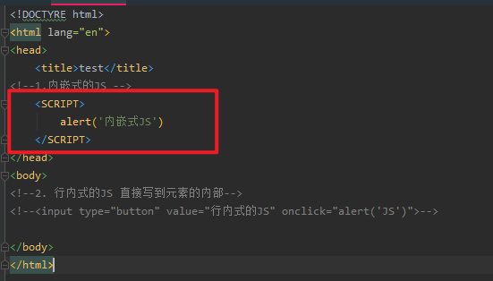
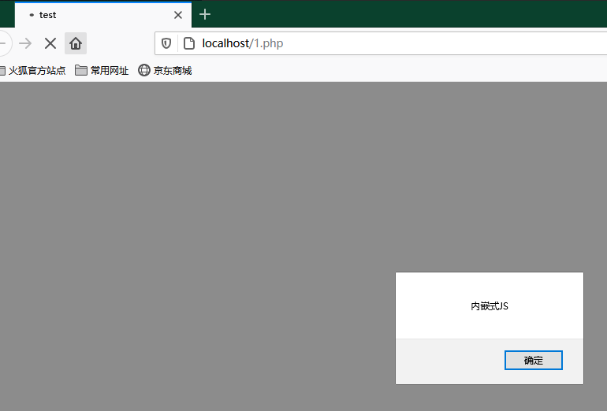
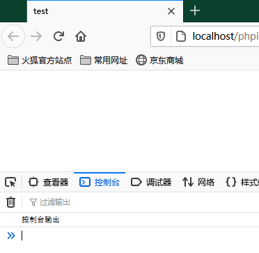
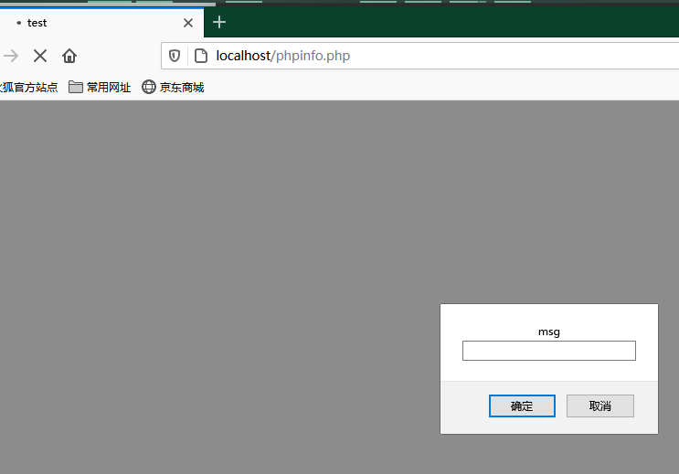
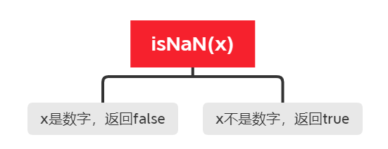

# JavaScript

[MDN WEB函数查询](https://developer.mozilla.org/zh-CN/)

A:你 JavaScript 写这么溜，你Java肯定很厉害吧？
B:**

众所周知，~~JavaScript是从Java上改~~ JavaScript和Java的关系就和雷锋和雷峰塔一样，为了能够看都XML 我开始学习JavaScript。话不多说，我直接启动！

[学习来源](https://www.bilibili.com/video/BV1ux411d75J?p=7)


## 1. JavaScript 的组成


组成框架

- ECMAScript
  - JavaScript语法

- DOM
  - 对页面的元素进行操作(大小，位置，颜色)

- BOM
  - 浏览器对象模型


### ECMAScript

ECMAScript 是由ECMA 国际制定的标准版的一门编程语言，这种语言在互联网上广泛应用。他们往往被称为 JavaScript 和 JScript ，但是实际上两者是 ECMAScript 语言的实现和扩展。

> ECMAScript规定了JS的编程语法和基础核心知识，是所有浏览器厂商共同遵守的一套JS语法工业标准。


**JavaScript**

是由网景公司开发，你可能不太懂这个公司是啥 但是我说一部动画片你多少有点耳闻。《小猪佩奇》


没错，小猪佩奇就是他们整出来的花活儿，他们开始指定并在互联网上发布使用JavaScript编写的脚本和网站，发现欸这个小王八羔子咋害有点招人稀罕？

**JScript**

在互联网上大伙都开始使用 JavaScript，谷歌也想整一手，但是咱也不能就嗯抄吧，这不掉价吗?我谷歌是何许人也？将来是要一统`因特耐特`的很人，所以就按照ECMA的标准开发了自己的语言 `JScript`


### DOM -- 文档对象模型

`DOM` 文档对象模型,是W3C组织推荐的处理可扩展标记语言的 `标准编程接口`.通过 DOM 提供的接口可以对页面上的各种元素进行操作(大小，位置，颜色等)


### BOM -- 浏览器对象模型

`BOM` 是指浏览器对象模型，它提供了独立于内容的，可以与浏览器窗口进行互动的对象结构。通过BOM 可以操作浏览器窗口，`比如弹框，控制浏览器跳转`，获取分辨率等等。


### 2.JS 初体验

JS 的两种区别

**1.内嵌式的JS**

将JS脚本写入 `head` 中触发



在页面加载时直接触发




**2.行内式的JS**

将js脚本直接写到元素的内部中


在HTML 中显示


### 常见输入和输出

|方法|说明|触发
|-|-|-
|alert(msg)|浏览器弹出警告框|浏览器
|console.log(msg)|浏览器在控制台中打印输出信息|浏览器
|prompt(info)|浏览器弹出输入框，可以提供传参|浏览器

- **alert(msg)**

```html
<!DOCTYRE html>
<html lang="en">
<head>
    <title>test</title>
<!--1.内嵌式的JS -->
    <SCRIPT>
        alert('msg')
    </SCRIPT>
</head>
<body>
</body>
</html>
```

- **console.log(msg)**

```html
<!DOCTYRE html>
<html lang="en">
<head>
    <title>test</title>
<!--1.内嵌式的JS -->
    <SCRIPT>
        console.log('控制台输出')
    </SCRIPT>
</head>
<body>
</body>
</html>
```




- **prompt(info)**

```html
<!DOCTYRE html>
<html lang="en">
<head>
    <title>test</title>
<!--1.内嵌式的JS -->
    <SCRIPT>
        prompt('msg')
    </SCRIPT>
</head>
<body>
</body>
</html>
```




## 变量

- 目录
  - 变量的概述
  - 变量的使用
  - 变量的语法扩展
  - 变量的命名规范
  - 交换变量案列

### 变量

变量即为承载数据的容器。我们通过调用变量名即可获取对应数据。

#### 1.变量的使用

1. 声明变量
2. 赋值

**变量的声明**

```js
// 声明变量
var age; // 声明一个变量名称为 age

如果只声明不赋值，则结果是
```

- `var` 是一个JS 的关键字，用来声明变量 (variable 变量的意思)。
- `age` 是程序员定义的变量名，可以通过变量名来访问变量中的数据。

**变量的赋值**

```js
var age;
age = 18;
```

**变量的输出**

使用 console.log 输出

```js
var age;
age = 18;
console.log();
```

## 数据类型

- 五种简单的数据类型
- 获取 typeof 等数据类型变量
- 数据类型的转换
- 什么是隐式转换

### 不同的数据类型

在计算机中存储不同的数据需要不同的空间，所以有了数据类型用于区分。 `JavaScript` 属于弱类型语言。变量的数据类型是不确定的。在程序运行时会被自动确定！

比如：

```js
// js 的变量数据类型是只有程序在运行过程中，更具等号右边的值来确定的
var num = 10; // 这是一个数字型

var name = '张三'; // 这是一个字符串
```

在 JavaScript 拥有动态类型，同时也以为着相同的变量可作用不同的数据类型。

```js
var x = 8;      // x 为数字
var x = "张三"; // x 为字符串
```

#### 数据类型的分类

JS 将数据类型分为两大类：
- 简单数据类型(Number,String,Boolean,Undefined,Null)
- 复杂数据类型(object)

**简单数据类型(基本数据类型)**

JavaScript 中的简单数据类型以及其说明如下：

|简单数据类型|说明|默认值|
|-|-|-|
|Number|数字型，包含整形值和浮点型值，如：21、0.21|0|
|Boolean|布尔值类型，如 true，false，等价于1和0 |false|
|String|字符串类型，如 阿巴阿巴，在js中，字符串都带引号|""|
|Undefined|var a;声明了变量a 但是没有给值，此时 a = undefined| undefined|
|Null|var a = null;声明了变量 a 为空值|null|

1. 数字型进制

常见的进制有二进制、八进制、十进制、十六进制。

```js
var num = 10; // num 数字型
var PI = 3.14;// PI 数字型
```

常见的进制

```js
//1.八进制数字序列范围： 0~7 我们的程序里面的数字前名加0 表示八进制
var num1 = 07;
var num2 = 019;
var num3 = 08;

//2.十六进制数字序列范围：0~9以及A~F #ffffff 数字的前面加 0x 表示十六进制
var num = 0xA;

// 3. 数字型的最大值
console.log(Number.MAX_VALUE)
```

2. 数字型 `Number`

数字型三个特殊值

```js
alert(Infinity); // Infinity
alert(-Infinity);// -Infinity
alert(NaN);      // NaN
```

- Infinity,代表无穷大，大于任何数值
- -Infinity，代表无穷小，小于任何数值
- NaN，Not A number,代表一个非数值，比如 ('张三' - 100);

3. isNaN()

`isNaN()` 这个方法用来判断非数字， 并且返回一个值 如果是数字返回的是 `false` 如果不是数字返回的是 `true`

```html
<!DOCTYRE html>
<html lang="en">
<head>
    <title>test</title>
    <!--1.内嵌式的JS -->
    <SCRIPT>
        console.log(isNaN('1aaa')); //true
        console.log(isNaN(12)); //false
    </SCRIPT>
</head>
<body>
</body>
</html>
</html>
```



字符串引号嵌套,在 JS 可以用 `单引号嵌套双引号`，或者用 `双引号嵌套单引号`(外双内单，外单内双)

```js
var strmsg = 'aaa"bbb"'; // 可以用
var strmsg = "aaa'bbb'";
var badQuotes = `what ?"
```

**字符串转义字符**

|转义符|解释说明|
|-|-|
|`\n`|换行符，n是newline 的意思|
|`\\`|斜杠\|
|`\'`|单引号|
|`\"`|双引号|
|`\t`|tab 缩进|
|`\b`|空格，b是 `blank` 的意思|

**字符型 String**

- 字符串长度

字符串是由若干字符串组成的，这些字符的数量就是字符串的长度。通过字符串的 `length` 属性可以获取整个字符串的长度。


```html
<!DOCTYRE html>
<html lang="en">
<head>
    <title>test</title>
    <SCRIPT>
    var str = 'A1 b2 c3 D4 E5'; // 设置字符串
    console.log(str.length); // 检测字符串长度
    // 此时控制台输出14
    </SCRIPT>
</head>
<body>
</body>
</html>
</html>
```

**布尔型 boolean**

布尔值有两个值：`true` 和 `false`，其中 true 表示真(对)，而 `false` 表示假(错)。

0 和 1

#### 获取变量数据类型

**获取检测变量的数据类型**

`typeof` 可用于获取变量的数据类型


```html
 <SCRIPT>
    var str = 'A1 b2 c3 D4 E5'; // 设置字符串
    console.log(typeof str); // 检测变量的数据类型为 string
</SCRIPT>
```

#### 字符转换

**转换为字符型**

```html
<SCRIPT>
    var num = 123123; // 设置字符串
    var = str = num.toString // 转换为字符型
    console.log(typeof str); // 检测变量的数据类型为 string
</SCRIPT>
```

|方式|说明|案例
|-|-|-
|toSting()|转换成字符串|var num=1;alert(num.toSting());|
|String()|转换成字符串|var num=1;alert(num.Sting(num));|
|**加号拼接字符串**|只要和字符串拼接就都是字符串|var num=1;alert(num+'string');


**转换为数字型**

```html
    <SCRIPT>
    var age = prompt('请输入您的年龄');
    console.log(parseInt(age));
    console.log(typeof age);
    </SCRIPT>
```

|方法|说明|案例
|-|-|-
|parselnt(string)函数|将string类型转换成整数数值型|`parselnt('1')`
|parseFloat(string)函数|将string类型转换成浮点数值型|`parseFloat('1.2')`
|Number()强制转换函数|将string类型转换成数值型|`Number('12')`
|js 隐式转换(- * /)|利用算数运算隐式转换为数值型|'12' - 0


**转换为布尔值**

```html
    <SCRIPT>
    console.log(Boolean(''));
    </SCRIPT>
```

|方法|说明|案例
|-|-|-
|Boolean()函数|其他数值转换成布尔值|Boolean('true');

### JavaScript 算数运算符

|运算符|描述|示例
|-|-|-
|+|加|1+1
|-|减|2-1
|*|乘|1*1
|/|除|2/1
|%|取余|3%2
|++|自增|1++，++1
|--|自减|1--，--1

## 循环

- for 循环
- while 循环
- do while循环

**for循环**


在处理实际问题中，会存在许多`具有规律性的重复操作`，因此在程序中要完成这类操作，就需要`重复执行某些语句`

```js
for (var i =1 ;i<=100;i++){
    console.log(i);
}
// 输出1-100
```
t
需要满足 for 循环的执行代码：

1. for 重要执行某些代码，通常跟计数有关系。
2. for 循环语法结构

```js
for (初始化变量;条件表达式;操作表达式){
// 循环体
}
```
 - 初始化变量 就是用 var 声明的变量，用于计数器
 - 条件表达式 用于决定每一次循环是否继续执行 就是终止的条件
 - 操作表达式 是每次循环最后执行的代码 经常用于我们的计数器变量 `用于更新初始化变量`


**示例**

- 使用 for 循环遍历数组并求平均值

```js
var arr = [1,2,3,4,5,6];
var sum = 0;
var average = 0;
for (var i =0;i<arr.length;i++)
{
    sum += arr[i];
}
average = sum/arr.length;
console.log(sum,average);
// 输出结果：21 3.5
```

- 使用 for 循环遍历数组求出最大值和最小值

```js
        var arr = [1,25,34,41,52,67];
        var max = arr[0];
        var min = arr[0];
        for (var i = 1;i<arr.length;i++){
            if (arr[i] > max){
                max = arr[i];
            }

        }
        for (var a = 1;i<arr.length;a++){
            if (arr[a] < min){
                min = arr[a];
            }
        }
        console.log('最大值为：'+max);
        console.log('最小值为：'+min);
        // 最大值为：67
        // 最小值为：1
```

这里是修改数组索引，并修改数组元素。

- 可以通过修改数组索引的方式追加数组元素
- 不能直接给数组名赋值，否则会覆盖掉以前的数据

```js
    <SCRIPT>
        var arr = [1,25,34,41,52,67];
        arr[4] = 666;
        console.log(arr);
    </SCRIPT>

// 输出：Array(6) [ 1, 25, 34, 41, 666, 67 ]
```

将 var 输出数组 1-10

```js
    <SCRIPT>
        var arr = [];
        for (var i = 0;i<10;i++){
            // arr = i;不要直接给数组名赋值 否则以前的元素都没了
            arr[i] = i+1;
        }
        console.log(arr);
    </SCRIPT>
    // 输出 Array(10) [ 1, 2, 3, 4, 5, 6, 7, 8, 9, 10 ]
```


将数组 `[2,0,6,1,77,0,52,0,25,7]` 中的0去掉后，形成一个不包含 0 的新数组。
需要一个新数组用于存放筛选之后的数据。 将数组去重，删除指定数组元素。


```js
    <SCRIPT>
        var arr = [2,0,6,1,77,0,52,0,25,7];
        var newArr = [];
        for (var i = 0;i < arr.length;i++){
        if (arr[i] > 10){
            // 新数组索引号应该从 0 开始 依次递增
            newArr[newArr.length] = arr[i];
            }
        }
        console.log(newArr);
    </SCRIPT>
```

### 函数

函数其实就是封装了一段可以被重复执行调用的代码.目的就是让大量代码可以重复使用

函数语法：

```js
//声明函数
function 函数名 (形参){
    表达式
}

函数名(参数) //调用函数
```

**示例**

1. 使用函数写一个计算 1-100之间的和的数,还有一个写1-100个数

```js
    <SCRIPT>
        function f() {
            var num = 0;
            var num1 = 0;
            for (var i = 0;i<=100;i++){
                num =+ i;
                num1 += i;
                console.log(num);
                console.log(num1);
            }
        }
        f();
    </SCRIPT>
```

**函数形参**

> 当函数有了，形参会将函数变的更加完整

1. 构造一个函数，当将两个数相加。得到函数

```html
    <SCRIPT>
        var num1 = prompt('第一个数字：');
        var num2 = prompt('第二个数字：');
        function f(j1,j2) {
            j1=parseInt(j1)+parseInt(j2);
            console.log(j1);
        }
        f(num1,num2);
    </SCRIPT>
```

按照写法来说 一般不会在函数中直接输出，而是将值返回给调用者。

同样的案例,

```html
    <SCRIPT>
        var num1 = prompt('第一个数字：');
        var num2 = prompt('第二个数字：');
        function f(j1,j2) {
            j1=parseInt(j1)+parseInt(j2);
            return j1;
        }
        console.log(f(num1,num2));
    </SCRIPT>
```

2. 直接使用return `去求加减乘除`

```html
    <SCRIPT>
        var num1 = prompt('第一个数字：');
        var num2 = prompt('第二个数字：');
        function f(j1,j2) {
            j1 = parseInt(j1);
            j2 = parseInt(j2);
            return [j1+j2,j1-j2,j1*j2,j1/j2];
        }
        console.log(f(num1,num2));
    </SCRIPT>
```

#### 退出循环

- break
- continue
- return

|函数|作用|
|-|-|
|return|结束当前的循环体(如：for\while)|
|continue|跳出本次循环，继续执行下次循环(如:for\while)|
|return|不仅可以退出循环，还能够返回 return语句中的值，同时可以结束当前的函数体内的代码|


**arguments的使用**

示例

> 利用函数求任意个数的最大值

```html
    <SCRIPT>
    function f() {
        var max = arguments[0];
        for (var i=1;i<arguments.length;i++){
            if (arguments[i] > max){
                max = arguments[i];
            }
        }
        return max;
    }
    console.log(f(1,2,314,4));
    console.log(f(1,123,3,411));
    console.log(f(1,2,3,4,51));
    </SCRIPT>
```

**作用域**

- 只要是代码，就至少有一个作用域
- 写在函数内部的局部作用域
- 如果函数中还有函数，那么在这个作用域中就又可以诞生一个作用域
- 根据在内部函数可以访问外部函数变量的这种机制，用链式查找决定哪些数据能被内部函数访问，就称作作用域。


我们举个例子：

```html
    <SCRIPT>
var num = 10; // 外部作用域
function f() {
    var num = 20; //内部作用域
    function f1() {
        console.log(num);

0.    }
    f1()
}
f();
    </SCRIPT>
```

请问这时 num 的值为多少？，可以去浏览器中自己试试看。原则就6个字：就近原则

预处理：

在看到 var赋值的时候，js就会提前处理赋值信息

```html
    <SCRIPT>
f();
console.log(c);
console.log(b);
console.log(a);
function f() {
    // var a;
   var a=b=c=9;
    console.log(a);
    console.log(b);
    console.log(c);

}
    </SCRIPT>
```

## 对象

什么是对象？保存一个值时，可以使用`变量`，多个值可以使用`数组`、保存一个完整的信息时：可以使用数组保存：
`var arr = ['a1','b2','c3']`

此时我们使用 对象存储信息可以达到快速高效

### 创建对象的三种方法

在 JavaScript 中，暂时可以使用三种方法创建对象：

- 使用 `字面量` 创建对象
- 使用 `new Object` 创建对象
- 利用 `构造函数` 创建对象

**使用字面量创建对象**

```html
    <SCRIPT>
var obj = {}; //创建一个空的对象
        var obj = {
            uname:'法外狂徒-张三',
            age:28,
            sex:'🚹',
            ant:function () {
                console.log('发动技能 减刑');
            }
        }
         console.log(obj.uname); // 调用内容
        obj.ant(); //调用函数
    </SCRIPT>
```

1. 在里面的属性或者方法我们采取键值对的形式存储
2. 多个属性或者方法中间使用逗号隔开
3. 方法冒号后面跟着的是一个匿名函数

**使用new Object创建对象**

使用 new Object 创建对象。

```html
    <SCRIPT>
        var obj = new Object();
        obj.uname = '法外狂徒';
        obj.age = 28;
        obj.sex = '男枪';
        obj.ant = function () {
            console.log('芜湖');
        }
        console.log(obj.uname);
        obj.ant();
    </SCRIPT>
```

**构造函数**

我们使用需要使用构造函数：因为前面俩种方法只能 一次创建一组，一次创建一组。此时我们若是利用构造函数，则可用于初始化对象

构造函数:是一种特殊的函数，主要用于初始化对象，即成为对象成员，对象成员变量赋值始值，它总与 new 运算符在一起使用。


```html
    <SCRIPT>
    // 使用new 构造函数名();
function guns(uname,age,gogo) {
    this.name = uname;
    this.age=age;
    this.gogo=gogo;
}
var ldj = new guns('法外狂徒',18,'男枪'); //调用函数的返回是一个对象
console.log(ldj.name);
console.log(ldj['gogo']);
    </SCRIPT>
```

> 构造函数的首字母需要大写
> 构造函数不需要return 就可以返回结果
> 我们调用构造函数时，必须使用 new
> 我们只要 new 函数名() 就可以创建一个对象

**构造函数的对象**

1. 构造函数 明星 泛指的某一大类 它类似于 C 语言里的 类(class)

```html
    <SCRIPT>
function Guns(uname,age,gogo) {
    this.name = uname;
    this.age=age;
    this.gogo=gogo;
}
var ldj = new Guns('法外狂徒',18,'男枪');
console.log(ldj.name);
console.log(ldj['gogo']);
    </SCRIPT>
```

如何使用 new 关键字 执行过程

1. new 构造函数可以再内存中创建了一个空的对象
2. this 就会指向刚才创建的空对象
3. 执行构造函数的代码里面，给这个空对象添加属性和方法
4. 返回这个对象

**内置对象**

什么是内置对象

- JavaScript 中的对象分为3种：自定义对象、内置对象、浏览器对象
- 前两种对象是 JS 基础内容，属于 ECMAScript，第三个属于浏览器对象，JS独有
- `内置对象`就是指JS语言自带的一些对象，这些对象供开发者使用。并提供了一些常用的基本功能
- 内置对象最大的优点就是帮助快速开发
- JavaScript 提供了多个内置对象：Math、Date、Array、String等


**内置对象**

举例： 数学函数

|函数|作用|
|Math.PI|圆周率
|Math.floor()|向下取整|
|Math.ceil()|向下取整|
|Math.round()|四舍五入，取近似值|
|Math.abs()|绝对值|
|Math.max()/Math.min|求最大和最小值|


```html
    <SCRIPT>
console.log(Math.PI); // 属性：圆周率
console.log(Math.max(1,3,5,4,412,51,12,3,1)); // 412
console.log(Math.max(-1,5,'奥里给！')); // NaN
    </SCRIPT>
```

**隐式转换**

在JavaScript ，不同的数据类型中存在隐式转换，例如 str型可以和int型进行转换。
示例：

```html
    <SCRIPT>
console.log(Math.abs(1)); // 1
console.log(Math.abs(-1)); // 1
console.log(Math.abs('-1')); // 1 隐式转换
    </SCRIPT>
```

**三个取整方法**

```html
    <SCRIPT>
//2. 三个取整的方法
        //1. math.floor() 地板 向下取整 最小值取整 例如：
        console.log(Math.floor(1.1));
        console.log(Math.floor(1.9));
        //2.math.ceil 天花板 向上取整 往最大值取
        console.log(Math.ceil(1.1));
        console.log(Math.ceil(1.1));
        //3.math.round() 四舍五入 其他数字都是四舍五入，但是 .5特殊，它往大了取
        console.log(Math.round(1.1)); // 1
        console.log(Math.round(1.5)); // 2
        console.log(Math.round(1.9)); // 2
        console.log(Math.round(-1.1));// -1
        console.log(Math.round(-1.5));// -1
    </SCRIPT>
```


**随机数**

`Math.random`

示例：

> 一个浮点型伪随机数字，在0（包括0）和1（不包括）之间。

```html
    //1.math对象随机数方法 random()方法 返回一个随机小数 0=< x < 1
    <SCRIPT>
    console.log(Math.random());  // 0.2198177205687024 等其他随机小数
    </SCRIPT>
```


> 得到一个两数之间的随机数

```html
    <SCRIPT>
    // 获取两个数之间的随机整数
    var max = 1;
    var min = 10;
    function getRandomArbitrary(min,max) {
        return Math.random()*(max - min) + min;
    }

    console.log(getRandomArbitrary(max,min));
    </SCRIPT>
```

> 得到两个数之间的随机整数

```html
    <SCRIPT>
    // 获取两个数之间的随机整数
    var max = 1;
    var min = 10;
    function getRandomArbitrary(min,max) {
        return Math.floor(Math.random()*(max - min) + min);
    }
    console.log(getRandomArbitrary(max,min));
    </SCRIPT>
```


```html
    <SCRIPT>
    var max = 1;
    var min = 5;
    function getRandomArbitrary(min,max) {
        return Math.floor(Math.random()*(max - min) + min);
    }
    console.log(getRandomArbitrary(max,min));

    // 获取两个数之间的随机整数
var arr = ['张三','李四','王二','迅哥','迅哥']
console.log(arr[getRandomArbitrary(max,min)])
    </SCRIPT>
```

#### 日期对象

**Date()**

Date() 日期对象 是一个构造函数，必须使用new 来调用创建日期对象

```html
    <SCRIPT>
var arr = new Array(); // 创建一个数组对象
var obj = Object();    // 创建了一个对象实例
// Date 函数
var date = new Date(); // 使用Date 对象，因为是构造函数，必须使用NEW
console.log(date); // 输出结果：Fri Dec 25 2020 14:42:42 GMT+0800 (中国标准时间)
// 参数常用的写法 数字型 ：2020,12,25 或者是 '2020-12-25 14:42:53'
    </SCRIPT>
```

#### 数组对象

数组对象的创建

创建数组对象的两个方法：

- 字面量
- new Array()

```html
    <SCRIPT>
// 创建数组的两种方式
        // 1. 利用数组字面量
var arr = [1,2,3];
console.log(arr);
        // 2. 利用new Array()
var arr1 = new Array(1,2,3);
console.log(arr1);
    </SCRIPT>
```


**添加和删除数组元素**

- push 添加

> 在我们数组的末尾 添加一个或者多个数组元素

```html
    <SCRIPT>
// 1. push()
var arr = [1,2,3];
arr.push(4,'giao!'); // 在数组的末尾中添加多个元素
console.log(arr);
    </SCRIPT>
```

1. push 是可以给数组追加新的元素的
2. push() 参数可以直接写 数组元素就可以了
3. push 完毕之后，返回的结果是 新数组的长度
4. 原数组也会发生变化

- unshift 在开头添加

>  在我们数组的开头 添加一个或者多个数组元素

```html
    <SCRIPT>
// unshift
arr.unshift('一给我里');
console.log(arr);
    </SCRIPT>
```

- pop() 删除

```html
    <SCRIPT>
//pop 默认删除数组的最后一个元素
console.log(arr.pop());
console.log(arr);
    </SCRIPT>
```

1. pop是可以删除数组的最好一个元素 记住一次只能删除一个元素
2. pop() 没有参数
3. pop 完毕后，返回的结果是 删除的那个元素
4. 原数组也会发生改变

**数组排序**

```html
    <SCRIPT>
        // 数组排序
        //1. 翻转数组
        var arr = ['a1','b2','c3'];
        arr.reverse()
        console.log(arr); //输出结果：`["c3", "b2", "a1"]`
    </SCRIPT>
```

**冒泡排序**

```html
    <SCRIPT>
        // 冒泡排序
        var arr1 = [3,5,1,6,8,6];
        arr1.sort();
        console.log(arr1); // 输出结果：[1, 3, 5, 6, 6, 8]
    </SCRIPT>
```

#### 获取元素索引

**indexOf**

```html
    <SCRIPT>
        var arr1 = [3,5,1,6,8,6];
        arr1.sort();
        console.log(arr1.indexOf(6)); // 输出结果：3
    </SCRIPT>
```

1. 返回数组元素的所引号方法 indexOf(数组元素) 作用就是返回该数组元素的索引号
2. 它只返回第一个满足条件的索引号
3. 它如果在该数组里面找不到元素，则返回的是 -1

### 基本包装类型

把简单数据类型包装成为了复杂数据类型。


```
孩子， 当你出生的时候，洛丹伦的森林轻声唤出了你的名字。
孩子， 我骄傲地看着你一天天长大，成为正义的化身。
你要记住，我们一直都是以智慧与力量统治这个国家。
我也相信你会谨慎地使用自己强大的力量。
但，真正的胜利，孩子——是鼓舞你的子民心中的斗志。
我告诉你这些，总有一天， 我的生命将抵达终点， 而你，将加冕为王。
```


