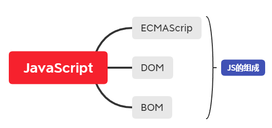
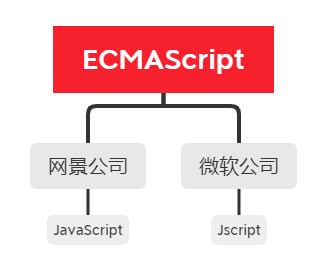
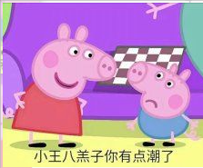
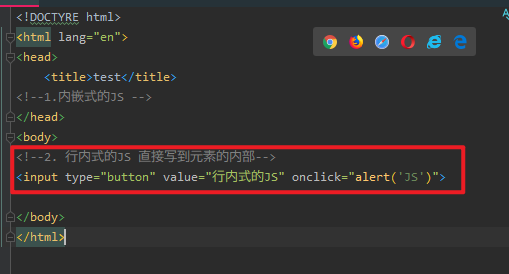
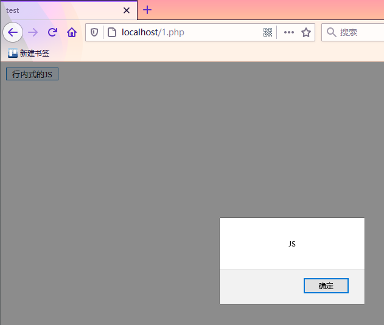

# JavaScript

A:你 JavaScript 写这么溜，你Java肯定很厉害吧？
B:**

众所周知，~~JavaScript是从Java上改~~ JavaScript和Java的关系就和雷锋和雷峰塔一样，为了能够看都XML 我开始学习JavaScript。话不多说，我直接启动！

[学习来源](https://www.bilibili.com/video/BV1ux411d75J?p=7)

## 1. JavaScript 的组成

组成框架

- ECMAScript
  - JavaScript语法

- DOM
  - 对页面的元素进行操作(大小，位置，颜色)

- BOM
  - 浏览器对象模型

### ECMAScript

ECMAScript 是由ECMA 国际制定的标准版的一门编程语言，这种语言在互联网上广泛应用。他们往往被称为 JavaScript 和 JScript ，但是实际上两者是 ECMAScript 语言的实现和扩展。

> ECMAScript规定了JS的编程语法和基础核心知识，是所有浏览器厂商共同遵守的一套JS语法工业标准。

**JavaScript**

是由网景公司开发，你可能不太懂这个公司是啥 但是我说一部动画片你多少有点耳闻。《小猪佩奇》

没错，小猪佩奇就是他们整出来的花活儿，他们开始指定并在互联网上发布使用JavaScript编写的脚本和网站，发现欸这个小王八羔子咋害有点招人稀罕？

**JScript**

在互联网上大伙都开始使用 JavaScript，谷歌也想整一手，但是咱也不能就嗯抄吧，这不掉价吗?我谷歌是何许人也？将来是要一统`因特耐特`的很人，所以就按照ECMA的标准开发了自己的语言 `JScript`

### DOM -- 文档对象模型

`DOM` 文档对象模型,是W3C组织推荐的处理可扩展标记语言的 `标准编程接口`.通过 DOM 提供的接口可以对页面上的各种元素进行操作(大小，位置，颜色等)

### BOM -- 浏览器对象模型

`BOM` 是指浏览器对象模型，它提供了独立于内容的，可以与浏览器窗口进行互动的对象结构。通过BOM 可以操作浏览器窗口，`比如弹框，控制浏览器跳转`，获取分辨率等等。

### 2.JS 初体验

JS 的两种区别

**1.内嵌式的JS**

**2.行内式的JS**

将js脚本直接写到元素的内部中

在HTML 中显示

