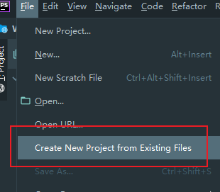
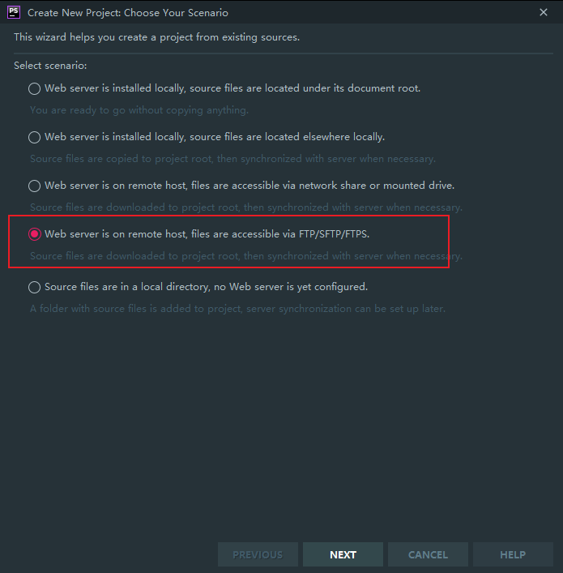
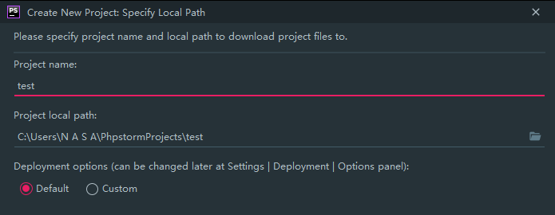
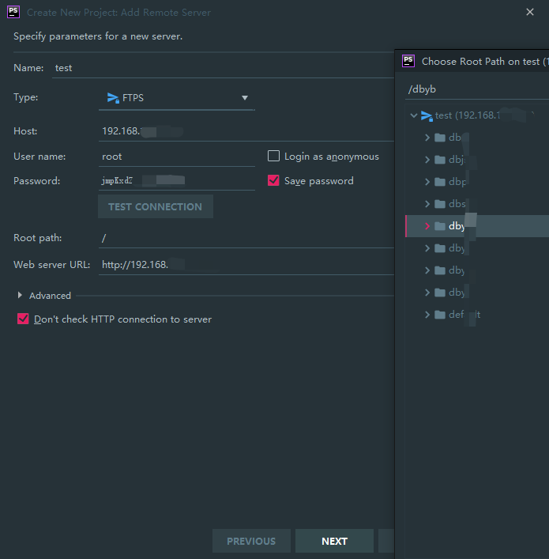
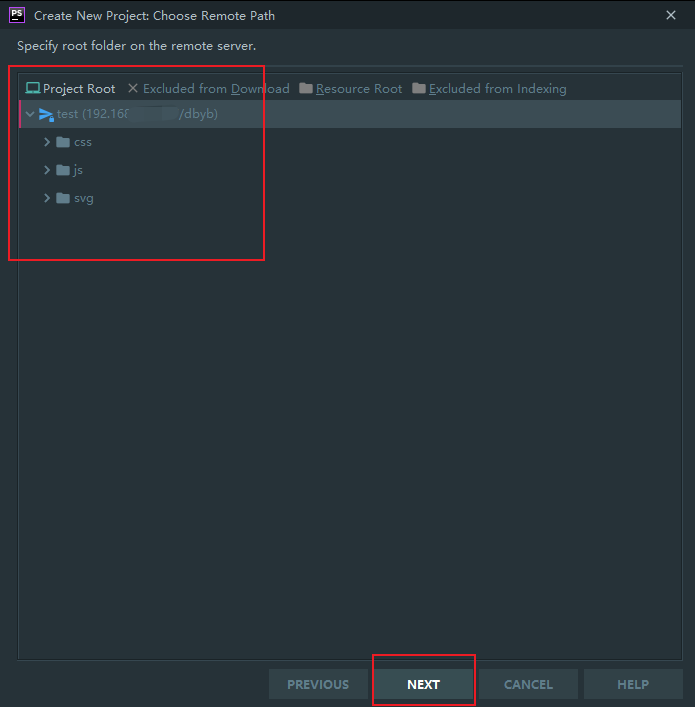
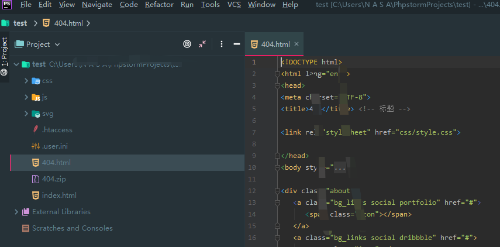
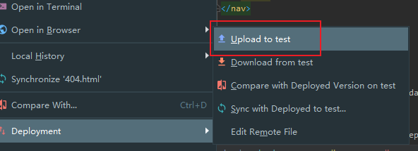
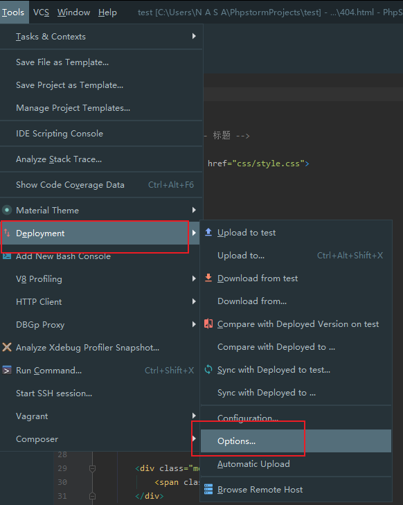
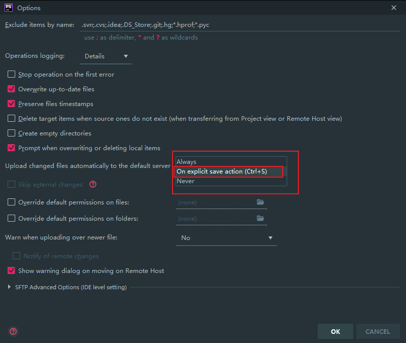

# phpstorm远程编辑代码技巧

1. 打开PHPStorm，选择`Create New Project from Existing Files`
   

2. 选择模式，选择SFTP

3. 填写本地存储的项目名称

4. 进入配置页面及配置

> 需要目标配置SFTP/FTP服务才可进行。

输入账户密码和对应信息即可。

|选项名称|解释|
|---|---|
|Name |服务器名称 |
|Type |传输模式 |
|FTP host |服务器地址 |
|PORT |默认端口 |
|Root path |根目录 |
|Username| 服务器用户名 |
|Auth type |密码类型 |
|password |密码 |
|Web server root URL |服务器根目录的Url|

**注意要勾选**

6. 点击对应的文件夹，然后点下一步等项目下拉完成。

7. 完成项目的下拉，同步到本地成功。

**配置保存**

1. 在本地写完后最后手动保存到服务器
   
   

2. 设置我们ctrl+s（保存）后，自动同步

   

这时候我们就能在本地编写及保存后实时同步到服务器端了。

