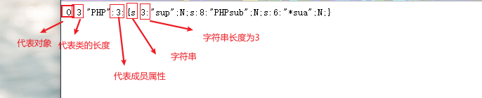

# PHP序列化和反序列化

在PHP反序列化中，有两个函数 `serialize()` 和 `unserialize()` 前者将对象转换成一个字符串，后者将字符串转换成一个对象。在PHP中的值都可以使用 `serizlize()` 来返回一个包含字节流的字符串来表示。

- 在反序列化对象后，需要当前作用域中存在该类的定义，否则 PHP 无法将类对应到指定的类

- 当一个类中的成员变量(属性)是另一个类时，会将另一个类也序列化到当前类中
- 序列化一个对象将会保存对象的所有变量，但是不会保存对象的方法，只会保留对象类的名字

**在序列化对象时，PHP将试图在序列动作之前调用该对象的成员函数 SLEEP(),这就允许对象在被序列化之前 做任何清楚操作。类似的，当使用unserialize()恢复对象之前，将调用wakeup()成员函数**

- **示例如下**
```php
<?php

class PHP
{
    public $sup;
    private $sub;
    protected $sua;
    public function __construct()
    {
        $sup = 'sup';
        $pri = 'pri';
        $pro = 'pro';
        echo "__construct";
    }
    public function __wakeup()
    {
        // TODO: Implement __wakeup() method.
        echo "__wakeup";

    }
    public function __destruct()
    {
        // TODO: Implement __debugInfo() method.
        echo '__destruct()';
    }

}
$a = new PHP();
$b = serialize($a);
echo $b;
```

输出结果：
```php
__constructO:3:"PHP":3:{s:3:"sup";N;s:8:"PHPsub";N;s:6:"*sua";N;}__destruct()
```


分析输出结果
- o 代表对象
- 3 代表类的长度
- 3 代表有多少成员属性
- s 代表字符串
- 3 字符串长度为3


**字符串内容**

- a -array-数组
- b -Boolean-布尔
- d -double-双精度
- i -integer-整数
- o -common object-公共对象
- r -reference-参考
- s -string-字符串
- C -custom object-自定义对象
- O -class-类
- N -null-空
- R -pointer reference-指针引用
- U -unicode string-unicode字符串


