# PHP基础知识

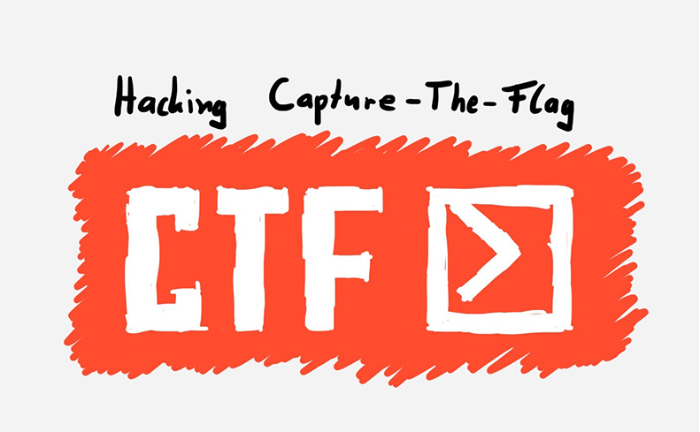

### 基础语法

**1. hello world**

```php
<? php
  echo 'hello,world';
?>
```

`<?php` 表示程序开始，`?>` 表示程序结束每行代码必须以分号结尾,`echo` 是 `php` 的输出函数。

**2. 赋值和拼接**

```php
<?php
   $a=3;
   $b=4;
   $c=$a+$b;
   echo "$a+$b="."$c";
   ?>
```

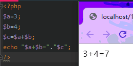

* 变量以$符号开头，变量名称对大小写敏感。
* 可以直接通过赋值来指定变量类型。
* 双引号中的变量也会被解析执行。
* 点 `.` 用于连接字符串。

**3. 单双引号**

```php
<?php
   $a=5;
   $b=6;
   $c=$a+$b;
   echo '$a+$b=$c'.'<br>'; //输出$a+$b=$c
   echo "$a+$b=$c";  //输出5+6=11
?>
```

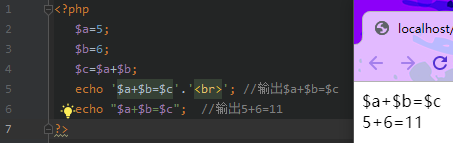

php单引号和双引号的区别:
* 单引号可以嵌套双引号，双引号可以嵌套单引号，单引号和双引号不能相互嵌套
* 单引号内部变量和特殊字符不会解析，双引号内部变量和特殊字符会解析。


**4. isset()函数**

```php
<?php
$a=100;
echo (isset($a));
?>
```

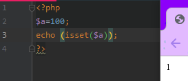

最常见的函数 `isset（）`函数是判断变量是否有值，存在返回值1，不存在返回值空.

**5. 注释**

```php
<?php
//   $a=5;  单行注释
#   $b=6;   单行注释


/*   $c=$a+$b;  多行注释
   echo '$a+$b=$c'; //输出$a+$b=$c
   echo "$a+$b=$c";  //输出5+6=11
*/

echo 'Hello,world!';
?>
```

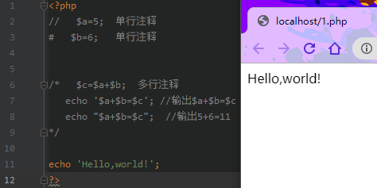

php的注释:
* //这是单行注释
* #这也是单行注释
* /* 这是多行注释 */

**6. 接收表单/数据**

```php
<?php
   $username=$_GET['username'];
   $password=$_POST['password'];
   echo "<p>用户名:"."$username</p>"
   echo "<p>密码:"."$password</p>";
?>
```

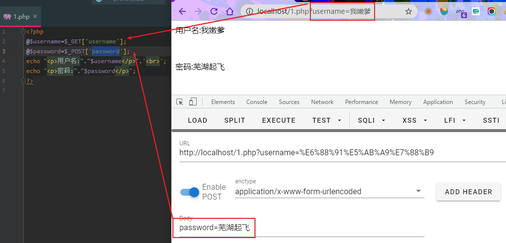

PHP中获取数据:
* $_GET:接收通过get方法传递的数据；
* $_POST：接收通过post方法传递的数据；
* $_REQUEST：接收通过get或post方法传递的数据

**7. if选择语句**

```php
<?php
   $username=$_REQUEST['username'];
   $password=$_REQUEST['password'];
   if($username=="admin" and $password=="123"){
       echo "登入成功";
   }else {
       echo "请输入正确的用户名和密码";
   }
?>
```

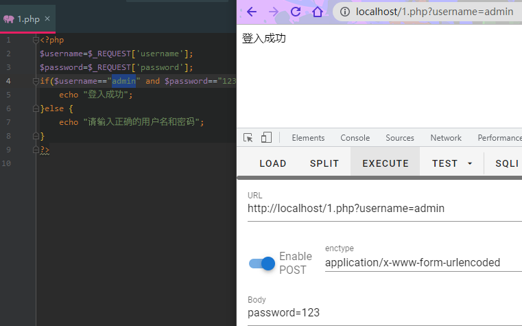

PHP中的赋值:
* ==：等于号
* =:给变量赋值符号

---

### 进阶语法

**1. for循环语句**

```php
<?php
$sum=0;
for($i=1;$i<=10;$i++){
    $sum+=$i;
}
$i=$i-1;
echo "1加到$i"."的和是$sum";
?>
```

**2. while循环语句**

```php
<?php
$sum=0;
$i=1;
while($i<=15){
    $sum=$sum+$i;
    $i++;
}
$i=$i-1;
echo "1加到$i"."的和是$sum";
?>
```

**3.PHP连接数据库**

使用PDO的方法连接数据库

```php
<?php
$db_server="localhost";//数据库地址
$db_name="test";//数据库的名称
$db_user="root";//数据库的用户名，不同的用户权限不同
$db_pwd="toor";//数据库的密码
$dsn="mysql:host=$db_server;dbname=$db_name;charset=utf8;";//使用PDO的方法连接数据库

try{
     $connect=new PDO($dsn,$db_user,$db_pwd);//如果需要数据库长连接，需要最后加一个参数

}
catch(PDOException $e){
    die("连接失败: ".$e->getMessage());
}
?>
```

mysql_connect方法

```php
<?php
mysql_connect("localhost","root","123"); //通过php连接上Mysql
mysql_select_db("test"); //选择要操作的数据库
mysql_query("set names utf8") //设置客户端和连接字符集
通过php进行增删改查
mysql_close($conn); //释放连接资源
?>
```

**4. 身份校验(一定要看)**

```php
<?php
$username=$_GET['username']; //GET方式得到username 也可以是POST
$password=$_GET['password'];//GET方式得到password
$conn=mysql_connect("127.0.0.1","root","123"); //和mysql数据库建立连接
mysql_select_db("USER"); //打开test数据库
mysql_query("set names utf8"); //设置字符集
$sql="select * from USER where username='$username' and password='$password'"; //将输入的用户名和密码和数据库中的用户名密码进行匹配
$res=mysql_query($sql); //执行上面的匹配语句，如果匹配成功，返回1,匹配失败返回0
if(mysql_num_rows($res)!=0){
    echo "登入成功";
}else {
    echo "登入失败";
}
mysql_close($conn); //和mysql数据库断开连接
?>
```
---

### PHP CTF中的常见知识点

请结合 `PHP CTF题目解析`一起学习查阅

#### 0x01 弱数据类型

PHP 是一种弱数据类型的语言,既方便，又容易出现一些问题.

**1. `"=="与"==="`的区别**

在使用`"=="`时会自动转换类型，而`"==="`则是校验类型，而非转换。

```bash
1 == '1';  //true
1 == '1abcdef';  //true
0 == 'abcdefg';  //true
0 === 'abcdefg';  //false
```

**2. Hash比较**

使用"=="时，如果字符串满足0e\d+，解析为`科学计数法`，否则视为`正常字符串`。

```bash
"0e132456789" == "0e7124511451155"  //true
"0e123456abc" == "0e1dddada"  //false
"0e1abc"=="0"     //true
md5('240610708') == md5('QNKCDZO')  //true
```

常见的0e开头的md5：

```bash
QNKCDZO
0e830400451993494058024219903391

s878926199a
0e545993274517709034328855841020

s155964671a
0e342768416822451524974117254469

s214587387a
0e848240448830537924465865611904

s214587387a
0e848240448830537924465865611904

s878926199a
0e545993274517709034328855841020

s1091221200a
0e940624217856561557816327384675

s1885207154a
0e509367213418206700842008763514
```

**3. 传入数组返回null系列**

`md5()`是不能处理数组的，`md5(数组)`会返回`null`，同理的有`sha1()`，`strlen()`，`eregx()`

```php
$array1[] = array(
    "foo" => "bar",
    "bar" => "foo",
);
$array2 = array("foo", "bar", "hello", "world");
var_dump(md5($array1)==var_dump($array2));  //true
```

**4. 十六进制转换**

使用"=="时，PHP会将十六进制转换为十进制然后再进行比较

```bash
"0x1e240"=="123456"     //true
"0x1e240"==123456       //true
"0x1e240"=="1e240"      //false
```

**5. intval()函数**

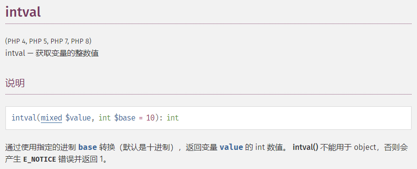

intval()函数会将从字符串的开始进行转换直到遇到一个非数字的字符。

```php
if(intval($a)>1000) {
    mysql_query("select * from news where id=".$a)
}
```

如果出现无法转换的字符串，intval()不会报错而是返回0。
这个时候$a的值有可能是`1002 union…..`

**6. strcmp()函数**

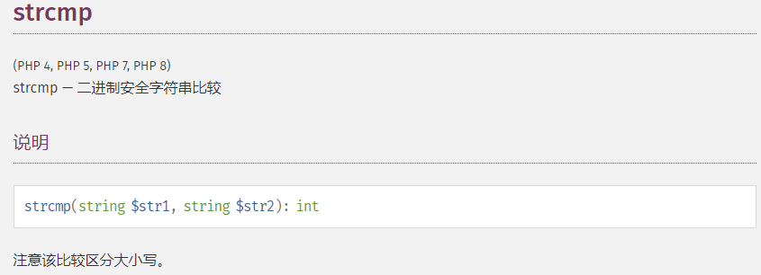

strcmp函数比较字符串的本质是将两个变量转换为ascii，然后进行减法运算。
```
$array=[1,2,3];
var_dump(strcmp($array,'123')); //null,在某种意义上null也就是相当于false。
```

>在`PHP5.3`版本之后使用这个函数比较array跟sring会返回0

**7. switch()函数**

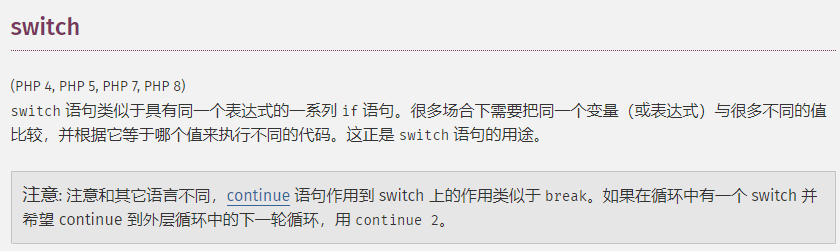

如果switch是数字类型的case的判断时，switch会将其中的参数转换为int类型。

```php
$i ="2abc";
switch ($i) {
case 0:
case 1:
case 2:
    echo "i is less than 3 but not negative";
    break;
case 3:
    echo "i is 3";
}
```

**8. in_array(),array_search()函数**

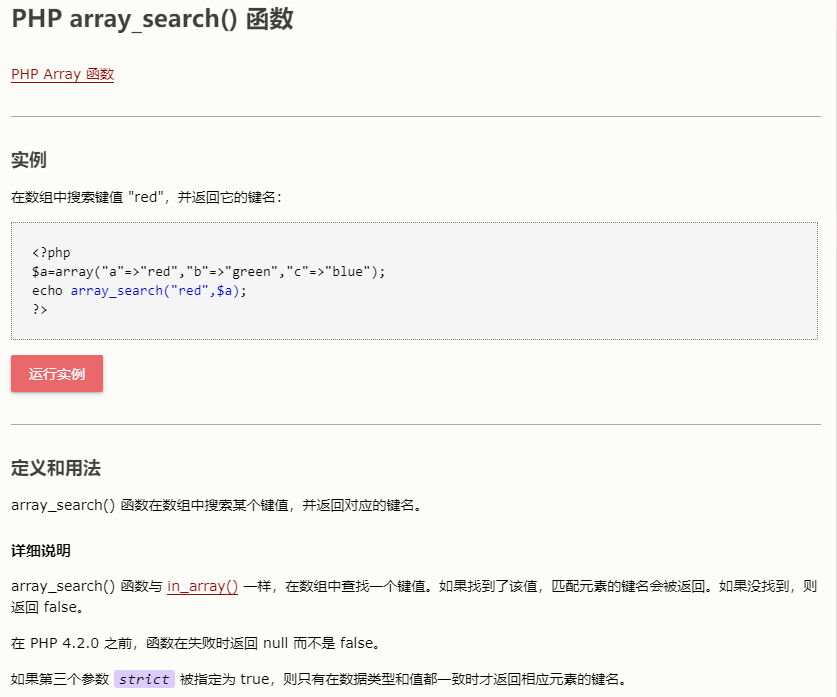

如果strict参数没有提供，那么in_array就会使用松散比较来判断$needle是否在$haystack中。


```php
bool in_array ( mixed $needle , array $haystack [, bool $strict = FALSE ] ),


$array=[0,1,2,'3'];
var_dump(in_array('abc', $array));  //true
var_dump(in_array('1bc', $array));  //true
```

当`strince`的值为`true`时，in_array()会比较`needls`的类型和`haystack`中的类型是否相同。


**9. is_numeric()函数**

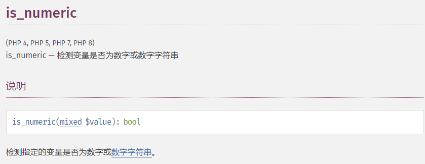

当有两个`is_numeric`判断并用and连接时，and后面的`is_numeric`可以绕过.

```php
<?php
$a=$_GET['a'];
$b=$_GET['b'];
$c=is_numeric($a) and is_numeric($b);
var_dump(is_numeric($a));
var_dump(is_numeric($b));
var_dump($c);  //$b可以不是数字，同样返回true
$test=true and false;
var_dump($test);     //返回true
?>

"="优先级比and高。
```

`16进制`也可以绕过is_numeric()检验，可以用来绕过sql注入里的过滤.

```php
<?php
$a = is_numeric ( $_GET ['a'] ) ? $_GET ['a'] : 0;
$con = mysql_connect ( 'localhost', 'root', 'root' );
mysql_select_db ( 'test' );
$sql = 'insert into a values(' . $a . ',"a")';
mysql_query ( $sql );
?>
```

`test.php?a=0x31206f7220313d31`时，数据库中成功插入值.


**10. json绕过**

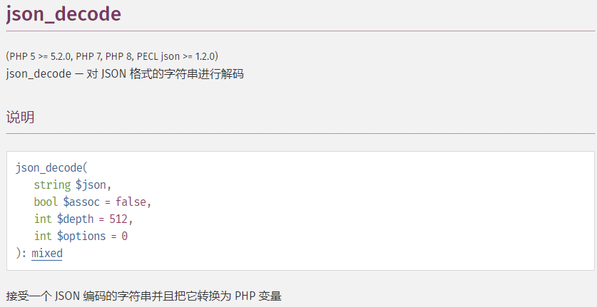

输入一个json类型的字符串，`json_decode`函数解密成一个数组，判断数组中key的值是否等于 $key的值，但是$key的值我们并不知道.

```php
但是可以利用0=="admin"这种形式绕过

<?php
if (isset($_POST['message'])) {
    $message = json_decode($_POST['message']);
    $key ="*********";
    if ($message->key == $key) {
        echo "flag";
    }
    else {
        echo "fail";
    }
 }
 else{
     echo "~~~~";
 }
?>

最终payload message={"key":0}
```

#### 0x02 正则表达式

**1.eregi()函数**

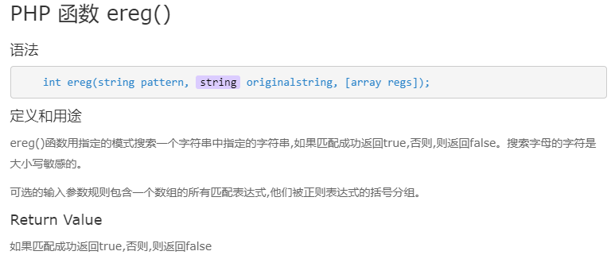

该函数用于字符串对比解析，当`ereg`读取字符串`string`时,`%00后面的字符串不会被解析`。

```php
<?php
    if (ereg ("^[a-zA-Z]+$", $_GET['a']) === FALSE)  {
        echo '你在输什么玩意儿啊';
    }
?>

这里 a=abcd%001234，可以绕过
```

> 如果传入数组，ereg返回NULL

**2. preg_match函数**

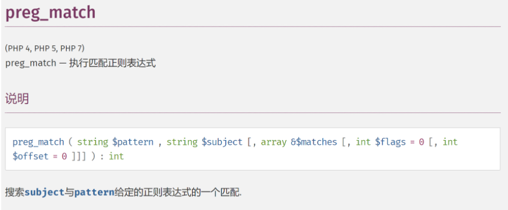

进行正则表达式匹配的时候，没有限制字符串的开始和结束`(^ 和 $)`，则可以存在绕过的问题.

```php
// .不会匹配换行符，如

$json=$_POST['json'];
if (preg_match('/^.*(flag).*$/', $json)) {
    echo 'Hacking attempt detected<br/><br/>';
}

所以 ?json="\nflag"
```

`preg_match`只能处理字符串，当传入的subject是数组时会返回false

**3. preg_replace函数**

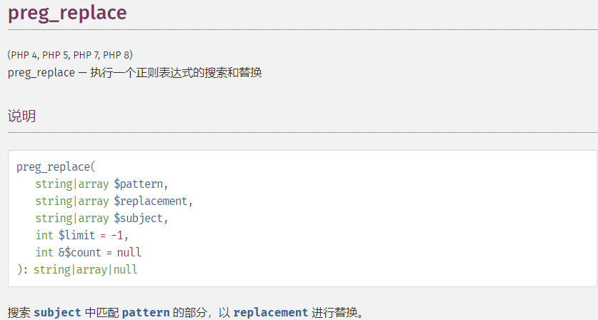

`preg_replace()` 的第一个参数如果存在 `/e` 模式修饰符，则允许代码执行。

```php
<?php
    preg_replace("/test/e",$_GET["nac"],"test");
?>

?nac=phpinfo() # 在版本 <7.0可以被执行
```

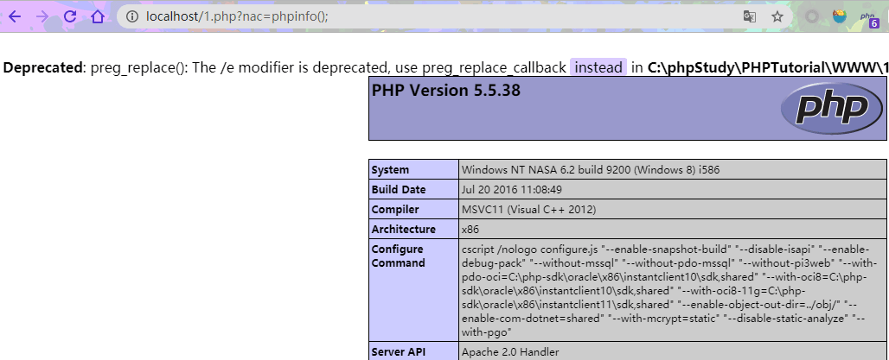

如果没有 /e 修饰符，可以尝试 %00 截断。

#### 0x03 变量覆盖

**1. extract()函数**

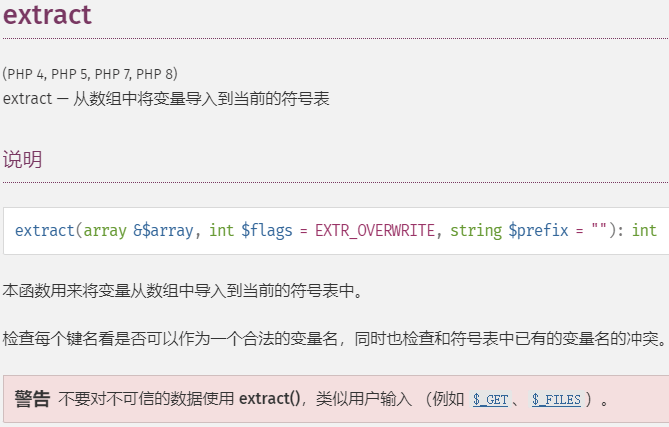

extract() 函数从数组中把变量导入到当前的符号表中,对于数组中的每个元素，键名用于变量名，键值用于变量值。

```php
<?php
    $auth = '0';
    // 这里可以覆盖$auth的变量值
    extract($_GET);
    if($auth == 1){
        echo "私有变量!";
    } else{
        echo "公用变量!";
    }
?>
```

**2. `parse_str()`函数**

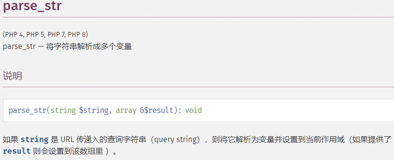

`parse_str()` 的作用是解析字符串，并注册成变量.与 `parse_str()` 类似的函数还有 mb_`parse_str()`，`parse_str()` 将字符串解析成多个变量.

```php
//var.php?var=new
$var='init';
parse_str($_SERVER['QUERY_STRING']);
// $var 会变成 new
echo $var;
```

如果参数 str 是 URL 传递入的查询字符串(query string)，则将它解析为变量并设置到当前作用域.


**3. `$$`的使用**

如果把变量本身的 key 也当变量，也就是使用了 `$$`，就可能存在问题。

```php

// http://127.0.0.1/index.php?_CONFIG=123

$_CONFIG['extraSecure'] = true;

foreach(array('_GET','_POST') as $method) {
    foreach($$method as $key=>$value) {
      // $key == _CONFIG
      // $$key == $_CONFIG
      // 这个函数会把 $_CONFIG 变量销毁
      unset($$key);
    }
}
if ($_CONFIG['extraSecure'] == false) {
    echo 'flag {XXXXXX}';
}
```

