# 类和对象的关系

1. **类的概念**

类就是  **分类、类别、概念、理论。**

在PHP中，类应该有相同的特征。

类的特性： `封装性、继承性、多态性、抽象性`

2. **对象的概念**

对象就是一个一个的实体.有形的、看得见的、摸得着、实体存在的。

而对象也是属性(特征)和方法(行为)的构成。

在现实中：先有对象，后有类。

**但是在计算机中：先有类，后有对象。**
(A君:🤔我就是有类也没**对象**啊)


## 类的定义

class classname{
    对象1；
    对象2；
    对象3；
}

语法格式说明：
```
(1)class是声明类的关键字，`不区分大小写`。
(2)类名、函数名、关键字，都不区分大小写;
(3)ClassName是类的名称，类名的命名规则与变量一样，但不带 `$` 符号。
(4)类名不能以数字开头，但是可以以字母或下划线开头。
(5)类名可以由字母、数字、下划线构成。
(6)类名尽量使用“驼峰式”命名：`每个单词首字母大写`
(7)类名后不跟下括号();
(8)大括号中{}定义的是类的成员和属性和成员方法。
```


## 在类中，对对象的数值引用

如果在 函数 `echo` 中输出时需要 在 `""`中加入

```php
{$this->xxx(所使用的对象名)}
```

 **类的定义实列**

```php
<?php
header('Content-type:text/html;charset=utf-8');

//声明类的语法格式
class Student{
    //定义成员属性
public $name = "a1";
    public $sex = "a1"; //定义对象的权限
    public $age = "a1";
    //成员的使用方法
public function showInfo(){
    echo "{$this->name}的年龄是{$this->age}岁性别是:{$this->sex}";

}
}
```


## **定义类的成员属性**

1. 成员的属性介绍

在PHP类中只有两个属性：

1. **对象的值(属性)**

2. **对象的方法**


(1)定义的成员属性一定要有前提：”谁的对象“，普通变量 `一般` 都是全局变量。
(2)成员属性一定要加权限控制符，但是普通变量不需要。


## **成员的定义格式**

```
  public    $a1    =    1;
权限控制符  变量名   =   变量值;
```


---


## **权限控制符**

作用：`用于保护数据的安全。`

1. public(公共权限)：在任何地方都可以访问。
2. protected(收保护的权限)：之内在本类和子类中可以访问。
3. private(私有的权限)：之内在本类中访问，类外和子类都不行。


示例：
**定义  类的成员方法**

1. **成员方法的介绍**

成员方法，就是普通函数
成员方法和普通函数的区别：

成员方法： 一定是那个对象的方法，不能单独存在
            成员方法前一定要加权限控制，普通函数不需要加；
            成员方法前也可以省略，但是默认为 `public` 建议不要使用。

成员方法和普通函数其他大致一样，都有返回值和参数。


---


## **成员方法的定义格式：**

```php
权限控制符 function funcName(形参1，形参2......){
    //该方法的功能
    [return 参数]
} 
```

示例：


---


## 实例对象含义


类可以产生N多个对象
类几乎不占内存，但每个对象都要占用内存空间。
平时工作的只有对象可以。
在js中，创建类的对象的方法：列如：var obj = new Date();
在PHP中，创建类的对象的方法：列如: $obj = new Date();
使用new关键字来创建类的对象。
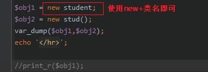
对象会直接获取类中方法的所有属性，不管是否调用或使用


`注意： 对象不能单独存在，对象必须归属于某个类`

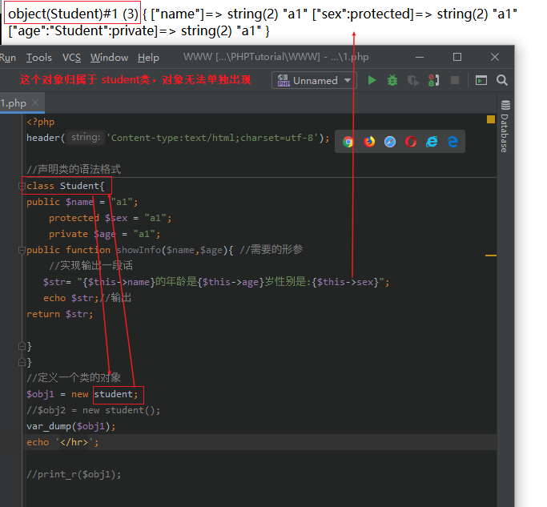

```php
<?php
header('Content-type:text/html;charset=utf-8');

//声明类的语法格式
class Student{
public $name = "a1";
    protected $sex = "a1";
    private $age = "a1";
public function showInfo($name,$age){ //需要的形参
    //实现输出一段话
   $str= "{$this->name}的年龄是{$this->age}岁性别是:{$this->sex}";
   echo $str;//输出
return $str;

}
}
//定义一个类的对象
$obj1 = new student;
//$obj2 = new student();     //一会儿的对比项
var_dump($obj1);
echo '</hr>';
```


##  **-> 访问对象中的方法**

`->` : 访问对象中的方法或属性
```php
 $object -> action();  // 访问对象 object 中的 action 方法
 使用
```

实列：`使用对象对类的方法的属性进行修改`

(A君：你给我好好翻译翻译这句话，什么tmd叫惊喜？ B君：`传参`)

1.修改对象属性：对已存在的属性进行重新赋值。

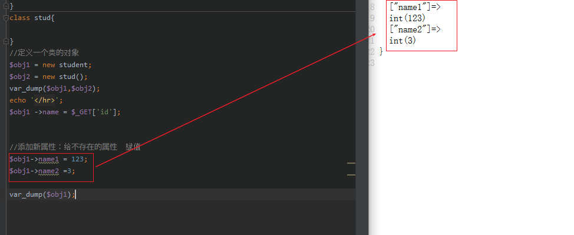


当你创建一个新的对象的时候原模板还是不变。

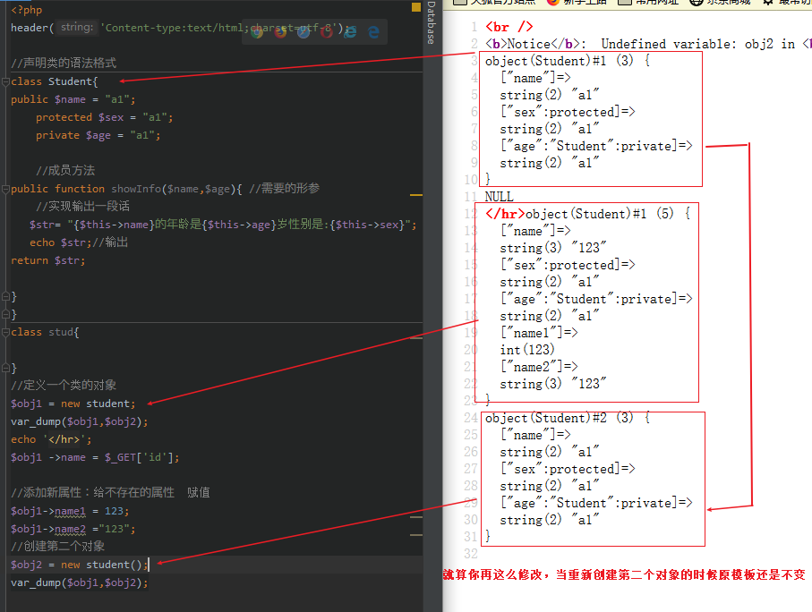


**删除属性**

```php
unset($obj1->name1);
函数   对象名 属性名
```

!注意 你删除的只能是对象，但是变量值还是会保存在内存中，在下次清理内存时会被一起清除。


---


## **对象的操作方法**

(A君：你甚至可以用于xss靶场测试！)


实例：
```php
<?php
header('Content-type:text/html;charset=utf-8');

//声明类的语法格式
class Student{

    //成员方法
public function showInfo($name,$age,$sex){ //需要的形参
    //实现输出一段话
   $str= "{$name}的年龄是{$age}岁性别是:{$sex}";
return $str;

}
}
//获取post提交的值
$n1 = $_POST["n1"];
$a1 = $_POST['a1'];
$s1 = $_POST['s1'];


//定义一个类的对象
$obj1 = new student;
echo $obj1->showInfo("$n1","$a1","$s1"); //传值并输出

//var_dump($obj1);
?>
新建表单
<form method="POST"  action="1.php">
    <input type= "text" name="n1" value="">名字
    <input type= "text" name="a1" value="">年龄
    <input type= "checkbox" name="s1" value="男">男
   // <input type= "checkbox" name="s1" value="女">女
    <input type= "submit" name="btn" value="ctrl男孩">

</form>
```


## **伪变量$this**

**1. $this变量的含义。**

1. js中关键字this代表当前对象
2. PHP中使用$this 变量代表当前对象。
3. $this 代表当前对象，用来调用对象的属性方式。
4. $this 能在成员方法中存在。

5. $this 对象是怎么来的？当使用 $obj 对象调用成员方法时，自动将当前对象的 $obj 传递到成员方法中，在成员方法中，使用 $this 变量来代替传递过来的 $obj 变量。


**2. 举例说明**

可以理解为将数据传输到类中然后对类对象的属性进行更改

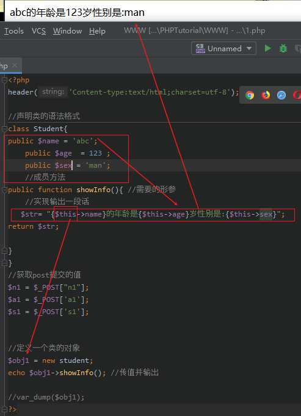

```php
<?php
header('Content-type:text/html;charset=utf-8');

//声明类的语法格式
class Student{
public $name = 'abc';
    public $age  = 123 ;
    public $sex = 'man';
    //成员方法
public function showInfo(){ //需要的形参
    //实现输出一段话
   $str= "{$this->name}的年龄是{$this->age}岁性别是:{$this->sex}";
return $str;

}
}

//定义一个类的对象
$obj1 = new student;
echo $obj1->showInfo(); //传值并输出

//var_dump($obj1);
?>
```

PHP中 `$this` 只可以调用类的成员属性和成员方法。

---

## **如何定义类的常量**

**1. 类的常量介绍**

**常量**

> 就是值永远不会变量常量不能修改，也不能删除。**(A君：一般老师会说是：常常不变的量，当然意思相同。)**

比方：`在一次HTTP请求过程中，常量不能修改。`

类常量定义使用 `Const` 关键字。Define()定义的常量为全局常量。

类常量，仅仅只是类的常量，`和对象无关.`

类常量，之内通过类名来调用,书写格式为：


```php
$a :: 123
类名::常量
```
如何访问常量：是通过范围解析符(::)来访问常量.列：  `student::TITLE`
类常量在内存中只有一份，不会随着对象的增加而增加。类常量可以被所有对象共享。

好处:`节省内存` 列：公司名(百度)。ICP备案号等。


**2.常量的定义格式**

const 常量名 = 常量值

语法说明：

1. 常量没有权限访问符。

2. const定义的常量，一般认为是局部常量。

3. 常量名一般不加 `$` 符号.

4. 常量的值，必须是个固定的值。

`可以直接访问类的常量`

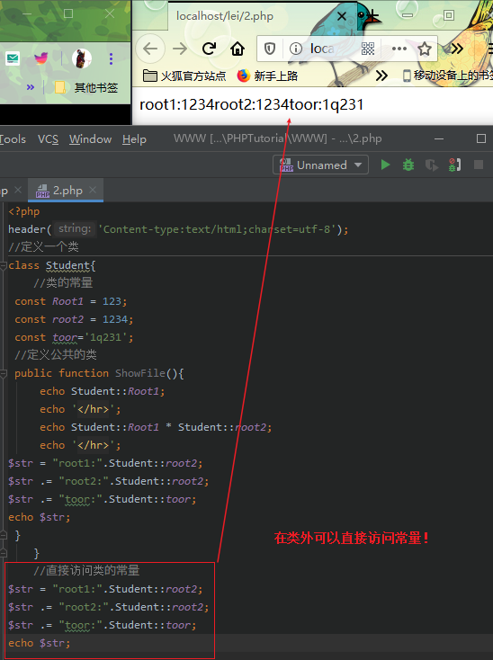

```php
<?php
header('Content-type:text/html;charset=utf-8');
//定义一个类
class Student{
    //类的常量
 const Root1 = 123;
 const root2 = 1234;
 const toor='1q231';
 //定义公共的类
 public function ShowFile(){
     echo Student::Root1;
     echo '<hr>';
     echo Student::Root1 * Student::root2;
     echo '<hr>';
$str = "root1:".Student::root2;
$str .= "root2:".Student::root2;
$str .= "toor:".Student::toor;
echo $str."<hr>";
 }
    }
    //直接访问类的常量
/*
$str = "root1:".Student::root2;
$str .= "root2:".Student::root2;
$str .= "toor:".Student::toor;
echo $str;
*/

$obj = new Student();
$obj ->ShowFile();

```


## **静态属性和静态方法**

### 1. 概述

static 关键字修饰的属性，就是静态属性；

static 关键字修饰的方法，就是静态方法；

静态属性，就是类的属性，与类相关，与对象无关。

静态方法，就是类的方法，与类相关，与对象无关。

静态属性和静态方法：是通过 `类名::$静态属性或静态方法` 方式来实现访问的。

静态属性和静态方法：`在内存中只有一份，不会随着对象的增加而增加。`

好处：节省内存.可以被所有对象去共享。

**静态的属性的值是可以改变的，可以被所有对象共享。**


### 2. **如何区分类的常量和静态常量**

不会改变的值 使用`常量`

但是会改变的使用 `静态属性` 


*实列：*

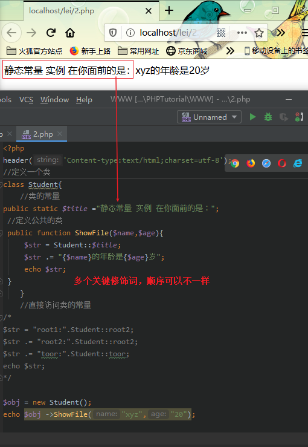

```php
<?php
header('Content-type:text/html;charset=utf-8');
//定义一个类
class Student{
    //类的常量
public static $title ="静态常量 实例 在你面前的是：";
 //定义公共的类
 public function ShowFile($name,$age){
     $str = Student::$title;
     $str .= "{$name}的年龄是{$age}岁";
     echo $str;
 }
    }
    

$obj = new Student();
echo $obj ->ShowFile("xyz","20");

```


---


## 代替当前`类名`

当你定义的类名称如果改变，那么你写的`类中名称都得改变`
这时可以使用  `self` 关键字 代替当前类名。

和 $this 有异曲同工之妙 $this 代表当前对象，self代表当前类；

$this 用于调用对象的东西:如成员属性、成员方法；

$this 使用箭头(->) 来调用成员属性、成员方法。

$self 使用(::)来调用类的常量、静态属性、静态方法。

$this 只能用于成员方法中；而 $self 可以用于成员方法，静态方法中。
 

实列：
```php
<?php
header('Content-type:text/html;charset=utf-8');
//定义一个类
class Student{
    //类的常量
public static $title ="静态常量 实例 在你面前的是：";
 //定义公共的类
 public function ShowFile($name,$age){
     $str = self::$title;
     $str .= "{$name}的年龄是{$age}岁";
     echo $str;
 }
    }
```


## **构造方法**

1. 什么是构造方法

使用  `NEW` 关键字 ，创建一个类的定义对象时，第一个自动调用的方法就是构造方法。

构造方法 的名称是固定的： `__construct()`。(__是两个下划线)

构造方法可以有参数，也可以没有参数；

当 NEW 一个类的时候，类名后面跟的小括号的参数，就是传递给构造方法的。列如： New Student('张三','34');

构造方法的作用: 对象初始化。 列如：给私有的属性赋值、数据库对象初始化(连通数据库，选择数据库)

> 注意！ ：构造方法只能定义一个；构造方法可有可无。
> 构造方法必须是成员方法。
> 构造方法一定没有返回值。


## **析构方法**

1. **什么是析构方法？**

- 当销毁一个对象前，自动调用的方法，就是析构方法。

- 析构方法的名称是固定的: __destruct();

析构方法一定没有参数，析构方法一定是成员中的方法。

析构方法的作用:  垃圾回收。例如：`可以断开数据库的连接`、同时在线人数等。

语法格式、举例说明：对象什么时候销毁、实例:统计在线人数。


2. **语法格式**

书写·格式：
```php
权限控制符 function __destruct(){
    垃圾回收的功能代码;
}
```

3. **举例说明：对象什么时候销毁**

网页执行完毕，所有变量自动销毁，包含对象变量;

函数 `unset(变量名)`

 `unset — 释放给定的变量` 

```php
<?php
header('Content-type:text/html;charset=utf-8');
class Student{
    public function __destruct(){
        echo "对象结束";
}
}
$obj = new Student;
//unset($obj);
echo "这是网页的xx代码";
```
若不加入删除对象代码 则输出为：


 `因为当网页执行完毕后才会到析构对象` 因为析构函数的执行时间，是当网页全部执行结束后才执行。

当输入销毁对象函数之后

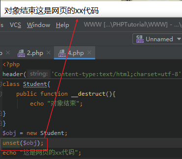

销毁函数会早于网页执行完毕 对象都没了对吧。

## OOP中内存的分配情况


## 传递的区别

**值传递**

其中，`标准数据类型和数组` 的传递格式都是"值传递" -- 单纯传输一个整数或字符串。
其中，对象、资源，默认都是"引用传递"。


什么是"值传递"？  将一个变量的值 复制一份，传递给另一个变量;俩个变量之间没有任何关系。修改其中一个变量值后另外一个不改变。毫无 `瓜` 系.


**引用传递**

引用传递 将一个变量的 "数据地址" 复制一份，传递给另外一个变量;两个变量指向同一个数据；修改其中一个变量的数据，另一个变量也会一起变。


---


## **类的封装性**

1. 什么是类的封装性

`类的封装性:将敏感数据保护起来，不被外界访问。`

类的封装性再次提醒: 将一个功能的方方面面,封装成一个类。 

例如： 数据库工具类，把数据库操作的所有的方面全部封装到类中，因此，在该类外，不能再使用 "`mysql_*`" 开头的函数。

**`类的封装性实现，就是通过权限控制符来实现。`**

在项目中，所有成员属性，一般都是private 、 protected 权限。


2. 访问权限控制符介绍

public(公共权限):在任何地方都可以被访问，主要是:类内、类外、子类中。
protected(受保护的权限): 只能在本类，子类中被访问.在类外禁止访问。
private(私有权限)：只能在本类中被访问。
成员属性、静态方法必须要加权限控制符，不能省略。
成员方法、静态方法可以不加权限控制符，默认未public.建议都要加权限。


3. 举例说明(类的封装性)

实例 数据库封装类

### 实例 ：使用PHP编写一个面对对象的数据库连接

```php
<?PHP
header('Content-type:text/html;charset=utf-8');
class Db
{//设置成员属性
    //数据库连接属性
   private $db_host;    //主机名
   private $db_user;    //用户名
   private $db_pass;    //密码
   private $db_name;//数据库名
    private $db_port;//端口号
   private $charset;    //字符集
    private $link; //连接1函数
//构造连接方法
    public function __construct($config)
    {
        $this->db_host = $config['db_host'];
        $this->db_user = $config['db_user'];
        $this->db_pass = $config['db_pass'];
        $this->db_name = $config['db_name'];

        $this->charset = $config['charset'];
        $this->db_port = $config['db_port'];
        $this->connectDb();//连接数据库
        $this->selectDb();//选择数据库
        $this->setCharset();//设置字符集

    }

//私有的连接数据库方法。
private  function connectDb(){
       //if(!@mysqli_connect($this->db_host,$this->db_user,$this->db_pass))
    //$server = "127.0.0.1"; $username = "pig"; $password = "123456"; $database
      //  = "users";
 //   if(!@mysqli_connect($server,$username,$password,$database))
    $this->link= mysqli_connect($this->db_host,$this->db_user,$this->db_pass) or die ('数据库连接失败');
    //var_dump($this->link);
        //取反报错显示连接失败
}
//私有的选择数据库的方法
private function selectDb(){
        if (!mysqli_select_db($this->link,$this->db_name))
            dir("选择数据库{$this->db_name}失败!");

}
// pig 123456

//设置数据库字符集的方法
private function setCharset(){
        mysqli_query($this->link,"set names {$this->charset}");

}
}
//接收数据
$arr = array(
    'db_host' => $_POST['db_host'],
    'db_user' => $_POST['db_user'],
    'db_pass' => $_POST['db_pass'],
    'db_name' => $_POST['db_name'],
    'charset' => $_POST['charset'],
    'db_port' => $_POST['db_port'],
    );
var_dump($_POST);
//测试连接
/*
$arr = array(
    'db_host' => 'localhost',
    'db_user' => 'root',
    'db_pass' => 'toor',
    'db_name' => 'users',
    'charset' => 'utf8',
    'db_port' => '3306',
);
*/
$obj = new Db($arr);
var_dump($obj);
?>
//html传值代码
<!--
<!DOCTYPE html>
<html lang="en">
<head>
    <meta charset="UTF-8">
    <title>Title</title>
</head>
<body>
<form  method="post" action="1.php" >输入数据库连接：
    主机： <input placeholder="Basic usage" type="text" class="ant-input" value="" name=db_host>
    端口： <input placeholder="Basic usage" type="text" class="ant-input" value="" name=db_port>
    用户名：<input placeholder="Basic usage" type="text" class="ant-input" value="" name=db_user>
    密码：<input placeholder="Basic usage" type="text" class="ant-input" value="" name=db_pass>
    数据库名：<input placeholder="Basic usage" type="text" class="ant-input" value="" name=db_name>
    编码：<input placeholder="Basic usage" type="text" class="ant-input" value="" name=charset>
    <input class="button" type="submit"  value="连接"   οnclick="test()" />
</form>
</body>
</html>
-->
```


## 类的继承

1. 继承的相关概念

继承：如果一个B类拥有了A类的所有特征信息，则我们就认为B类继承了A类。

A类：父类、上层类、基础类
B类：子类、下层类、派生类

为什么继承？继承是为了实现 `功能的升级和扩展` .如果一个项目不需要升级和扩展，则不需要继承.

功能和升级:原有的功能，对现在的功能进行更加完善的处理。
功能的扩展:原来没有的功能，增加一个新功能。

 `如果项目需要升级和扩展功能` ,不能直接修改原类，需要创建一个子类，并继承父类。


2. 继承的语法格式
class Subclass extends ParentClass{
    //子类的功能代码
}
语法说明:

1）SubClass 代表要创建的子类的名称
2）extends 是继承关键字，不区分大小写
3）ParentClass 代表已经存在的父类或上层类

3. 单继承和多继承
 - 单继承:只能从一个父类中来继承功能，例如 ：PHP,java等
 - 多继承:可以同时从多个父类中来继承功能，例如:C++。

```php
//单继承的表现
class Subclass extends ParentClass{
    class D extends A,B,C{

    }
}

```

## **parent关键字**

`Self` 代表当前类 ， `Parent` 代表父类

self 可以调用本类的内容：`类常量、静态属性、静态方法；`
Parent 可以调用本类的内容：`类常量、静态属性、静态方法、成员方法；`


## **类的多态**

1. **类的多态是指类的多种形态。**

类的多态：主要是指方法重载和方法重写；

函数重载:在一个脚本文件中，定义两个同名函数: `PHP不支持` ；

方法重载:在一个脚本文件中，定义两个同名方法: `PHP不支持` ；

方法重写:父类中有一个方法，在子类中用同样的名称再定义一次。


功能升级：父类有的功能，子类的功能更加完善、更详尽.通过方法重写来实现。

如果不需要升级，也不需要扩展，那么继承就没有意义。


2. **方法重写的要求**

子类中重写的方法名称,要与父类的 `方法名称一致` 。

子类中重写的方法的参数个数，必须要与父类方的参数个数一致；

子类中重写的方法的类型，必须要与父类方法的类型一致。父类是成员的方法，子类必须是成员的方法；父类是静态方法的权限，子类也必须是静态方法。


子类中重写的方法的权限， `不能低于` 父类方法的权限。

举例说明:

如果父类方法权限为 public， 则重写方法必须是 public。
如果父类方法权限为protected，则重写方法必须是public、protected;
如果父类方法权限为private，则子类 `无法继承！`

例如：

```php
<?php
header('Content-type:text/html;charset=utf-8');

//定义学生类
class Student{
    //静态方法
    public function showInfo($a,$b){
        return "{$a}的年龄是{$b}岁！";
    }
}
//定义一个学生了再让他继承学生类
class ItcastStudent extends Student{
    //重构父类的方法
    public function showInfo($name,$age) //重构一个名称相同的方法
    {   //当场重写
        $str = "<h2>重构学生类</h2>";
        $str .= @parent::showInfo($name,$age);
        echo $str;
    }
}
//直接调用静态方法

@ItcastStudent::showInfo("小明",24);
```

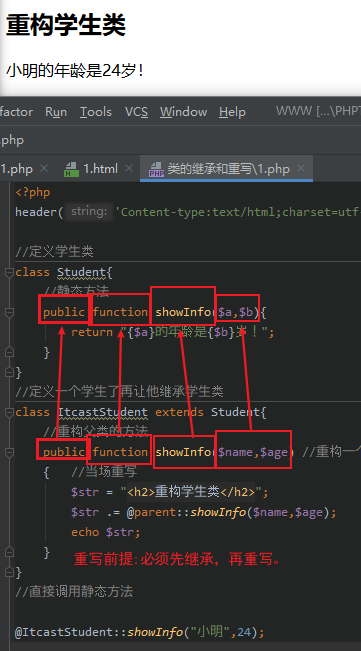

重写必须复合4个条件才行 加油 奥里给！


---

3. **析构方法重写**


程序写的你中有我我中有你
实例：
```php
<?php
header('Content-type:text/html;charset=utf-8');

//定义一个类
class Shop{
    //私有商品属性
    private $name;
    private $price;

    //收保护构造方法
    protected  function __construct($name2,$price2)
    {
        $this->name = $name2;
        $this->price = $price2;

    }
    //受保护的自我显示的方法
    protected function showInfo(){
        $str = "商品名称：{$this->price}";
        $str .= "<br>商品价格:{$this->price}";
        return $str;
    }
}
//定义手机类，并继承商品类
class Mobile extends Shop{
//私有手机的属性
    private $pinpai;
    private $city;
//公共的构造方法
    public function __construct($name2, $price2,$pinpai2,$city2)
    {
        //调用父类的构造方法并传递参数。
        parent::__construct($name2, $price2);
        $this->pinpai = $pinpai2;
        $this->city = $city2;

    }
    //公共的自我输出的信息方法
    public function showInfo()
    {   $str = parent::showInfo();
        $str .= "<br>手机品牌：{$this->pinpai}";
        $str .= "<br>手机产地：{$this->city}";
        echo $str;

    }
}
//创建手机类对象

$obj = new Mobile("小米9","1999","小米","北京");
$obj->showInfo();

```


---


## **最终类的和最终方法**

1. 概述 

Final 关键字修饰的类，就是最终类。
Final 关键字修饰的方法，就是最终方法。
最终类： 该类不能被继承，直接实例化。该类已经十分完善了，不需要升级和拓展了。
最终方法： 该类不能被重写，直接调用即可。该方法已经十分完善了，不需要升级和拓展了。


例如：数据库操作类，即可定义为最终类。


## 抽象类和抽象方法

### 1. 简介

Abstract 关键字修饰的类,就是抽象类;

Abstract 关键字修饰的方法,就是抽象方法;

抽象类:` 该类之内被继承，不能直接实例化 `.常用于"` 基础类 `"。

抽象方法: 该方法没有方法体，抽象方法必须先继承，后重写。

` 如果有一个类有一个抽象方法 `，该类必须声明为抽象类。

抽象方法作用：`方法的命名规范，是一种监督的机制.`

抽象类中，也可能有其他元素:`成员属性、成员方法、静态属性、静态方法、常量`。

抽象方法不能是静态方法，只能是成员方法.

抽象方法可以有参数，也可以没有.


### 2. 举例说明:

```php
<?php
header('Content-type:text/html;charset=utf-8');

//定义抽象的商品基础类
abstract class Shop {
    const TITLE = "抽象类的定义方法";
    abstract protected function showInfo($a,$b);
    abstract protected function readMe();

}
//定义手机类，并继承商品基础类
final class Mobile extends Shop{
    public  function showInfo($name,$age){
    echo "{$name}的年龄是{$age}岁！<br>";
    }
    //重写readMe()方法
    public function readMe()
    {
        // TODO: Implement readMe() method.
        echo "当前成员方法：".__METHOD__."<br>"; //输出当前方法。
        echo "当前成员函数：".__FUNCTION__;//输出当前函数
    }
}
$obj = new Mobile();
$obj->showInfo('圣骑',24);
$obj->readMe();
```


---

# 接口技术

## 什么是接口

`接口 就是 特殊的抽象类！`

## 为什么需要接口技术?

>(A君： PHP只支持 `单继承` ，只能从一个父类中继承功能;如果PHP同时想从多个父类中继承功能，怎么办？）
>(B君:用JAVA)

- 可以使用接口来实现;接口也是子类中方法的命名规范.

接口就是特殊的抽象类; --如支付宝接口，微信接口。


## 接口的定义和实现要点

 `interface`
- 接口的关键字 ： 用于声明一个接口。 `接口是一种特殊的类`。

 `implements`
- 关键字，创建一个子类，`来实现接口`。


### **接口的详细讲解**

|在同类的东西，使用extends 关键字;不同类的东西，使用implements 关键字。
|---|
|例如：子类继承父类、接口继承接口、类实现接口.|
||
|接口中只能存在两样东西:类常量，抽象方法.|
||
|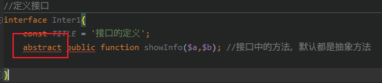|
||
|在接口中的方法，默认都是抽象方法，因此，不用加 `abstract` 关键字。|
||
|接口中的方法的权限，必须是 `public`;|
||
|接口中方法，可以是成员方法，也可以是静态方法；|
||
|接口中所有的抽象方法，在子类中必须要重写；|
||
|PHP中的 `重写` ,不一定是方法重写，还可以是常量重写，静态属性重写、静态方法重写；|
||
|<h3>接口中的常量不能重写，只能继承！</h3>|
||

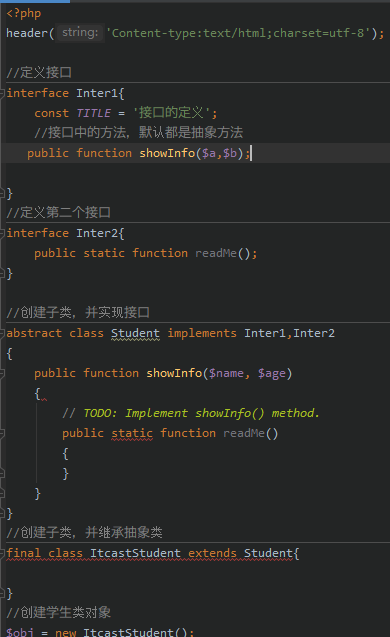


## **类的自动加载**

### 1. 为什么需要类的自动加载？

    程序员在做开发的时候，会把每一个功能，都定义成一个独立的类文件,类文件就是以".class.php"结尾。一个大项目大概有几十个功能，就需要定义几十个类，在应用页面，就需要把相关的类文件 require()、require_once()包含进当前页面。
    
    所以tmd在开头就会有50个reuire_once()语句。这样的话:极大浪费内存空间，不需要的类也会包含进来。

实例如下：


> 这代码就很不潇洒。

### 2. 常规的自动加载类函数(__autload())

注意！
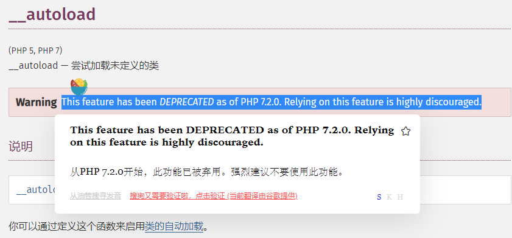


1. **类文件的命名规则**

将每一个功能，单独定义成一个 `类文件`;
每一个类文件，尽量以".class.php"结尾; 例如: Student.class.php;
类文件的主名，要和类名一致; 例如：class Student{};

类的命名方法：尽量使用"驼峰式"命名，`每个单词首字母大写`；例如:class ConnMySQL
方法的命名方式: 尽量使用"驼峰式"命名，第一个单词全小写，后面的每个单词首字母大写；例如:getCode();

属性命名方式，尽量使用"驼峰式" 命名，与方法命名一致。


示例：


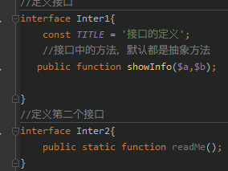


2. **__autoload()函数的语法**

__autoload()是系统函数，不是方法，名称是固定的；

|我们需要定义该函数的内容:|
|---|
该函数有一个唯一的参数，就是类名参数；|
|当使用一个不存在的类时， `__autoload($className)` 会自动调用；|
|当使用 `NEW` 关键字，创建一个不存在的类的对象·时， __autoload()会自动调用；例如:$obj = new student();|
|当使用静态化方式调用不存在类的属性或方法时， __autoload()自动调用；例如： Student::getCode();|
|当继承一个不存在的父类时, __autoload()自动调用；例如：class ItcastStudent extends Student{};|
|当实现一个不存在的接口时，__autoload() 自动调用；例如：class Student implements Inter{};|
|构建类文件的真实路径;|
|判断并包含类文件代码;|
||


自动加载和常规加载的区别

传统加载：


## 魔术方法

将所有以 `__(两个下划线)` 开头的类方法保留为 `魔术方法` 。建议不要以 __为前缀。


1. __toString()

描述：将对象转换成字符时，魔术方法 __toString()会自动调用

语法：

```PHP
public string __toString(); 
```

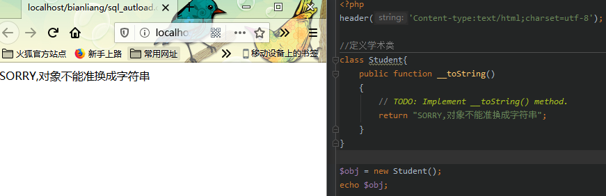


2. __invoke()

描述： 当把对象当场函数调用时，魔术方法 `__invoke()` 会自动调用。
语法：

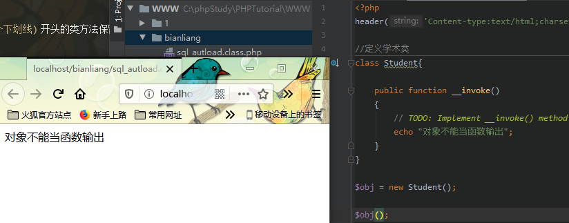


## 面向对象设计模式

设计模式: 就是面向对象代码设计经验的总结.
设计模式: 可以实现代码重用、节省时间、对于后期维护十分方便

## 常见的设计模式

单例模式：一个类之内创建一个对象，不管用上面方法，都无法创建第二个对象。例如：数据库对象，

工厂模式：根据传递的不同类名，来创建不同类的对象的工厂。


## 单例设计的要求(三私一公)

|三私一公|
|---|
|一私：私有的静态的保存对象的属性。|
|一私：私有的构造方法，阻止类外NEW对象。|
|一私：私有的克隆方法，阻止类外克隆对象。|
|一公：公共的静态的创建对象的方法。|
||


## 单列的数据库的工具类

```php
<?php
header('Content-type:text/html;charset=utf-8');

//定义最终的单列的数据库操作类
final class Db{

    //私有的静态的保存对象属性
    private static $obj = NULL;

    //私有数据库的配置信息
    private $db_host;
    private $db_user;
    private $db_pass;
    private $db_name;
    private $charset;


    //私有的构造方法：阻止类外NEW对象
    private function __construct(array $config)
    {
        $this -> db_host = $config['db_host'];
        $this -> db_user = $config['db_user'];
        $this -> db_pass = $config['db_pass'];
        $this -> db_name = $config['db_name'];
        $this -> charset = $config['charset'];
        $this->connectDb();//连接数据库
        $this->selectDb();//选择数据库
        $this->setCharset();//设置字符集
    }
    //私有的克隆方法：阻止类外 clone 对象
    private function __clone()
    {
        // TODO: Implement __clone() method.
    }

    //公共的静态的创建对象的方法
    public static function getInstance($config){
        //判断当前对象是否存在
        if(!self::$obj instanceof self){
            self::$obj = new self($config);

        }
        //如果对象已经存在，直接返回
    }

//私有的链接MYSQL数据库的方法
private function connectDb(){
        if (!@mysqli_connect("$this->db_host","$this->db_user","$this->db_pass"))
            die("链接数据库失败！");
}
//私有的选择数据库的方法
private function selectDb(){
    $link = mysqli_connect("$this->db_host","$this->db_user","$this->db_pass");
        if (!@mysqli_select_db($link,"$this->db_name"))
            die("选择数据库{$this->db_name}失败");
}

//私有的设置字符集
private function setCharset(){
        $this->exec("set name {$this->charset}");
}
//公共的执行SQL语句的方法： insert 、update、delete、set、create、drop
//返回为布尔值
public function exec($sql){
        //将语句全小写
    $link = mysqli_connect("$this->db_host","$this->db_user","$this->db_pass","$this->db_name");
    $sql = strtolower($sql);
    //判断是不是select语句
    if(substr($sql,0,6) =='select'){
        die("该方法不能执行select语句");
    }
    //else 继续执行语句，并返回布尔值
    return mysqli_query($link,$sql);
}
private function query($sql){
       // $sql = "select * from users";
    $link = mysqli_connect("$this->db_host","$this->db_user","$this->db_pass","$this->db_name");
        $sql = strtolower($sql);
    if(substr($sql,0,6)!='select') {
die("该函数不能执行除select以外语句");
    }
    //正常执行
    //返回结果是结果集 - 本类中的方法
    return mysqli_query($link,$sql);
}

public function fetchOne($sql,$type=3){
        $result = $this->query($sql);
        $types = array(
            1 => MYSQL_NUM,
            2 => MYSQL_BOTH,
            3 => MYSQL_ASSOC,
        );
        //一维数组，返回一条记录
        return mysqli_fetch_array("$result","$types[$type]");

}
//公共数组，返回多条记录，并存入一个新数组中。
public function fetchAll($sql,$type=3){
        $result = $this->query($sql);
$types = array(
    1 => MYSQL_NUM,
    2 => MYSQL_BOTH,
    3 => MYSQL_ASSOC,
);
//循环从结束中取出所有记录并存入一个新数组中
while ($row = mysqli_fetch_array("$result","$types[$type]")){
    $arrs[]=$row;
}
//返回二维数组
return $arrs;
}

//公共的获取记录数的方法
public  function rowCount($sql){
        //执行语句
        $result = $this->query($sql);
        //返回记录数
        return mysqli_num_rows("$result");
}

}

```

该工具类可以实现自动加载和数据库增删功能，对select语句有严格判断。


## 连接数据库的公共文件


```php
<?php
//类的自动加载
header('Content-type:text/html;charset=utf-8');

function my_autoloader($Class)
{
$filename = "./libs/classDb.php";
if (file_exists($filename)) require_once($filename);
}

spl_autoload_register('my_autoloader');

spl_autoload_register(function ($class){
    include './libs/classDb.php'. $class .'classDb.php';
});


//连接数据库的信息存到arr数组中
$arr = array(
    'db_host' => '127.0.0.1',
    'db_user' => 'root',
    'db_pass' => 'toor',
    'db_name' => 'users',
    'charset' => 'utf8',
);
$db = Db::getInstance($arr); //创建db对象成功，数据库连接成功
```


