# Python - 基础

- [学习来源](https://www.bilibili.com/video/BV1o4411M71o?p=1)

<p align="center">
    
</p>

<p align="center">👴 I hear her voice in the morning hours,She calls me</p>
<p align="center"><a href="http://music.163.com/song?id=1313205002&userid=262256866"><font>《Take Me Home Country Roads》</font></a> </p>
<p align="center">专辑：Take Me Home: The John Denver Story</p>
<p align="center">歌手：David Meol</p>


> 我比较喜欢的翻唱版本，墨水乐队翻唱，喜欢可以去苹果买正版！

### 安装Python

- [Python下载](https://www.python.org/downloads/windows/)

### Python是啥

- 编程语言 脚本语言 也可以理解为胶水语言。

- 需要过解析器，所以只需要有对应语言的解析器即可跨平台。
如C平台的解析器，和Java平台的解析器。

- [Pycharm](https://www.jetbrains.com/pycharm/download/) IDE工具

推荐插件：
- Material Theme UI 我最爱的UI，谁用谁知道！

- Rainbow Brackets 彩虹括号，真心好用。

- Markdown Image Support MD解析器。


自选 😂懒得一个一个写了

- [教程学习的网站](https://www.liujiangblog.com/)

### 注释的分类和语法

注释的作用：用人类读得懂的语言对代码进行解释说明，方便日后维护。

给大家举个生动形象的栗子：

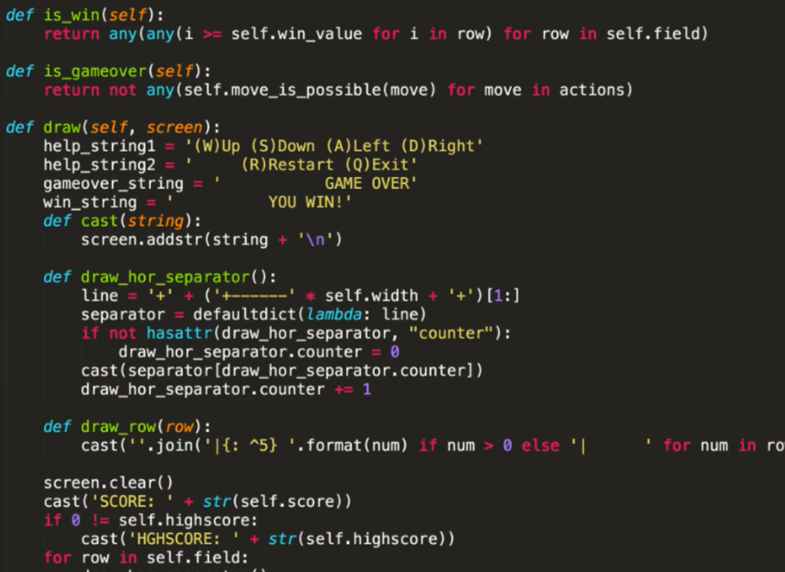

如果是个初学者，或者没什么代码基础的看到上面这段代码，第一反应是啥？
`色彩丰富`？这堆代码就这么堆叠在一起，既不美观也影响阅读。甚至阅读你个代码还要看个说明书。

我们再看下面这端代码：

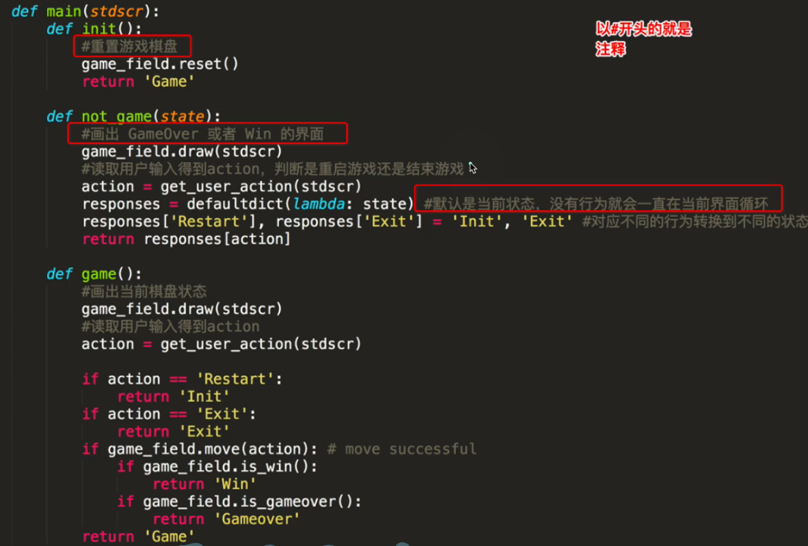

代码整洁，十分潇洒。中间穿插注释，即使是初学者也能大体理解代码的功能。


单行注释：
```py
# 注释内容
```
> 在注释符号和注释内容中要加空格。行业标准 在Pycharm中可以使用快捷键 `Ctrl+/`

多行注释：
```py
'''
    多行注释
    多行注释
    多行注释
    多行注释
'''

"""
    多行注释
    多行注释
    多行注释
    多行注释
"""
```
---

### 变量

#### 命名规范

**变量命名**
标识符命名规则的Python中定义各种名字的时候的统一规范，具体如下：
  - 由数字、字母、下划线组成
  - 不能使用数字开头
  - 不能使用内置关键字
  - 严格区分大小写

**命名习惯**

  - 见名知义 如:`year = 2077`
  - 大驼峰：每个字母首字母大写，如：`MyName`
  - 小驼峰：第二个以后的单词首字母大写，如：`myName`
  - 下划线：如：`my_name`


#### 变量赋值

将值赋给变量：

`变量名 = 值`


```py
name = '张三'
print(name)
```

#### 调试BUG

写一个最简单的小BUG:
```py
name = '张三'
print(Name)
```

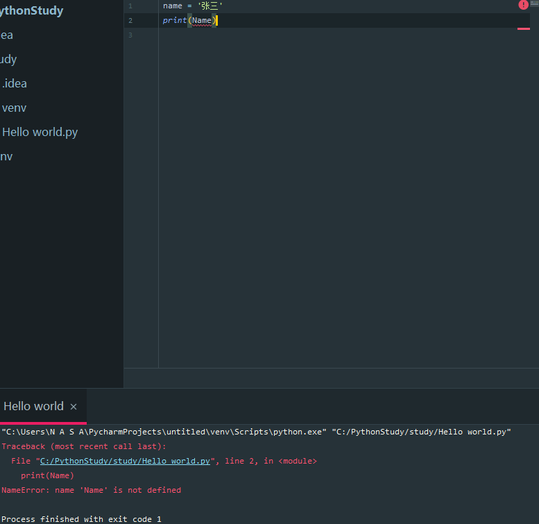

错误信息显示为到变量名 `Name`,尝试阅读错误信息。修复bug。建议整理一个报错集锦方便排错和修复。

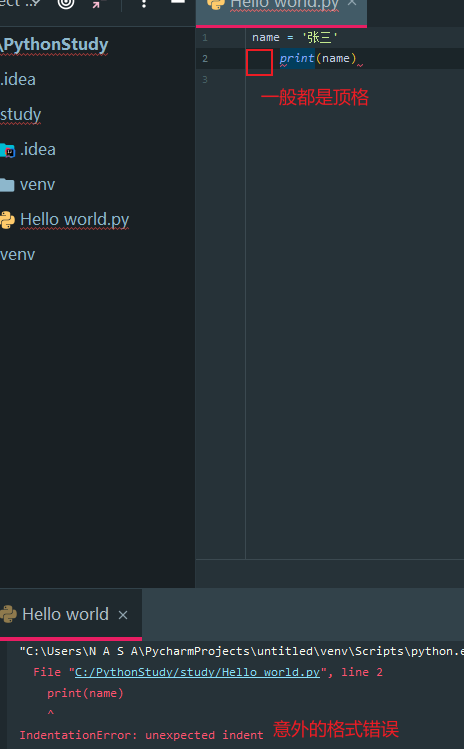

意外的缩进。

在编写的时候，解析器会按照从上到下解析。所以编写时一定要先定义，后调用。


#### Debug工具 调试代码

Debug工具是Pycharm 中的集成工具，在这里程序员可以查看程序的执行细节和流程或者调试BUG。

Debug工具使用步骤：
  1. 打断点

  2. Debug调试

- **打断点**

**添加断点位置**
在需要调试的代码块的第一行，定义一个断点即可.

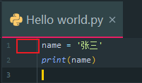

点击红框区域即可添加断点


单击目标代码的行号右侧空白位置。

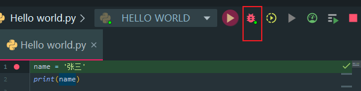
点击这个按钮开始Debug，调试代码。

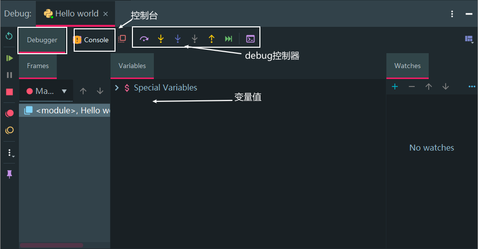

[教学连接](https://blog.csdn.net/u011331731/article/details/72801449/)


### 数据类型

Python中为了应对不同的业务需求，把数据类型分为不同的类型。

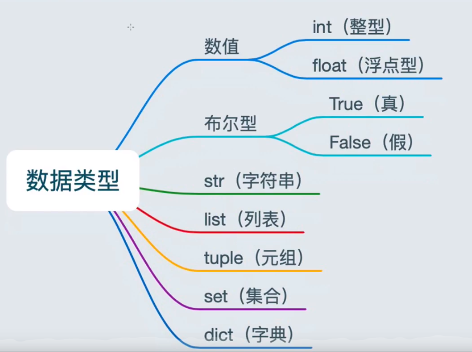


- 数据类型
    - 整型：int
    - 浮点型：float
    - 字符串：str
    - 布尔型：bool
    - 元组：tuple
    - 集合：set
    - 字典：dict


对于定量的类型，Py会定义不同的数据类型。举例：
```py
num1 = 1
num2 = 1.1
print(type(num1))

```
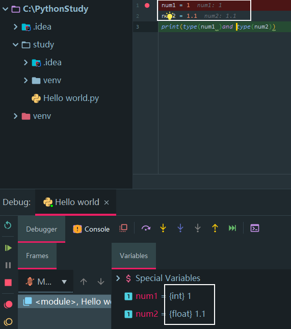

和C++，Java不同，不需要自定义数据类型。简单的数据类型将会被 Py 自动分配。这也是弱类型语言的一种特点。


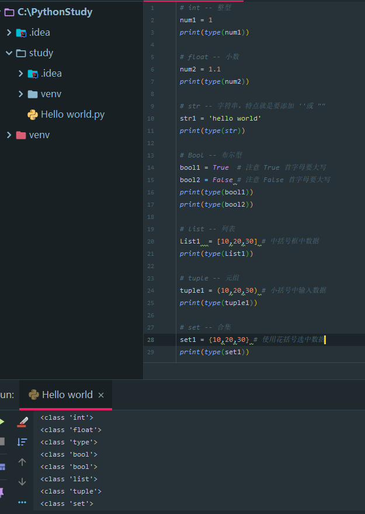


从头认识数据类型，先学前几个，只至于后面的四个 `数据序列` ，再说吧!🐦🐦🐦
先认识认识就行了


```py
# int -- 整型
num1 = 1
print(type(num1))

# float -- 小数
num2 = 1.1
print(type(num2))

# str -- 字符串，特点就是要添加 ''或 ""
str1 = 'hello world'
print(type(str))

# Bool -- 布尔型
bool1 = True  # 注意 True 首字母要大写
bool2 = False # 注意 False 首字母要大写
print(type(bool1))
print(type(bool2))

# list -- 列表
List1  = [10,20,30] # 中括号框中数据
print(type(List1))

# tuple -- 元组
tuple1 = (10,20,30)
print(type(tuple1))

# set -- 合集
set1 = {10,20,30}
print(type(set1))

# dict -- 字典
dict1 = {'name':'TOM','age':18}
print(type(dict1))
```
---

## 输出

将程序输出内容给用户看

```py
print('hellow world')

age = 20
print(age)
```

#### 格式化输出

- **1. 整数的输出**

    |格式化符号|进制|举例|结果|
    |---|---|---|---|
    |%o|八进制|`print('%o' % 20)`|24|
    |%d|十进制|`print('%d' % 20)`|20|
    |%x|十六进制|`print('%d' % 20)`|14|

- **2. 浮点数输出**

    |格式化符号|含义|应用|举例|结果|
    |---|---|-|---|---|
    |%f|保留小数点后面六位有效数字|`%.3f` 保留3位小数位|`print('%f' % 1.11)`|1.110000|
    |%e|保留小数点后面六位有效数字，指数形式输出|`%.3e` 保留3位小数位，使用科学计数法 `1.110e+00`|`print('%e' % 1.11)`|1.110000e+00
    |%g|在保证六位有效数字的前提下，使用小数方式，否则使用科学计数法|`%.3g` 保留3位有效数字，使用小数或科学计数法 1.1e+03|`print('%g' % 1111.1111)`|1111.11


- **3.内置round()**

        round(number[, ndigits])
    > 参数：
    number - 这是一个数字表达式。
    ndigits - 表示从小数点到最后四舍五入的位数。默认值为0。
    返回值
    该方法返回x的小数点舍入为n位数后的值。

```py
round(1.1125)  # 四舍五入，不指定位数，取整
1

round(1.1135,3)  # 取3位小数，由于3为奇数，则向下“舍”
1.113

round(2.675,2)  # 无法理解
2.67
```


- **4.字符串输出**

`%s`

        %10s——右对齐，占位符10位
        %-10s——左对齐，占位符10位
        %.2s——截取2位字符串
        %10.2s——10位占位符，截取两位字符串
    ```py
    1 >>> print('%s' % 'hello world')  # 字符串输出
    2 hello world
    3 >>> print('%20s' % 'hello world')  # 右对齐，取20位，不够则补位
    4          hello world
    5 >>> print('%-20s' % 'hello world')  # 左对齐，取20位，不够则补位
    6 hello world
    7 >>> print('%.2s' % 'hello world')  # 取2位
    8 he
    9 >>> print('%10.2s' % 'hello world')  # 右对齐，取2位
    10         he
    11 >>> print('%-10.2s' % 'hello world')  # 左对齐，取2位
    12 he
    ```


- **5.字符串格式代码如下**

    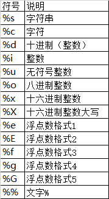


- **6.常用转义字符如下**

    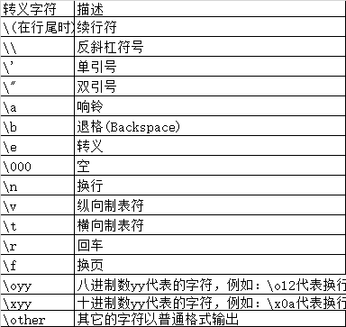


### 转义字符

  - `\n`: 换行。
     ```py
     print("hello\nworld")


    hello
    world
     ```


  - `\t`: 制表符，一个Tab键(4个空格)的距离。
    ```py
    print("hello\tworld")

    hello	world # 四个空格
    ```

### 结束字符

```py
print('hello',end="\n" )
```
在Python 中 ，`print` 自带结束 `end="\n" ` 符号，导致两个 `print` 之间会直接换行展示 ，也可以使用 `end` 自定义更改结束符。

`end` 可以使用转义符做结束符号，也可以用任意字符串做结束符号。


### 总结

  - 输出。
  - 格式化输出。
  - 转义和结束字符。


---


## 输入

在 Python 中，遇到需要接收用户输入的数据的功能。即是获取输入的数值。

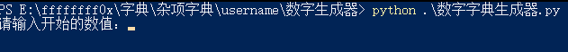

**语法**

    input("提示信息")


**特点**

  - 当程序执行到 `input` 后，等待用户输入，输入`完成之后`才继续向下执行。
  - 在 Python 中， `input` 接受用户输入后，一般会存储到变量，方便用户使用。
  - 在 Python 中， `input` 会把接受到的任意用户输入的数据都当作`字符串(str)`处理

> 也就是说 ，当接受到的用户信息要当场int型要强制转换。

**演示**

```py
in1=input("输入信息")
print(in1)
```
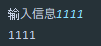


**转换数据类型**

转换数据类型的函数
|函数|说明|
|-|-|
|常见函数||
|int(x[base])|将X转换成一个整数|
|float(X)|将X转换成一个浮点数|
|str(x)|将对象X转换为字符串|
|eval(str)|用于计算在字符串中的有效python表达式，并返回一个对象|
|tuple(s)|将序列s转换为一个元组(雪月饼😂)|
|list(s)|将序列s转换为一个列表|
|不常见函数||
|repr(x)||
|chr(x)|将一个整数转换为一个unicode字符|
|ord(x)|将一个字符转换为它的 ASCll 整数值|
|complex(real[,imag])|创建一个复数，real为实部，imag为虚部|
|hex(x)|将一个整数转换为一个十六进制字符串|

写法基本一致：
```py
int(numb1)
```

以一个数字字典生成器为例：

```py

start = int(input("请输入开始的数值："))
end = int(input("请输入结束的数值："))
num = int(input("请输入生成的位数："))
path = str(start)+"到"+str(end)+"的"+str(num)+"位数字典.txt"#输出的字典名

for i in range(start,end+1):   # 生成从start到end的字典
    s = str(i).zfill(num)         #生成六位数的字典
    with open(path,"a") as f:  #打开文件
        f.write(str(s) + "\n")    #写入文件
        f.close()
```

示例：
  1. int() -- 将数据转换成` int `型
  ```py
  int(nmb)
  ```
  2. str() -- 将数据转换成字符串型
  ```py
  print(type(str(numb1)))
  ```
  3. tuple() -- 将一个序列转换成元组
  ```py
  list1=[10,20,30]
  print(tuple(list1))
  ```
  4. list() -- 将一个序列转换成列表
  ```py
  t1=(100，200，300)
  print(list(t1))
  ```
  5. eval() -- 自动发现数据中的有效` python `表达式，并返回一个对象。
  ```py
  num=1
  eval(num)

  # 自动转换为int
  ```
---

## 运算符的分类

  - 算数运算符
  - 赋值运算符
  - 复合赋值运算符
  - 比较运算符
  - 逻辑运算符


  **算数运算符**
  |运算符|描述|实例|
  |-|-|-|
  |+|加|1+1=2|
  |-|减|1-1=0|
  |* |乘| 2*2=4|
  |/|除|10/2=5.0|
  |//|整除|9//2=4|
  |%|取余|9%4=1|
  |** |指数| 2**4=16，即 `2*2*2*2` 2的4次方|
  |()|小括号|小括号由于提高运算优先级。`(1+2)*3=9`|

  > 整数不管是否是 `float` 相除，得到的都是 `float` 型。

  **赋值运算符**
  |运算符|描述|实例|
  |-|-|-|
  |=|赋值|将 `=` 右侧的结果赋值给等号左侧的变量


  - 单个变量赋值
    ```py
    num=1
    print(num)
    ```

  - 多个变量赋值
    ```py
    num1,num2,num3=1,2.0,'hello world'
    ```

  - 多个变量赋相同值
      ```py
      a=b=2
      ```


  **比较运算符**

  |运算符|描述|实例|
  |-|-|-|
  |==|判断相等。如果两个操作数的结果相等，则条件结果为 `true` ,否则条件结果为假 `false`|如 a=3,b=3,则(a==b)为 `True`|
  |!=|不等于两个条件的结果不相等，则条件为真 `True` 否则条件为假 `False`|如：a=3,b=3 则(a==b)为 `True`如a=1,b=3,则(a!=b)为`True`|
  |>|大于 |a=7,b=3,a>b true|
|<|小于|a=7,b=3,a>b false|
|>=|大于等于|a=7,b=7,a>=b true|
|<=|小于等于|a=7,b=3,a<=b false|


  **逻辑运算符**

  |运算符|逻辑表达式|描述|实例|简述
  |-|-|-|-|-|
  |and|x adn y |布尔'与'：如果X为false，x and y 返回 false 否则它返回 `y` 的值。 | True and false 返回false|都真才真，有假则假
  |or|x or y|布尔 '或' ：如果x是True，则它返回 `true` ,否则他返回 `y`的值|  True and false 返回 true|一真则真，都假才假
  |not | not x| 布尔 '非' 如果x为true 则返回 `false` 如果为 false 则返回 true| no true 返回 false ，not false 返回 true|取反

  示例：
  ```py
  a=1
  b=2
  c=3
  print((a<b)and (b<c)) # True
  print((a>b)and(b<c))  # False
  print((a>b)or(b<c))   # True
  print(not(a>b))       # True
  ```


### 总结

  - 算数运算符的优先级
    - 混合运算优先级顺序：`()` 高于 `**` 高于 `* / // %` 高于 `+ -`
  - 赋值运算符
    - =
  - 复合赋值运算符
    - +=
    - -=
    - 优先级
      1. 先算复合赋值运算符右侧的表达式
      2. 再算复合赋值运算的算数运算
      3. 最后算赋值运算
  - 比较运算符
    -  判断相等： ==
    -  大于等于： >=
    -  小于等于： <=
    -  不等于： !=
  - 逻辑运算符
    - 与： and
    - 或： or
    - 非： not

---

### if 语句

  - if 语句作用
  - if 语法
  - if...else...
  - 多重判断
  - if 嵌套


**if语句**

  if语句示例:
  ```py
  if(判断语句):
    # 条件成立执行的代码 
    # 注意上方的缩进对齐
  ```
  示例
  ```py
    a=1
    if(a!=1):
      print('a!=1')

print ('这行与if无关')
  ```


**if...else...**

  > 作用：条件成立执行 if 语句，条件不成立执行 else 部分语句。

  if...else...语法
  ```py
  if 条件 ：
      条件成立执行的代码
  else：
      条件不成立执行的代码
  ```


  **实例**
  ```py
  """
  1.用户输入 注意input的是str型，要进行数据类型转换才能做判断！
  2.if判断
  3.输入
  """

  in1 = int(input("输入年龄"))
  if in1>=18:
      print('年龄大于18，您已成年！')
  else:
      print('未成年，给👴爬！')
  print(f'您输入的年龄是{in1}')# 无论是否成立，这段输出语句都会执行
  ```

  **多重判断**

  语法：
  ```py
  if 条件1：
      条件成立执行的代码
  elif 条件2：
      条件不成立执行的代码
  ......
  else:
    以上条件都不成立执行的代码
  ```

**示例**
> 工作年龄判断
```py
in1 = int(input("输入年龄"))
if in1>=18 and in1<=60:
    print('快去干活！')
elif in1<18:
    print('未成年！')
else:
    print('退休！')
print(f'您输入的年龄是{in1}')

```

 **if 嵌套**

  语法:
  ```py
  if 条件1:
     条件成立执行的代码1
     条件成立执行的代码2

      if 条件2：
          条件成立执行的代码1
          条件成立执行的代码2
  ```

  **示例**

  ```py
  in1 = int(input("带了多少钱?"))
  if in1 !=0:
      print('土豪，gkd')
      in2 = int(input('有多少个空座'))
      if in2 != 0:
          print('有座，gkd')
      else:
          print('还是爬吧')
  else:
      print('兄弟，没带钱你就跟着后面爬，爬快点')
  ```

---

### 随机数

  导出 `random` 模块
  `imprt 模块名`

  使用 random 模块中的随机整数功能
  `random,randint(开始，结束)`

  示例:
  `random,randint(0,8)`

  **示例**
> 做一个剪刀石头布的游戏奥:
  ```py
  import random
  compile1 = random.randint(0,2) # 出拳
  print(compile1) # 打印
  player =int(input('请出拳： 0--石头；1--剪刀；2--布')) # 获取玩家出拳
  if((player==0) and (compile1==1)) or ((player==1) and (compile1==2)) or ((player==2)
  and (compile1==0)): # 判断
      print('玩家获胜')
  elif player==compile1: # 平局
      print('平局 爬~')
  else: # 就这？
      print('就这¿')
  ```


### 三目运算符

三目运算符也叫三元运算符，或三元表达式。

条件成立的表达式 `if` 条件 `else` 条件不成立执行的表达式。

语法:
```py
条件成立的表达式 if 条件 else 件不成立执行的表达式。
```

**示例**
```py
a = 1
b = 2
c = a if a > b else b
print(c)
```

### 总结

- if 语句语法
  ```py
  if 条件
      条件成立执行语句
  ```

- if...else...
  ```py
  if 条件:
    条件成立执行的代码
  else：
    条件2成立执行的代码
  ```

- 多重判断
  ```py
  if 条件1:
    条件1成立执行代码
  elif 条件:
    条件2成立执行的代码
  else:
    条件都不成立的代码
  ```
- if 嵌套
  ```py
  if 条件:
    条件1成立执行的代码
    if 条件2:
      条件2成立执行的代码
  ```
- 三目运算符
  ```py
  条件成立的表达式 if 条件 else 件不成立执行的表达式。
  ```


---

## 循环

- 了解循环
- while语法
- while应用
- break和continue
- while循环嵌套
- for循环

  **循环分类**
  在 Python 中，循环分为 `while` 和 `for` 两种，最终实现效果相同。


 ### while的语法
  ```py
  while 条件:
    条件成立重复执行的代码1
    条件成立重复执行的代码2
  ```

**示例**

  ```py
  a = 5
  c = 0
  while c <= a:
      print('c')
      c += 1
  ```

  **拓展**

  配合多重判断可以写一个如果你输了就不会退出的猜拳游戏
  ```py
  a = 1
  c = 0
  while c < a:
      import random

      compile1 = random.randint(0, 2)  # 出拳
      print(compile1)  # 打印
      player = int(input('请出拳： 0--石头；1--剪刀；2--布'))  # 获取玩家出拳
      if ((player == 0) and (compile1 == 1)) or ((player == 1) and (compile1 == 2)) or ((player == 2) and (compile1 == 0)):  # 判断
          print('玩家获胜')
          c = 2
      elif player == compile1:  # 平局
          print('平局 爬~')
      else:  # 就这？
          print('就这¿')

  ```

  **while 应用**
  计算1-100累计
  ```py
  a = 1
  c = 0
  while a <= 100:
      c += a
      a += 1
      print(c)
  print(c)
  ```

  使用 if 嵌套运算 100 以内偶数相加
  ```py
  while 条件:
    条件成立重复执行的代码1
    条件成立重复执行的代码2
  ```

 **`break` 和 `continue`**

  `break` 和 `continue` 是循环中满足一定条件退出循环的

  **break**
> 在 break 后跳出判断，结束循环

  ```py
  i = 1
  while i <= 6 :
      if i == 3:
          print(f'第{i}个 停止')
          break
      print(f'第{i}个')
      i += 1
  '''
  输出：
  第1个
  第2个
  第3个 停止
  ···
  ```

 **continue**

> 在continue 后 跳出当此循环判断，执行下一次循环

```py
i = 1
while i <= 6 :
    if i == 3:
        print(f'第{i}个 停止')
        i += 1
        continue
    print(f'第{i}个')
    i += 1

'''
输出:
第1个
第2个
第3个 停止
第4个
第5个
第6个
'''
```

**while 循环嵌套**

  语法：
  ```py
  while 条件:
    条件成立重复执行的代码1
    条件成立重复执行的代码2
      while 条件:
      条件成立重复执行的代码1
      条件成立重复执行的代码2
  ```

  **示例**
  使用 `while` 循环三次打印100个数相加.
  ```PY
  b = 0
  while b < 3:
      a = 1
      c = 0
      while a <= 100:
            c += a
            a += 1
            print(c)
      print('分割输出-------------------------')
      b += 1
  print('循环三次结束')
  ```


  **while 循环嵌套应用**

  输出一行 6个星星，重复打印6行
  ```py
  a = 0
  while a <=6  :
      i = 0
      while i <= 6 :
          print('*', end='')
          i += 1
      print()
      a += 1
  ```

  **99乘法表**

  ```py
  '''
  1. 打印表达式
  2.打印多个表达式  不换行中一个表达式不换行
  3，控制打印多个表达式 一行表达式 -- 换行
  '''
  a = 1
  while a <= 9:
      i = 1
      while i <= a:
          print(f' {i}*{a}={i*a} ', end='')
          i += 1
      print()
      a += 1

  ```

  **for循环**

  语法：
  ```py
  for 临时变量 in 序列
    重复执行代码1
    重复执行代码2
  ```

  **示例**

> 重复打印字符串

  ```py
  str1= '123123'
  for i in str1:
      print(i)

  '''
  输出结果
    1
    2
    3
    1
    2
    3
  '''
  ```

**循环使用 else 语句**

  ```py
  #!/usr/bin/python
  # -*- coding: UTF-8 -*-

  for num in range(10,20):  # 迭代 10 到 20 之间的数字
    for i in range(2,num): # 根据因子迭代
        if num%i == 0:      # 确定第一个因子
          j=num/i          # 计算第二个因子
          print '%d 等于 %d * %d' % (num,i,j)
          break            # 跳出当前循环
    else:                  # 循环的 else 部分
        print num, '是一个质数'
  ```

  当使用数据或数组去控制 `for` 循环时，使用:
  `range(开始,结束)` 函数。 控制开始和结束

  如果需要在其中某位截止。可以在循环中嵌套一个 `for` 或者一个 `if`

  **break**
  使用 `if` 嵌套一个值后进行判断，遇到某值后执行 `break`  在嵌套时一定要注意回车对齐
  ```py
  str1 = '123123'
  for i in str1:
      if i == '3':
          print(f'遇到{i}停止打印')
          break
      print(i)
      '''
      输出结果：
      1
      2
      遇到3停止打印
      '''
  ```


  **continue**
  使用 `if` 嵌套一个值后进行判断，遇到某值后执行 `continue`  在嵌套时一定要注意回车对齐
  ```py
  str1 = '123123'
  for i in str1:
      if i == '3':
          print(f'遇到{i}不打印')
          continue
      print(i)

      '''
      输出结果
      1
      2
      遇到3不打印
      1
      2
      遇到3不打印
      '''
  ```

### else

#### while...else

  将要循环正常结束后要执行的代码写入 `else` 中

  **语法**
  ```py
  while 条件:
    条件成立重复执行的代码
  else：
    循环正常结束后要执行的代码
  ```

  **示例**
  ```py
  a = 1
  c = 0
  while a <= 100:
      c += a
      a += 1
      print(c)
  else:
      print('完成')
  ```


#### while...else和break、continue


  **break**
  ```py
  while 条件:
      循环语句
      if 条件:
      执行语句
      break
  else:
      循环正常结束后要执行的代码
  ```
  当使用 `break` 后,会`中止`循环和后续循环正常结束后要执行的代码

  **示例**
  ```py
  a = 1
  c = 0
  while a <= 5:
      if a == 4:
          print('中止')
          break
      c += a
      a += 1
      print(c)

  else:
      print('完成')
  '''
  输出：
    1
    3
    6
    中止
  '''
  ```

会发现并没有执行后面的完成。

**continue**
  ```py

  ```


  **示例**
  ```py
  a = 1
  c = 0
  while a <= 5:
      if a == 4:
          print('中止')
          a += 1
          continue
      c += a
      a += 1
      print(c)

  else:
      print('完成')
  '''
  输出结果：
  1
  3
  6
  中止
  11
  完成
  '''
  ```

#### for...else和break、continue

同上，略🙃略略略


### 总结

循环代码的控制和语法

- while 语法
  ```py
  while 条件:
    条件成立重复执行的代码1
    条件成立重复执行的代码2
  ```
- while 循环嵌套语法
  ```py
  while 条件:
    条件成立重复执行的代码1
    条件成立重复执行的代码2
      while 条件:
      条件成立重复执行的代码1
      条件成立重复执行的代码2
  ```
- for 循环语法
  ```py
  for 临时变量 in 序列
    重复执行代码1
    重复执行代码2
  ```
- `break` 退出整个循环
- `continue` 退出本次循环，继续执行下一次重复执行的代码
- `else`
    - while 和 for 都可以配合使用 else
    - else 下方缩进的代码含义:当循环正常结束后执行的代码
    - break 中止循环不会执行else 下方缩进的代码
    - continue 退出循环的方法并执行 else 下方缩进的代码

---

## 字符串

类型为 `str` 最常见的数据类型

```py
a = '这就是字符串'
```

  **输出**

在字符串输出时，可以使用
  ```py
  name = tom
  print('我的名字是%s' % name)
  print(f'我的名字是{name}')
  ```

  **下标**
  字符串 `下标` ，又叫 `索引` ，即编号。比如火车座位号，方便快速找到对应的位置。下标也是如此，通过下标快速找到对应的数据。

  `这些数据会从0开始顺序分配一个编号` -- 使用这个编号可以精确的找到某个字符数据 -- 使用下标或索引或索引值
  ```py
  # str[下标]
  str(1q2w3e4r5t)
  print(str[0])
  '''
  输出值
  1
  '''
  ```

  **切片**
  对字符串进行截取，只截取其中一部分。
  其中，`字符串,列表,元组`都支持切片操作

    语法：
    ```py
    序列[开始位置的下标:结束位置下标:步长]
    ```

    不包含结束位置下标对应的数据，正负整数均可
    步长是选取间隔，正负整数均可，默认步长为1.

  **示例**

  ```py
  a = '012345678'
  print(a[2:8:2])

  '''
  输出结果：
  246
  '''
  ```


  **使用负数**
  不能选取出数据:从 -2开始到-1结束，选取方向为从左向右。但是-1是负数：从右向左选取

  ```py
  a = '012345678'
  print(a[-2:-8:-2])
  '''
  输出结果：
  753
  '''
  ```

 #### 常用操作方法

  字符串的常用操作方法有 查找、修改和判断三大类

  - **查找**
    所谓字符串查找方法即是查找字串在字符串中的位置或`出现的次数`。
    find(): 检测某个字符串是否包含在这个字符串中，如果在返回这个字串开始的位置下标，否则则返回 `-1`
       **find 语法**
      `字符串序列.find(子串，开始位置下标，结束位置下标)`
      > 注意: 开始和结束位置下标可以省略，表示在整个字符串序列中查找。

      ```py
      str=aaand11111and
      print(str.find('and', 2, 10))
      '''
      输出结果：
      3
      '''
      str=aaand11111and
      print(str.find('ssandss', 2, 10))
      '''
      输出结果：
      -1
      '''
      ```

      **rfind 语法**
    > 注意: `rfind` 指从字符串右侧开始寻找。
      书写方式相同。

 -  **修改**

      **replace() 替换**
      **1. 语法**
      `字符串序列.replace(旧字符串,新字符串,替换次数)`
    > 注意:替换次数如果查出字串出现次数，则替换次数为该字串出现次数。

      **示例**
      ```py
      str = "aa and11111and"
      new_str=str.replace('and', 'a')
      print(str)
      print(new_str)
      '''
      输出结果：
      aa and11111and
      aa a11111a
      '''
      ```

  - **分割**
  `split()` -- 分割，返回一个列表

      **语法**
      ```py
      字符串序列.split(分割字符串,分割次数)
      ```
      > 注意: num表示的是分割字符出现的次数，即将来返回数据个数为 `num+1` 个.

      **示例**
      ```py
      str = "aa and11111and"
      new_str=str.split('and')
      print(str)
      print(new_str)

      '''
      输出结果：
      aa and11111and
      ['aa ', '11111', '']
      '''
      ```
      分割数据后会变成一个列表，并且丢失分割字符。

  - **合并**
    `join()` -- 合并列表里的字符串数据为一个大字符串

    **语法**mystr = 'hello'
mystr.ljust(10,'.')
'hello.....'
    print(net_list)

    '''
    输出结果：
    aa..bb..cc
    '''
    ```

- **大小写转换**

  - 大写
    `capitalize()`：将字符串第一个字符转换成大写，其他的字符全部小写。
    `title()`: 将字符串每个单词的首字母都转换成大写。
  - 小写
    `lower()`:将字符串中大写转小写。
    `upper()`:将字符串中小学转大写。

- **删除空白字符**

  - `lstrip()`:删除字符串左侧空白字符
  - `rstrip()`:删除字符串右侧空白字符
  - `strip()`: 删除字符串两侧的空白字符

- **字符串对齐**
  - `ljust`:返回一个原字符串左对齐，并使用指定字符(默认为空格)填充至对应长度的新字符串。
    语法:`字符串序列.ljust(长度，填充字符)`

    **示例**
    ```py
    mystr = 'hello'
    mystr.ljust(10,'.')

    输出结果为：'hello.....'
    ```
    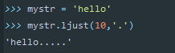

  - `rjust`:返回一个原字符串右对齐，并使用指定字符(默认空格)填充至对应长度的新字符串，语法和` ljust `相同
  - `center()`:返回一个原字符串居中对齐，并使用指定字符(默认空格)填充至对应长度的新字符串，语法和` ljust `相同

  - **判断**
    - startswith()：检查字符串是否是以规定的字符串`开头`，是则返回 `True` ，否则返回 `False`.
      语法：
      `字符串序列.startswitch(字串，开始位置下标，结束位置下标)`
    - endswitch(): 检查字符串是否是以规定的字符串`结尾`，是则返回 `True` ，否则返回 `False`.
    - isalpha(): 如果字符串`至少有一个字符并且所有字符都是字母`则返回 `True` ，否则返回 `False`。
    - isdigit():如果字符串`只包含数字`，则返回 `True` 否则 返回 `False`.
    - isalnum():如果字符串`至少有一个字符`并且所有`字符都是字母或数字`，则返回 `True`，否则返回`false`
    - isspace():如果字符串中只包含空白，则返回 `true` ,否则返回 `false`

### 总结
  - 下标
    - 计算机为数据序列中每一个元素分配的从0开始的编号
  - 切片
    - `序列名[开始位置下标:结束位置下标：步长]`
  - 常用操作方法
    - find()
    - index()

### 拓展

python一句话开启http服务

```
python -m http.server 80
```

python中 pip安装出错时

```bash
ERROR: pip's dependency resolver does not currently take into account all the packages that are installed. This behaviour is the source of the following dependency conflicts.
impacket 0.9.23.dev1+20210517.123049.a0612f00 requires ldap3!=2.5.0,!=2.5.2,!=2.6,>=2.5, which is not installed.
impacket 0.9.23.dev1+20210517.123049.a0612f00 requires ldapdomaindump>=0.9.0, which is not installed.


# 单独安装其中的环境即可
python3 -m pip install ldap3 -i https://pypi.doubanio.com/simple

python3 -m pip install ldapdomaindump -i https://pypi.doubanio.com/simple

```
