# Python - 列表与元组

- [学习来源](https://www.bilibili.com/video/BV1o4411M71o?p=1)

<p align="center">
    
</p>

<p align="center">👴 Its a long road to hell without no soul</p>
<p align="center"><a href="http://music.163.com/song?id=27713944&userid=262256866"><font>《Long Road to Hell》</font></a> </p>
<p align="center">专辑：True</p>
<p align="center">歌手：Avicii / Audra Mae</p>

## 列表

  ### 目录
  - 列表的应用场景
  - 列表的格式
  - 列表的常用操作
  - 列表的循环遍历
  - 列表的嵌套使用

  ### 列表的格式
  - 列表
      可以一次性存储多个数据。
  - 格式
      `[数据1，数据2，数据3...]`
      列表可以一次型存储多个数据，且可以为不同数据类型。
      尽量一个列表存储相同的数据类型，方便后期数据控制。

  #### 查找

  **下标**
  使用下标查找数据的方法和在字符串中查找数据写法相似。
  示例：
  ```py
  list1 = ['aa','bb','cc']
  print(list1[0]) # aa
  print(list1[1]) # bb
  print(list1[2]) # cc
  ```

  **函数**
  语法:
  `列表序列.index(数据，开始位置下标，结束位置下标)`
  `list.index('aa',0,2)`
  示例：
  ```py
  list1 = ['aa', 'bb', 'cc']
  print(list1.index('aa'))
  ```

  **判断是否存在**

  **语法**
  判断指定数据在某个列表序列，如果在则返回 `True` ,否则返回 `False`

  ```py
  list = ['aa','bb','cc']
  print('aa') in list
  '''
  结果为TRUE
  '''
  ```

  **示例**
  判断用户输入的名字是否存在：
  ```py
  list = ['aa', 'bb', 'cc']
  name = input('name:')
  if name in list:
      print(f'名字已经存在{name}')
  else:
      print(f'名字不存在{name}')

  '''
  输出结果：
  名字不存在2w21
  或者
  名字已存在aa
  '''
  ```

  ### 添加

  > 增加指定数据到列表中

  - **append()**
  **语法**
  `列表序列.append(数据)`

  **示例**
  ```py
  list = ['aa', 'bb', 'cc']
  name = input('name:')
  list.append(name)
  print(list)
  ```
  添加一个数据到列表中。
  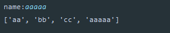

  也可以添加一组数据到列表结尾:
  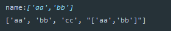


  - **extend()**

  **语法**
  `列表序列.extend()`
  可以追加整个序列到列表中。

  **示例**
  ```py
  list = ['aa', 'bb', 'cc']
  # list.extend(name)
  list.extend(['aaa','bbb'])
  print(list)
  ```
  结果:
  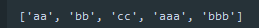

  - **insert()**
  > 指定任意位置去添加数据。
    **语法**
    `列表序列.insert(位置下标,数据)`

    **示例**
    ```PY
    list = ['aa', 'bb', 'cc']
    name = input('name:')
    list.insert(1,name)
    print(list)
    '''
    输出结果
    ['aa', 'aaaa', 'bb', 'cc']
    '''
    ```
  

  ### 删除

  - **del**
  **语法**
  `del 目标`

    - **删除整个列表**
    ```py
    list = ['aa', 'bb', 'cc']
    del list[0]
    print(list)

    # 结果:报错提示 NameError: name 'list1' is not defined
    ```

    - **删除指定数据**
    指出对应下标数据
    ```py
    list = ['aa', 'bb', 'cc']
    del list[0]
    print(list)
    ```
    

    - **pop()**
    > 删除对应下标的数据，如果不指定下标，则默认删除最后一个数据。
    >>无论是按照下标删除还是默认删除最后一个，pop函数都会返回这个被删除的函数的数据。而不是像`del()` 一样报错。

      **语法**
      `数据序列.pop(下标)`

      示例
      ```py
      list1 = ['aa', 'bb', 'cc']
      list1.pop(1)
      print(list1)

      # 输出结果: ['aa', 'cc']
      ```

  - **remove()**
  删除指定数据，而不是删除下标位置的数据。
    **语法**
    `list.remove('数据名')`

    **示例**
    ```py
    list1 = ['aa', 'bb', 'cc']
    name = input('name:')
    list1.remove(name)
    print(list1)
    ```
  

  - **clear()**
    清空列表数据。

    **语法**
    `列表名称.clear()`

    **示例**
    ```py
    list1 = ['aa', 'bb', 'cc']
    list1.clear()
    print(list1)
    '''
    输出结果
    []
    '''
    ```

### 修改数据
  修改指定下标数据
  **语法**
  `数据列表[下标数] = 修改的数据`
  直接赋值给对应下标数据即可
  ```py
  list1 = ['aa', 'bb', 'cc']
  name = input('name:')
  list1[0]=name
  print(list1)
  ```
  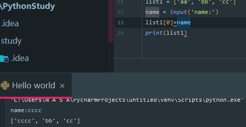

###  **倒置数据**
    - **reverse()**
    **语法**
    `列表名.reverse()`
    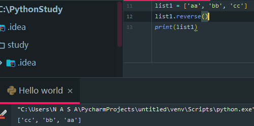

- **排序**
  - 排序规则：
     -  `reverse = TRUE` 则为降序
     -  `reverse = False` 为升序 (默认)
    **语法**
    `列表序列.sort(key=None,reverse=False)`

    **示例**
    ```py
    list1 = [1,2,3,4,5,6,7,8]
    list1.sort(reverse=True)
    print(list1)
    ```
    

- **复制**
  一般涉及到数据的修改，删除时，经常会用到copy，将数据先备份一遍后在做修改。
  - **语法**
    - `列表序列.copy()`
    **示例**
    ```py
    list1 = [1,2,3,4,5,6,7,8]
    list1.sort(reverse=True)
    print(list1)
    ```

###  **列表的循环遍历**
  - **while**
    如:依次打印或控制列表中的各个数据。
    **示例**
    ```py
    list1 = [1, 2, 3, 4, 5, 6, 7, 8]
    i = 0
    while i < len(list1): # len(列表名)即是判断列表中有几个数据，从1开始。
        print(list1[i])
        i += 1
    ```
      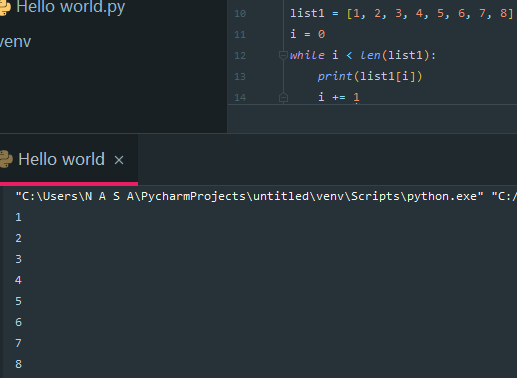

    如果控制输出为其他函数即可按序进行操作。

  - **for**
    - 使用变量遍历所有数据。
    **示例**
    ```py
    list1 = [1, 2, 3, 4, 5, 6, 7, 8]
    for i in list1:
      print(i)
    ```
      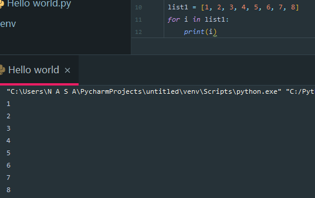

### 列表嵌套
  **所谓的列表嵌套就是一个个列表中包含了其他的子列表。**
    比如，要同时存储三个班级的学生新名，班级等等。
    如何查找数据
    `list1=[['a','b','c'],['aa','bb','cc'],['aaa','bbb','ccc']]`

  在大列表中包含几个子列表
  此时获取数据的下标为0的数(第一个数组)
  ```py
  list1=[['a','b','c'],['aa','bb','cc'],['aaa','bbb','ccc']]
  print(list1[0])
  '''
  输出值:
  ['a', 'b', 'c']
  '''
  ```

  此时尝试获取数据b：
  ```py
  list1 = [['a', 'b', 'c'], ['aa', 'bb', 'cc'], ['aaa', 'bbb', 'ccc']]
  print(list1[0][1])
  ```

  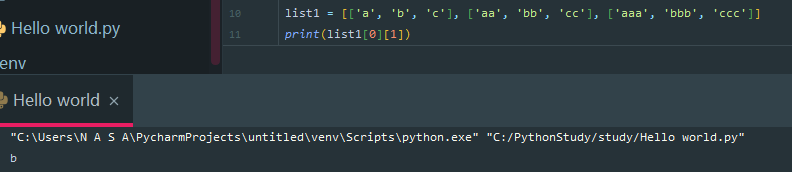

  此时获取到的就是 `b` 的值.

### 随机分配
  需求:随机将 `8个数` 分配给 `3个字母` 中。

  分析实例
  步骤：
   1. 准备数据
      1. 8个数    -- 列表
      2. 3个字母  -- 列表
   2. 分配数到字母
      1. 随机分配
      2. 将数字写入到字母列表中
   3. 验证是否分配成功
      1. 打印每个字母和数字


  ```py
  import random # 引入随机数

  # 1. 准备数据
  list1 = [[], [], []]
  list2 = [1 , 2 , 3 , 4 , 5 , 6 , 7 , 8]

  # 2. 随机分配数据到指定列表
  for str in list2:
      # 列表追加数据 -- append()
      # xxx[0] -- 不能指定是具体某个下标时，使用随机
      num = random.randint(0,2)
      list1[num].append(str)
  print(list1)

  # 3. 验证是否分配成功 -- 打印所有列表中的数据
  for str1 in list1:
      print(f'第一个列表中存在数字{str1},个数是{len(str1)}')


  '''
  输出结果:
  [[1, 4, 6], [2, 3], [5, 7, 8]]
  第一个列表中存在数字[1, 4, 6],个数是3
  第一个列表中存在数字[2, 3],个数是2
  第一个列表中存在数字[5, 7, 8],个数是3
  '''
  ```

  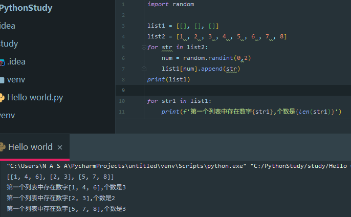

  **拓展**，要在最后分别显示列表中的数据：
  ```py
  import random

  i = 1
  list1 = [[], [], []]
  list2 = [1 , 2 , 3 , 4 , 5 , 6 , 7 , 8]
  for str in list2:
      num = random.randint(0,2)
      list1[num].append(str)

  print(list1)

  for str1 in list1:
      print(f'第{i}列表中存在数字{str1},个数是{len(str1)}')
      i += 1
      for number in str1:
          print(f'数字分别是{number}')
  ```

  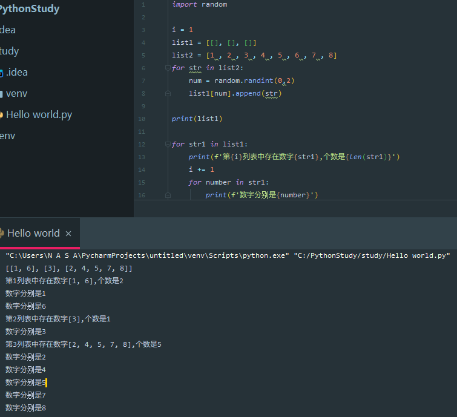

## 总结
  - 列表的格式
    `[数据1，数据2，数据3]`

  - 常用操作方法
    |函数|含义|
    |-|-|
    |index()|查找|
    |len()|个数|
    |append()|添加|
    |pop()|删除下标|
    |remove()|删除指定数据|

  - 列表嵌套
    ```py
    list1 = [['a', 'b', 'c'], ['aa', 'bb', 'cc'], ['aaa', 'bbb', 'ccc']]
    list1[0][1]
    ```

---
## 元组

  - 目标
    - 元组的应用场景
    - 定义元组
    - 元组的常见操作

    ### 元组的应用场景
    思考:如果想要存储多个数据但是这些数据都是不能修改的数据。如何操作?
    列表可以存储多个数据，但是列表中的数据是允许修改的。

    此时天降猛男，一个元组闪亮登场。元组可以存储多个数据，并且元组内的数据是不能修改的。

### 定义元组
  元组的特点:定义元组使用`小括号`，并且使用`逗号`隔开各个数据，数据可以是不同的数据类型.
  ```py
  多个数据元组
  t1 = (1,2,3)
  t2 = ('a' , 'b' , 'c')

  单个数据元组
  t3 = (1,)
  ```
  如果定义的元组只有`一个数据`，那么这个数据后面也要添加`逗号` ,否则数据类型为单个值的数据类型。

  **示例**
  ```py
  t1 = (1,) # tuple
  t2 = (1)  # int
  t3 = ('a')  # str
  t4 = ('a',) # tuple
  print(type(t1))
  print(type(t2))
  print(type(t3))
  print(type(t4))
  ```

  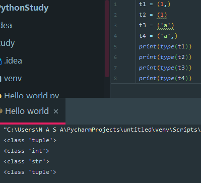

  当数据类型为`tuple`时才算元组。

### 元组的常见操作

  元组数据不支持修改,`只支持查找`。
  示例如下：
  1. **使用下标查找数据**
    ```py
    tuple1 = ('aa','bb','cc')
    print(tuple[0]) # aa
    ```
  2. **使用数据查找下标**
     **index()**
    ```py
    tuple1 = ('a','b','c')
    print(tuple1.index('a')) #0
    ```
  3. **统计某个数据在当前元组出现的次数**
     ```py
    tuple1 = ('a','b','c','a')
    print(tuple1.count('b')) # 2
     ```
  4. **统计元组数据个数**
     ```py
    tuple1 = ('a','b','c')
    print(len(tuple1))  # 3
     ```

  > 一般情况下，`元组`中的数据是无法进行修改的
  **示例**
  ```py
  tuple1 = ('a','b','c')
  tuple1[0] = 'aa'

  '''
  当场报错😂
  '''
  ```

  > 某些情况下的`小括号`中的数据还是可以修改的
  即在元组中嵌套一个列表即可进行数据的修改
  **示例**
  ```py
  tuple1 = ('a','b','c',['aa','bb'])
  print(tuple1)
  tuple1[3][1] = 'cc'
  print(tuple1)
  ```
  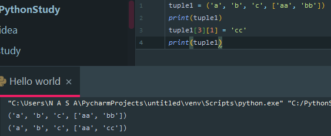

  此时嵌套列表中的数据被修改了。而元组中的还是不行。
  当然要统一数据结构，在元组中的列表尽量还是不要修改的为好。

  ## 总结
  - 元组
    - 定义元组
      ```py
      t1 = (10,20,30)
      t2 = (10,)
      ```
    - 常用操作
      - index()
      - len()

```
Python项目依赖，生成requirements.txt 有两种方法

1、进入需要生成文件的目录，执行 pip freeze > requirements.txt ，此方法会包含环境所有的依赖包。

2、pip install pipreqs

　进入需要生成文件的目录执行： pipreqs ./     (或者直接  pipreqs  D:\test(实际路径））

在此时可能会遇见

UnicodeDecodeError: 'gbk' codec can't decode byte 0x80 in position 776: illegal multibyte sequence

这个错误.

解决方法：指定编码格式      pipreqs ./  --encoding=utf8


如果要安装requirements.txt中的类库内容，那么你可以执行:  pip install -r requirements.txt

```