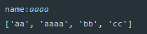
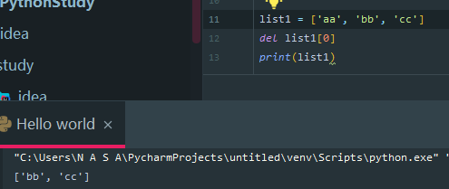

# Python - 列表与元组

- [学习来源](https://www.bilibili.com/video/BV1o4411M71o?p=1)

<p align="center">
    
</p>

<p align="center">👴 Its a long road to hell without no soul</p>
<p align="center"><a href="http://music.163.com/song?id=27713944&userid=262256866"><font>《Long Road to Hell》</font></a> </p>
<p align="center">专辑：True</p>
<p align="center">歌手：Avicii / Audra Mae</p>

## 列表

  ### 目录
  - 列表的应用场景
  - 列表的格式
  - 列表的常用操作
  - 列表的循环遍历
  - 列表的嵌套使用

  ### 列表的格式
  - 列表
      可以一次性存储多个数据。
  - 格式
      `[数据1，数据2，数据3...]`
      列表可以一次型存储多个数据，且可以为不同数据类型。
      尽量一个列表存储相同的数据类型，方便后期数据控制。

  #### 查找

  **下标**
  使用下标查找数据的方法和在字符串中查找数据写法相似。
  示例：
  ```py
  list1 = ['aa','bb','cc']
  print(list1[0]) # aa
  print(list1[1]) # bb
  print(list1[2]) # cc
  ```

  **函数**
  语法:
  `列表序列.index(数据，开始位置下标，结束位置下标)`
  `list.index('aa',0,2)`
  示例：
  ```py
  list1 = ['aa', 'bb', 'cc']
  print(list1.index('aa'))
  ```

  **判断是否存在**

  **语法**
  判断指定数据在某个列表序列，如果在则返回 `True` ,否则返回 `False`

  ```py
  list = ['aa','bb','cc']
  print('aa') in list
  '''
  结果为TRUE
  '''
  ```

  **示例**
  判断用户输入的名字是否存在：
  ```py
  list = ['aa', 'bb', 'cc']
  name = input('name:')
  if name in list:
      print(f'名字已经存在{name}')
  else:
      print(f'名字不存在{name}')

  '''
  输出结果：
  名字不存在2w21
  或者
  名字已存在aa
  '''
  ```

  ### 添加

  > 增加指定数据到列表中

  - **append()**
  **语法**
  `列表序列.append(数据)`

  **示例**
  ```py
  list = ['aa', 'bb', 'cc']
  name = input('name:')
  list.append(name)
  print(list)
  ```
  添加一个数据到列表中。
  

  也可以添加一组数据到列表结尾:
  


  - **extend()**

  **语法**
  `列表序列.extend()`
  可以追加整个序列到列表中。

  **示例**
  ```py
  list = ['aa', 'bb', 'cc']
  # list.extend(name)
  list.extend(['aaa','bbb'])
  print(list)
  ```
  结果:
  

  - **insert()**
  > 指定任意位置去添加数据。
    **语法**
    `列表序列.insert(位置下标,数据)`

    **示例**
    ```PY
    list = ['aa', 'bb', 'cc']
    name = input('name:')
    list.insert(1,name)
    print(list)
    '''
    输出结果
    ['aa', 'aaaa', 'bb', 'cc']
    '''
    ```
  

  ### 删除

  - **del**
  **语法**
  `del 目标`

    - **删除整个列表**
    ```py
    list = ['aa', 'bb', 'cc']
    del list[0]
    print(list)

    # 结果:报错提示 NameError: name 'list1' is not defined
    ```

    - **删除指定数据**
    指出对应下标数据
    ```py
    list = ['aa', 'bb', 'cc']
    del list[0]
    print(list)
    ```
    

    - **pop()**
    > 删除对应下标的数据，如果不指定下标，则默认删除最后一个数据。
    >>无论是按照下标删除还是默认删除最后一个，pop函数都会返回这个被删除的函数的数据。而不是像`del()` 一样报错。

      **语法**
      `数据序列.pop(下标)`

      示例
      ```py
      list1 = ['aa', 'bb', 'cc']
      list1.pop(1)
      print(list1)

      # 输出结果: ['aa', 'cc']
      ```

  - **remove()**
  删除指定数据，而不是删除下标位置的数据。
    **语法**
    `list.remove('数据名')`

    **示例**
    ```py
    list1 = ['aa', 'bb', 'cc']
    name = input('name:')
    list1.remove(name)
    print(list1)
    ```
  

  - **clear()**
    清空列表数据。

    **语法**
    `列表名称.clear()`

    **示例**
    ```py
    list1 = ['aa', 'bb', 'cc']
    list1.clear()
    print(list1)
    '''
    输出结果
    []
    '''
    ```

### 修改数据
  修改指定下标数据
  **语法**
  `数据列表[下标数] = 修改的数据`
  直接赋值给对应下标数据即可
  ```py
  list1 = ['aa', 'bb', 'cc']
  name = input('name:')
  list1[0]=name
  print(list1)
  ```
  

###  **倒置数据**
    - **reverse()**
    **语法**
    `列表名.reverse()`
    

- **排序**
  - 排序规则：
     -  `reverse = TRUE` 则为降序
     -  `reverse = False` 为升序 (默认)
    **语法**
    `列表序列.sort(key=None,reverse=False)`

    **示例**
    ```py
    list1 = [1,2,3,4,5,6,7,8]
    list1.sort(reverse=True)
    print(list1)
    ```
    

- **复制**
  一般涉及到数据的修改，删除时，经常会用到copy，将数据先备份一遍后在做修改。
  - **语法**
    - `列表序列.copy()`
    **示例**
    ```py
    list1 = [1,2,3,4,5,6,7,8]
    list1.sort(reverse=True)
    print(list1)
    ```

###  **列表的循环遍历**
  - **while**
    如:依次打印或控制列表中的各个数据。
    **示例**
    ```py
    list1 = [1, 2, 3, 4, 5, 6, 7, 8]
    i = 0
    while i < len(list1): # len(列表名)即是判断列表中有几个数据，从1开始。
        print(list1[i])
        i += 1
    ```
      

    如果控制输出为其他函数即可按序进行操作。

  - **for**
    - 使用变量遍历所有数据。
    **示例**
    ```py
    list1 = [1, 2, 3, 4, 5, 6, 7, 8]
    for i in list1:
      print(i)
    ```
      

### 列表嵌套
  **所谓的列表嵌套就是一个个列表中包含了其他的子列表。**
    比如，要同时存储三个班级的学生新名，班级等等。
    如何查找数据
    `list1=[['a','b','c'],['aa','bb','cc'],['aaa','bbb','ccc']]`

  在大列表中包含几个子列表
  此时获取数据的下标为0的数(第一个数组)
  ```py
  list1=[['a','b','c'],['aa','bb','cc'],['aaa','bbb','ccc']]
  print(list1[0])
  '''
  输出值:
  ['a', 'b', 'c']
  '''
  ```

  此时尝试获取数据b：
  ```py
  list1 = [['a', 'b', 'c'], ['aa', 'bb', 'cc'], ['aaa', 'bbb', 'ccc']]
  print(list1[0][1])
  ```

  

  此时获取