# Python - 字典与进阶

- [学习来源](https://www.bilibili.com/video/BV1o4411M71o?p=1)

### 字典的应用场景
   当存在多个数据时，例如：'a','aa','aaa'。并且在程序的处理后，列表发生了变化。在不改变查找语句的情况下还能找到对应数据。

在字典中,数据是以键值对的形式出现的，字典数据和数据顺序没有直接关系，字典不支持使用下标，后期无论数据如何变化，只需要按照对应的键的名字查找对应的数据即可。


### 创建字典的语法

- 字典的特点:
  - 符号为`大括号`
  - 数据为`键值对`形式出现
  - 各个键值对之间使用逗号隔开

**语法**
```py
# 有数据的字典
dict1 = {'aa':'a','bb':'b','cc':'c'}

# 空字典 --1
dict2 = {}

# 空字典 --2
dict3 = dict()
```

### 对于字典的常见操作

- **增加数据**

    写法：`字典序列[key] = 值`
    > 注意：如果key存在`则修改这个key对应的值`；如果key不存在则`新增此键值对`。

    **示例**
    ```py

    dict1['dd'] = 'd'
    print(dict1)    # {'aa': 'aaa', 'bb': 'b', 'cc': 'c', 'dd': 'd'}
    ```
    > 字典为可变数据类型。

- **删除数据**
    写法： `del()/del`:删除字典或删除字典中指定键值对
   ```py
    dict1 = {'aa':'a','bb':'b','cc':'c'}
    del dict1['aa']
    print(dict1) # {'bb': 'b', 'cc': 'c'}
   ```

   - `clear()`:清空字典
   ```py
    dict1 = {'aa':'a','bb':'b','cc':'c'}
    dict1.clear()
    print(dict1)    # {}
   ```

- **修改数据**
    写法：`字典序列[key] = 值`
    ```py
    dict1 = {'aa':'a','bb':'b','cc':'c'}
    dict1['aa'] = 'aaa'
    print(dict1)    # {'aa': 'aaa', 'bb': 'b', 'cc': 'c'}
    ```

- **查找数据**
    - 使用 `Key` 值查找
      写法：`dickt1['键值']`
        ```py
        dict1 = {'aa':'a','bb':'b','cc':'c'}
        print(dict1['aa']) # a

        print(dict1['dd']) # 报错
        ```
        > 如果查找当前存在的Key值则返回对应的值；否则则报错。

    - **get()**
        语法：
        `字典序列.get(key,默认值)`
        > 注意：如果当前查找的key`不存在则返回第二个参数`(默认值)，如果省略第二个参数，则返回None。

        **示例**
        ```py
        dict1 = {'aa':'a','bb':'b','cc':'c'}
        print(dict1.get('aa'))  # a
        print(dict1.get('dd'),'d')  # None d
        print(dict1.get('dd'))  # None
        ```

    - **values()**
        返回字典中的所有value，返回可迭代数据。
        语法：`字典序列.values()`
        示例
        ```py
        dict1 = {'aa':'a','bb':'b','cc':'c'}
        print(dict1.values()) # dict_values(['a', 'b', 'c'])
        ```

    - **items**
      查找字典中所有的键值对
      语法：`字典序列.items()`
        ```py
        dict1 = {'aa':'a','bb':'b','cc':'c'}
        print(dict1.items())   # dict_items([('aa', 'a'), ('bb', 'b'), ('cc', 'c')])
        ```

### 字典的循环遍历

- 遍历字典的key
  ```py
  dict1 = {'aa':'a','bb':'b','cc':'c'}
  for a in dict1.keys():
      print(a)
  ```
  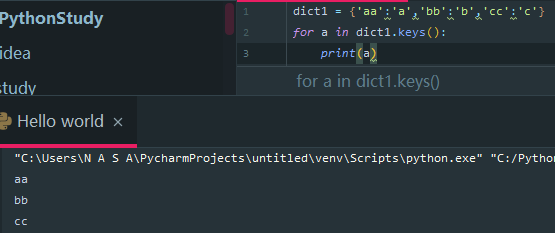

- 循环遍历字典中的value
  ```py
  dict1 = {'aa':'a','bb':'b','cc':'c'}
  for a in dict1.values():
      print(a)
  ```
    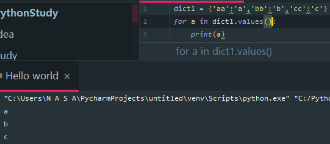

- 遍历字典的元素
  ```py
  dict1 = {'aa':'a','bb':'b','cc':'c'}
  for a in dict1.items():
      print(a)
  ```
    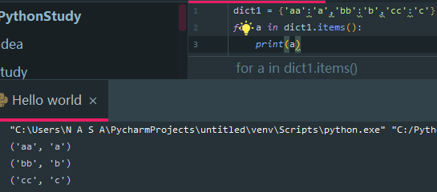


- 遍历字典的键值对
  ```py
  dict1 = {'aa':'a','bb':'b','cc':'c'}
  for key,value in dict1.items():
      print(f'{key}={value}')
  ```
    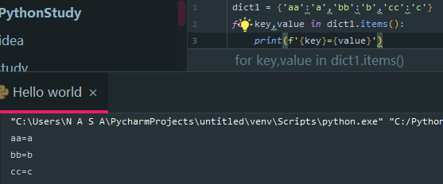


### 总结

  - 定义字典
    ```py
    dict1 = {'aa':'a','bb':'b','cc':'c'}
    dict2 = {}
    dict3 = dict()
    ```
  - 常见操作
    - 增/改
    `字典序列[key] = 值`
    - 查找
      - 字典序列[key]
      - keys
      - values()
      - items()

---

## 集合

  - 目标
    - 创建集合
    - 集合数据的特点
    - 集合的常见操作

### 创建集合

  创建集合使用`{}`或`set()`，但是如果要创建空集合只能使用 `set()` ,因为`{}`用来创建空字典。
  ```py
  s1 = {10,20,30,40,50}
  print(s1)


  s2 = {10,20,30,40,5,20,20}
  print(s2) # 集合会自动去重

  s2 = set('abcdqweqwe')  # 可以使用小括号编写，如果是一串字符串不会自动去重。
  print(s2)

  ```
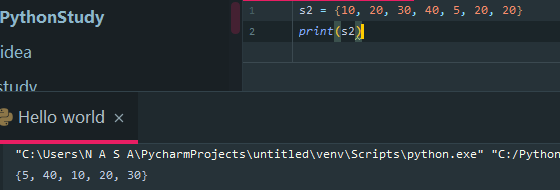


### 查找数据

  - in: 判断数据在集合序列
  - not in：判断数据不在集合序列
  ```py
  s1 = {10,20,30,40,5,20,20}

  print(10 in s1)
  print(10 not in s1)
  ```
    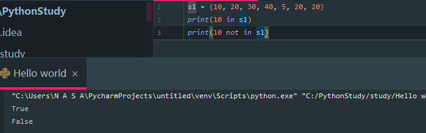

  判断是否存在

---

## 公共操作

### 目录
  - 运算符
  - 公共方法
  - 容器类型转换

### 运算符
  |运算符|描述           |支持的容器类型        |
  |-     | -            |-                    |
  |   +   |合并          |字符串、列表、元组     |
  |  *   |复制          |字符串、列表、元组     |
  | in   |元素是否存在  |字符串、列表、元组、字典|
  |not in|元素是否不存在|字符串、列表、元组、字典|

**合并运算符**

```py
str1 = 'aa'
str2 = 'bb'

list1 = [1,2]
list2 = [10,20]

t1  = (1,2)
t2 = (10,20)

dict1 = {'name': 'python'}
dict2 = {'age': 10}

# +: 合并
print(str1+str2)    # 合并字符串
print(list1+list2)  # 合并列表
print(t1+t2)        # 合并元组

'''
输出结果：aabb
'''
```

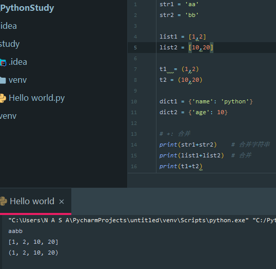

尝试合并字典
```py
dict1 = {'name': 'python'}
dict2 = {'age': 10}
print(dict1+dict2)  # 报错
```
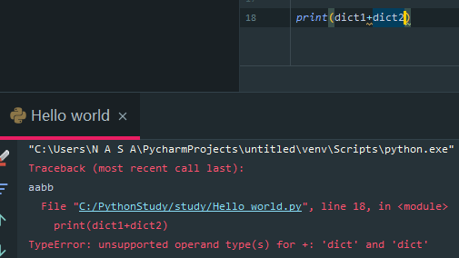

> 字典不支持合并

**复制运算符**
- 打印 `aa` 20次
  ```py
  str1 = 'aa'
  print(f' {str1}' * 20)

  '''
  输出结果： aa aa aa aa aa aa aa aa aa aa aa aa aa aa aa aa aa aa aa aa
  '''
  ```

  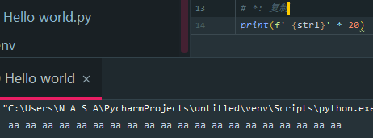

- 打印 `list` 5次
  ```py
  list1 = [1,2]
  print(f'{list1 *5}')
  ```

  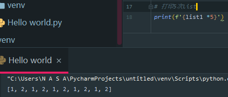

- 打印`元组`10次
  ```py
  t1 = (1,2)
  print(f'{t1 *5}')
  ```
  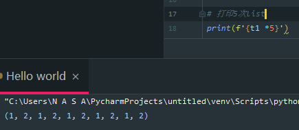


### 公共方法

|函数|描述|
|-|-|
|len()|计算容器中元素的个数|
|del()/del|删除|
|max()|返回容器中元素的最大值|
|min()|返回容器中元素的最小值|
|range(start,end,step)|生成从 start 到 end 的数字，步长为 step ，供 for 循环使用|
|enumerate()|函数用于将一个可遍历的数据对象(如列表，元组或字符串)组合成一个索引序列，同时列出数据和数据下标，一般用于 `for` 循环中|


  **计算个数**
  ```py
  dict1 = {'name': 'python'}
  print(len(dict1))
  '''
  输出结果：1
  '''
  ```

  > 计算字典中的个数。

  **删除数据**

  ```py
  str2 = 'bb'
  del(str2)
  print(str2)
  '''
  输出结果:报错
  '''
  ```

  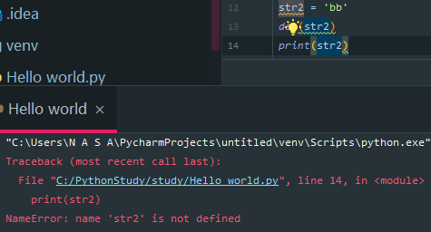

```py

  dict1 = {'aa': 'a','bb':'b'}

  del dict1['bb']
  print(dict1)
```

  **最大值**
  ```py
  str1 = 'aafghjklfdsfghjkotred'
  list2 = [10,20,30,40,50,60]

  print(max(str1))  # 输出最高位的字母
  print(max(list2)) # 输出值最高的数值
  '''
  输出结果
  t
  60
  '''
  ```


  **最小值**
  ```py
  str1 = 'aafghjklfdsfghjkotred'
  list2 = [10,20,30,40,50,60]

  print(min(str1))  # 输出最高位的字母
  print(min(list2)) # 输出值最高的数值
  '''
  输出结果
  a
  10
  '''
  ```

  **递增添加**
  > 生成从start到end的数字，步长为step。,`不包含end`。

  ```py
  for i in range(1,10,2): # 步长为 2
      print(i)

  # 输出结果为：1 3 5 7 9


  start = int(input("输入开始值"))
  end = int(input('输入结尾值'))
  for i in range(start,end+1):
      print(i)

  # 最简写法
  for i in range(10)
      print(i)
  ```
  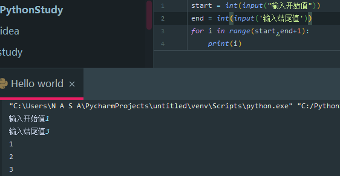

  **可遍历数据对象**

  > 用于将一个可遍历的数据对象组合为一个索引序列。

  ```py
  list1 = [10,20,30,40,50,60]
  s1 = {100,200,300,400}
  t1 = ('a','b','c','d')

  print(tuple(list1))
  '''
  将列表转换成元组
  输出结果：(10, 20, 30, 40, 50, 60)
  '''
  ```
  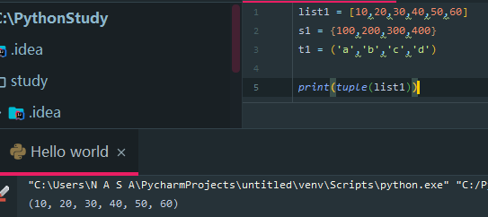

  **enumerate()**

  - 语法
    ```py
    enumerate(可遍历对象，start=0)
    ```
    > start参数可以用于设置遍历数据的下标的起始值，默认为0。

  ```py
  list1 = [10,20,30,40,50,60]
  for i in enumerate(list1):
      print(i)
  ```
  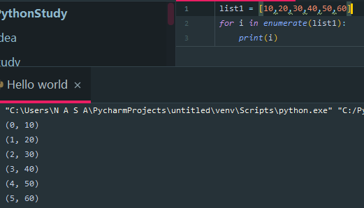

  ```py
  # 更改下标，使下标从1开始
  list1 = [10, 20, 30, 40, 50, 60]
  for i in enumerate(list1,start=1): # 下标从1开始
      print(i)
  '''
  输出结果：
  (1, 10)
  (2, 20)
  (3, 30)
  (4, 40)
  (5, 50)
  (6, 60)
  '''
  ```

### 容器类型转换

  **tuple()**
  作用: 将某个序列转换成元组
  ```py
  list1 = [10, 20, 30, 40, 50, 60]
  s1 = (1,2,3,4,5,6)
  print(tuple(list1))
  print(tuple(s1))
  ```

  

  **list()**
  作用: 转换成列表
  ```py
  list1 = [10, 20, 30, 40, 50, 60]
  s1 = (1,2,3,4,5,6)
  print(list(list1))
  print(list(s1))
  ```
  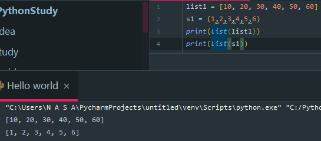

  **set()**
  作用: 转换成集合
  ```py
  list1 = [10, 20, 30, 40, 50, 60]
  s1 = (1,2,3,4,5,6)
  print(set(list1))
  print(set(s1))
  ```
  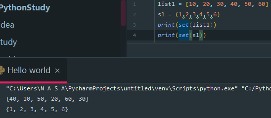

---

## 推导式

> 最大的作用就是用于化简代码。

- 目标
  - 列表推导式
  - 字典推导式
  - 集合推导式

### 列表推导式
  作用：用一个表达式创建一个`有规律的列表`或控制一个有规律的列表
  > 列表推导式又叫列表生成式。

  **示例**
  - 使用 `while` 生成一个从0开始到10的列表
    ```py
    list1 = []

    i = 0
    while i <= 10:
        list1.append(i) # append() 方法用于在列表末尾添加新的对象。
        i += 1
    print(list1)
    '''
    输出结果:[0, 1, 2, 3, 4, 5, 6, 7, 8, 9, 10]
    '''
    ```

    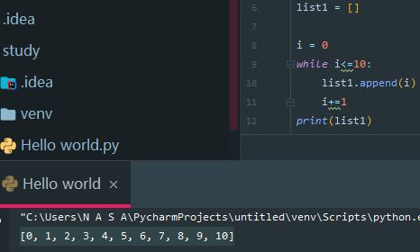

  - for循环示例

    ```py
    list1 = []

    for i in range(10):
        list1.append(i)
    print(list1)
    ```
    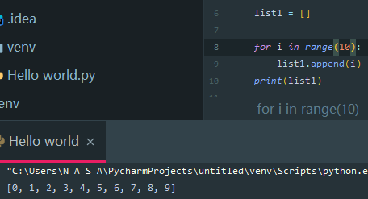

  - 列表推导式实现

    ```py
    list1 = [i for i in range(10)]
    print(list1)
    ```
    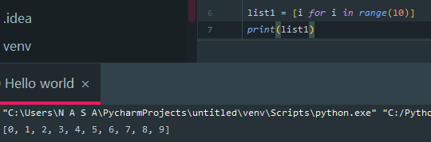

  > 推导式书写方法
  ```
  dick/list = [i for i in rang(1,5)]
  列表/元组  = [输出结果 for i in rang(开始 不写默认为0，结束+1/不加)]
  ```

### 带 if 的列表推导式

  需求: 创建0-10的偶数列表
  - 方法一: `range()` 步长实现
    ```py
    list1 = [i for i in range(0,10,2)]
    print(list1)
    ```

  - 方法二：if 实现
    ```py
    list2 = []
    for i in range(10):
        if i % 2 == 0:
            list2.append(i)
    print(list2)
    '''
    输出结果：[0, 2, 4, 6, 8]
    '''
    ```

  - 方法三：带if的列表推导式
    ```py
    list1 = [i for i in range(10) if i % 2 == 0]
    print(list1)
    ```

### 多个 for 循环实现列表推导式

当一个循环执行完后，才去执行另一个数据的循环 --- 循环嵌套

> for 循环嵌套写法
  ```py
  list1 = []
  for i in range(1,3):
      for j in range(0,3):
        list1.append((i,j))
  print(list1)
  ```


  需求: 创建列表如下：
  ```py
  [(1, 0), (1, 1), (1, 2), (2, 0), (2, 1), (2, 2)]
  ```
  示例代码如下：
  ```py
  list2 = [(i,j) for i in range(1,3) for j in range(3)]
  print(list2)
  ```


### 字典推导式

  > for 循环写法
  ```py

  ```
  思考：如果有如下两个列表：
  ```py
  dict1 = {i:i**2 for i in range(1,5+1)}
  print(dict1)
  '''
  输出结果
  {1: 1, 2: 4, 3: 9, 4: 16, 5: 25}
  '''
  ```
  此时将两个数组合并成一个列表。
  ```py
  list1=['name','age','gender']
  list2=['tom',20,'man']
  dict1 = {list1[i]:list2[i] for i in range(len(list1))}
  print(dict1)
  ```
  - 总结:
    1. 如果两个列表的个数都相同，len统计在任何一个列表中的长度都可以。
    2. 如果两个列表数的个数都不相同，len统计数据多的个数会报错。


  提取字典中的目标数据，并进行条件判断。
  ```py
  counts = {'a' :1 ,'b':2,'c':3,'d':4}
  # 要求提取数字大于2的字典数据
  counts1 = {key: value for key,value in counts.items() if value >=2} # 因为我们的字典中存在键值对，所以使用key value 的临时变量对字典进行拆包。
  print(counts1)
  '''
  输出结果：
  {'b': 2, 'c': 3, 'd': 4}
  '''
  ```
  > 可见当数据大于等于2时，数据会变成表结构形式。

  当上下结合使用时，从两个列表中对应提取出，对应数值大于20的数据
  ```py
  list1 = ['a', 'b', 'c', 'd', 'e']
  list2 = [21, 20, 32, 21, 7]

  dict1 = {list1[i]:list2[i] for i in range(len(list1))}
  dict2 = {key: value for key,value in dict1.items() if value >=20 }
  print(dict2)
  '''
  输出结果
  {'a': 21, 'b': 20, 'c': 32, 'd': 21}
  '''
  ```


### 集合推导式

  需求:创建一个集合，数据为下方列表的2次方

  ```py
  # list1 = [1,1,2]
  list1 = [1,1,2]
  set1 = {i**2 for i in list1}
  print(set1) # {1,4}
  # 集合具有去重功能
  ```

### 总结

  推导式的作用： 简化代码
  推导式的写法：
  ```py
  # 列表推导式
  [xx for xx in range()]

  # 字典推导式
  {xx1: xx2 for ... in ...}

  # 集合推导式
  {xx for xx in ...}
  ```


