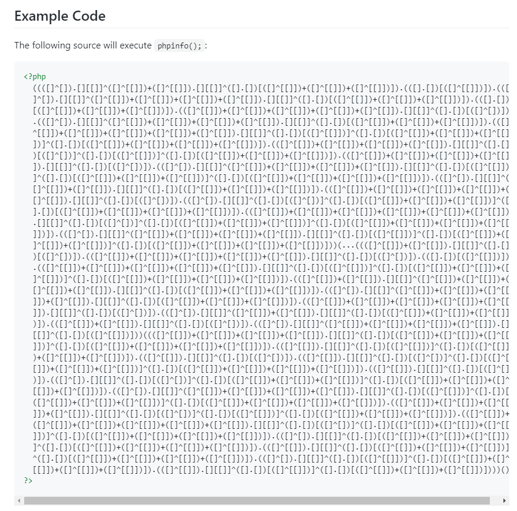
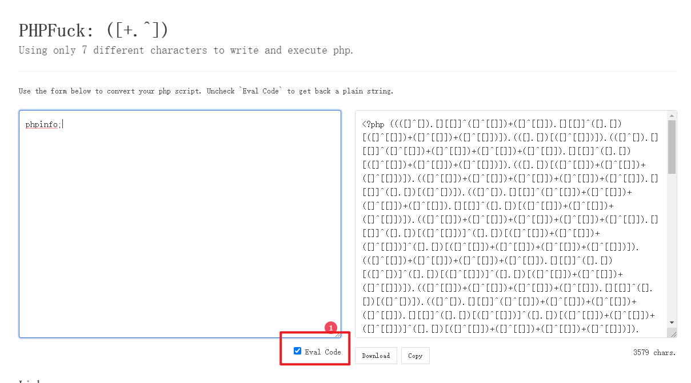
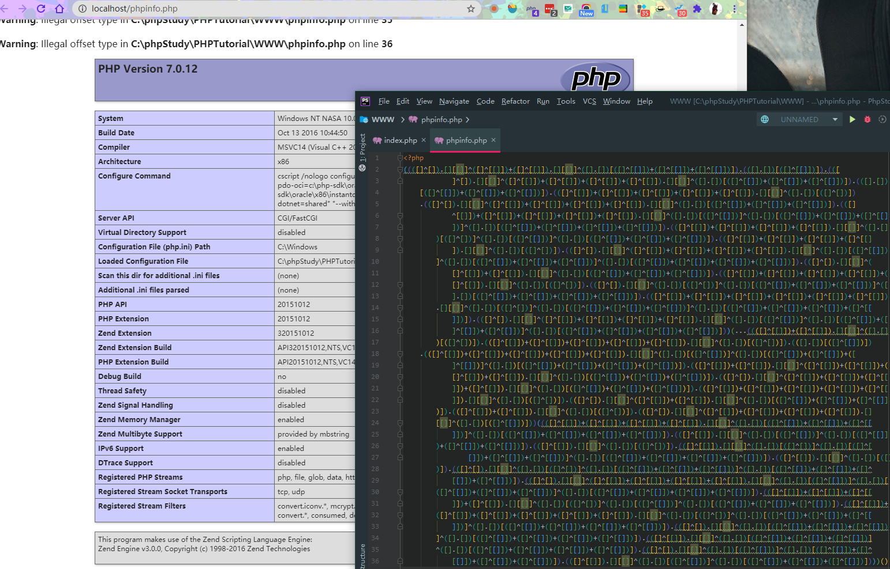
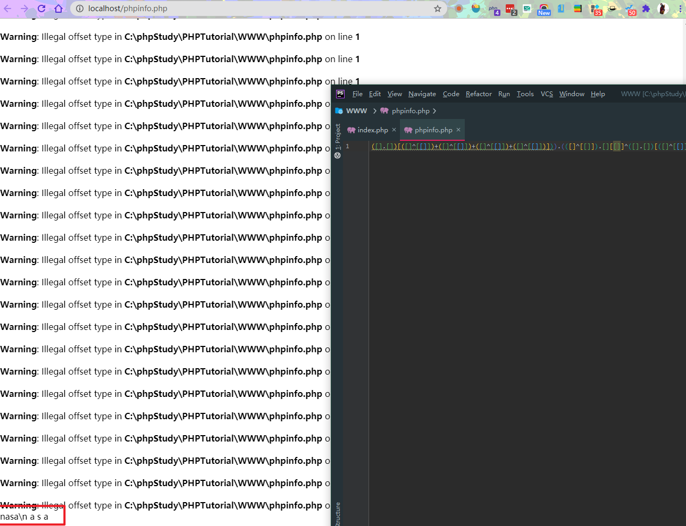
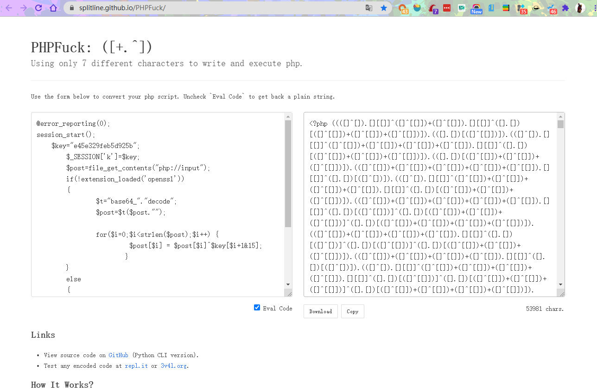
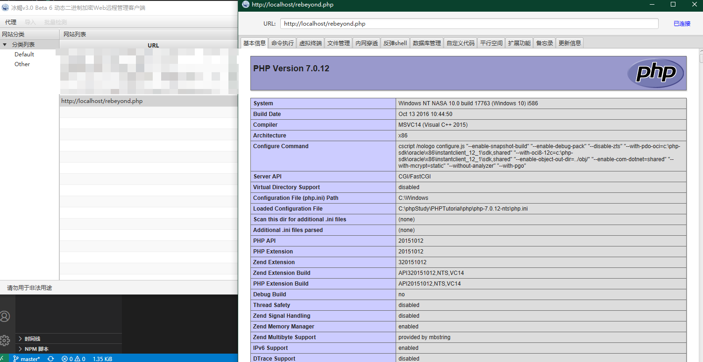
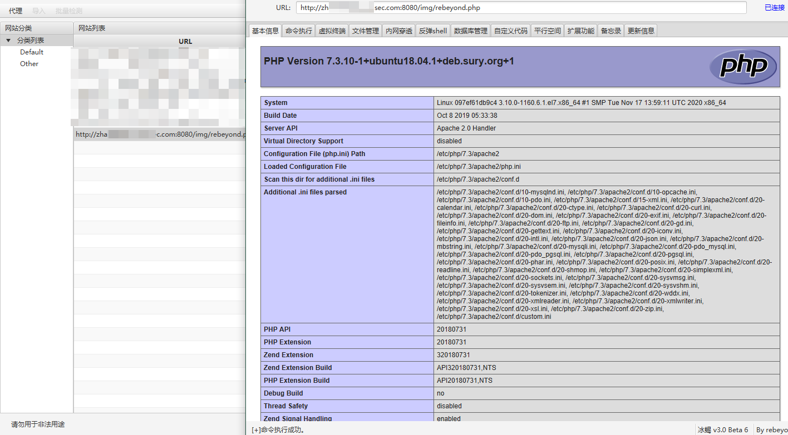

# 过D小技巧

在一次研究PHP免杀的过程中，意外遇到了一个真的无敌的项目，于是就有了此文。下面就简单地介绍一下该项目的用法和原理。

## PHPFUCK

闲来逛逛GITHUB，看看大佬们都star了哪些项目(点个star假装自己在看项目)。忽然发现了一个有趣的标题 `PHPFUCK`，我直接想到了 CTF中的 `JSFUCK`。

https://github.com/splitline/PHPFuck



点开一看，不能说是一模一样，只能说是完全一致。好家伙我直接好家伙。

该解析特性必须在 php 》= 7.0 版本。

## 使用

**使用环境**

Python

```bash
usage: phpfuck.py [-h] [-O FILE] [-P] [-E {assert,create_function}] code

positional arguments:
  code                  any string to encode.

optional arguments:
  -h, --help            show this help message and exit
  -O FILE, --output-file FILE
                        write encoded string into some file.
  -P, --plain-string    encode as plain string (without eval it).
  -E {assert,create_function}, --eval {assert,create_function}
                        choose eval mode. (`assert` mode only support PHP < 7.1)
```


这里提供web页面的转换脚本：

https://splitline.github.io/PHPFuck/

使用的时候勾选 `Eval Code` 选项后直接复制即可。




## 利用

话不多说 咱先测试一波能不能用 按照提供的代码 看看能不能输出 `PHPINFO()`



哟，有点东西。`PHPINFO` 被解析了。咱再试试看能不能执行 `system` 等系统命令。

```php
system('whoami')
```



完全没有问题，咱直接试试转换个冰蝎的马，这里实测是`7.0`以上随便上马






直接一把嗦上线，爽到。

尝试搭建个云端服务器使用安全狗，D盾。完全扫不出来好吧。




实战中使用过几次，发现只要不检测后缀名，读文件内容那真的是随便过。什么哥斯拉，蚁剑一句话都是随便连。

##  结语

随着PHP8的更新，相信之后PHP会有更多的bug，虽然删了很多bypass的技巧，但是PHP在有漏洞方面肯定不会让人失望的！希望大家可以变得更强！

---

> 本文作者 FFFFFFFF0X-XiDanEr
