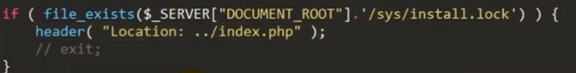

# PHP代码审计之安装篇

- 👴如何找到一个女朋友当对象？ 
`$对象=new GirlFriend;` 铛铛！

1. 在安装时，查看安装判断是否完全结束，例如，判断header是否安装后未exit退出如果为进行退出则可能存在可利用点。

2. 在软件进行安装时，多办会进行数据库的数据导入，如表格格式，新建对应的数据库信息。在测试时可以进行代码的更改，但是在测试 `Payload` 时记得还原。

3. 在安装时记得抓包查看，有些值是录入后设置。比如有些值是通过`POST`。安装。或者通过脚本安装。

4. 寻找可以输入的值，并可以写入数据库。或者是在自定义添加库名中做绕出，看看能不能绕出数据库，编写出敏感函数。如 `eval($_POST[1])`、`phpinfo();`

5. 在存入数据库时，或者新建库的时候。如果其他页面有回显数据或者存入页面中时。或者写入的内容是否可控，显示的内容是否被过滤等。

在找到可以绕过的方法后加入`Payload`。

6. 在存在漏洞的页面访问或者进行漏洞测试即可。

        

