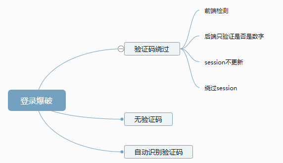

# PHP审计中的登录密码爆破和绕过


<p align="center">
    
</p>

<p align="center">👴Yo, I'll tell you what I want, what I really really want！</p>
<p align="center"><a href="http://music.163.com/song?id=501220770&userid=262256866"><font>《Wannabe》</font></a> </p>
<p align="center">专辑：Wannabe</p>
<p align="center">歌手：Why Mona/Unlike Pluto/Joanna Jones</p>

### 暴力猜解

暴力猜解即是穷举法，是蛮力策略的具体体现，穷举法的基本思想就是根据题目的部分条件确定答案的大致范围。
`比如如果你爆破短信验证码你要先知道这个短信验证码有几位，是4位还是6位。然后构造对应的爆破字典。`

并在此范围内对所有可能的情况逐一验证，直到全部情况验证完毕。也就是所谓的 `选择题把abcd`分别都选一遍。

对于爆破字典的构造可以参考[ffffffff0x/AboutSecurity](https://github.com/ffffffff0x/AboutSecurity)

和我整理的雷神众测的密码口令猜测方法[密码规则和编写](https://github.com/xidaner/Freed0m/blob/master/%E7%AC%94%E8%AE%B0/%E6%B8%97%E9%80%8F/Web%E6%B8%97%E9%80%8F/%E5%BC%B1%E5%8F%A3%E4%BB%A4%E6%8C%96%E6%8E%98%E8%A7%A3%E6%9E%90/%E5%AF%86%E7%A0%81%E7%AF%87.md)


**绕过验证码**
一般登录都需要验证码，而突破验证码的思路有两种：



**验证码绕过**
- 使用burp抓包去掉session尝试发包看看服务器是否会报错，如果不报错就继续爆破。
- 进行密码爆破

使用burp的 `intruder` 插件进行爆破测试。


> 示例1：
> 
**查看目标主页代码**
```php
if(@$_POST['captcha'] !== $_SESSION['captcha']){//判断提交的验证码是否等于session获取的验证码的值
 header('Location: login.php');//返回到登录页面
 exit;
}

$name = $_POST['user'];//获取账户
$pass = $_POST['pass'];//获取密码

   $query = "SELECT * FROM admin WHERE admin_name = '$name' AND admin_pass = SHA('$pass')";//查询是否正确。
```
这时候就可以分析，这里并没有看到`判断验证码是否存在的语句`，
只是在页面里判断了是否相等，并没有判断session是否存在，试想，如果我们不填写session，也不填写验证码，让他们都为空，null = null。是不是即可完成绕过

**PHP验证码生成代码**
```php
session_start();
$rand = '';
for($i=0; $i<4; $i++){
 $rand.= dechex(rand(1,15));
}
$_SESSION['captcha']=$rand;
$im = imagecreatetruecolor(100,30);
$bg=imagecolorallocate($im,0,0,0);
$te=imagecolorallocate($im,255,255,255);
imagestring($im,rand(5,6),rand(25,30),5,$rand,$te);
header("Content-type:image/jpeg");
imagejpeg($im);
?>
```
这里使用抓包的方式，通过抓取数据包，将session和验证码删除，删除后，他们的值都为空。这样就可以绕过检测了。


