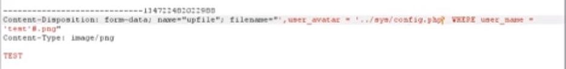
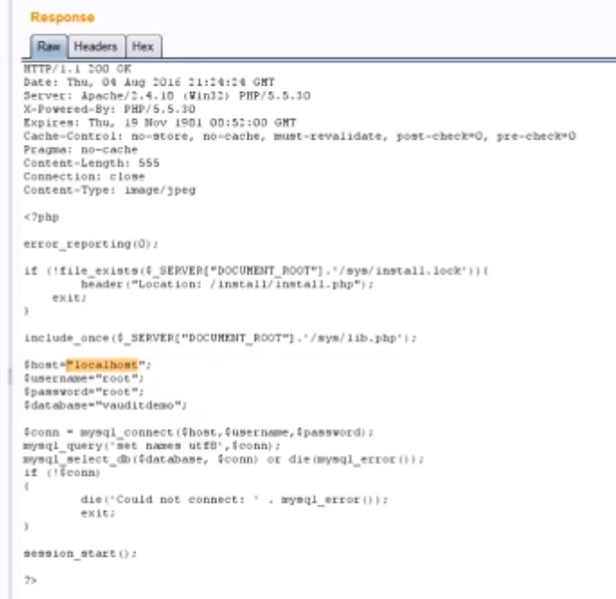

# PHP审计中的任意文件读取

- 👴 like that old time rock 'n' roll ！ 
<<[Time Is Running Out](http://music.163.com/song?id=571175220&userid=262256866)>> 
专辑：Time Is Running Out
歌手：Why Mona/Unlike Pluto/Joanna Jones

## 文件操作漏洞

文件读取漏洞是属于文件操作漏洞一类的，一般任意文件读取都可以读取文件的配置信息，甚至系统的重要文件。

严重的话，就可能导致 `SSRF` ,进而漫游内网。

以[春秋课堂教学为例](https://www.bilibili.com/video/BV197411y7mf?p=11),

当我们看见某些文件的读取是存入数据库，或者是存储至PHP代码中时，有可能存在任意文件读取漏洞。

以读取头像为例。当查询把用户的头像路径存入数据库时。有可能会不做过滤或者过滤不足。

当加载这个被修改后的路径时。

如果我们在存入数据库的时候进行这种类似于二次注入的操作。即可利用PHP的函数进行任意文件读取。

但是在文件写入的时候一般是不允许使用 `../` 的形式。所以需要进行编码绕过，这里使用16进制绕过。

使用16进制绕过后成功将数据写入数据库。

当用户加载文件或者使用 burp 获取读取头像的信息包后，可以发现可以读取到所需信息。

成功读取到用户 `config` 的配置文件。

