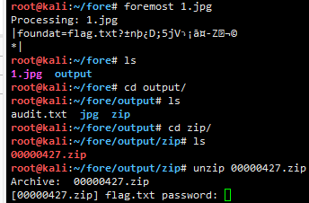
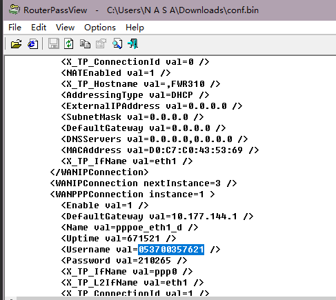

**1. bugku隐写**


bugku隐写


将图片进行十六进制查看
在这里插入图片描述
根据png的格式进行查看，第一行是png的pe头，第二行是png的宽和高，将第二行宽和高修改为相同，就可以了。
（固定）八个字节89 50 4E 47 0D 0A 1A 0A为png的文件头
（固定）四个字节00 00 00 0D 代表数据块的长度为13
（固定）四个字节49 48 44 52（即为ASCII码的IHDR）是文件头数据块的标示（IDCH）
（可变）13位数据块（IHDR)

前四个字节代表该图片的宽 00 00 01 F4
后四个字节代表该图片的高 00 00 01 A4
我们需要加高

修改后就可得到结果BUGKU{a1e5aSA}


**3. bugku---啊哒**

这里我们就是最简单的利用，在binwalk后直接提供固件文件路径和文件名即可:

```bash
binwalk carter.jpg
```

当我们使用这行命令后，binwalk就会自动分析这个jpg文件：
```bash
# binwalk carter.jpg

DECIMAL       HEXADECIMAL     DESCRIPTION
--------------------------------------------------------------------------------
0             0x0             JPEG image data, JFIF standard 1.01
382           0x17E           Copyright string: "Copyright (c) 1998 Hewlett-Packard Company"
3192          0xC78           TIFF image data, big-endian, offset of first image directory: 8
140147        0x22373         JPEG image data, JFIF standard 1.01
140177        0x22391         TIFF image data, big-endian, offset of first image directory: 8
```

**使用foremost工具分离**

foremost是一个基于文件文件头和尾部信息以及文件的内建数据结构恢复文件的命令行工具，win可以下载地址，Linux可以

通过下面命令安装使用：
```bash
apt-get install foremost
```
安装foremost后你可以使用foremost -help查看使用帮助，这里最简单分离文件的命令为：
```bash
foremost carter.jpg
```
当我们使用这行命令后，foremost会自动生成output目录存放分离出文件：




**宽带信息泄露**

看起来好像是让我们找宽带用户名，这个时候就要用下面这个工具了（截图自百度百科）

**路由器密码查看工具(RouterPassView)**

用`routerpassview`打开.bin文件，搜索`username`关键字




**linux**

使用7z打开文件，提取其中图片/使用


**图片隐写常用套路**
```
1、能打开的先用stegsolve看一下各个颜色通道有没有隐藏信息，或者是不是LSB隐写。
2、打不开的在十六进制下看一下是不是缺少头标记
3、用解压、Linux下的binwalk、foremost看一下有没有隐藏文件
4、查看文件属性、修改图片的长宽比例。
5、用记事本查看图片，查看图片的十六进制。
```


BugkuCTF之misc题之
**图穷匕见**
下载文件，用winhex打开，由于是jpg文件，直接搜索FFD9
发现后面接了一长串类似于16进制的数字：

```py
f = open('1.txt')
temp = []
while True:
    k = f.read(2)  # 读取三位
    if k:
        temp.append(k)
    else:
        break

f.close()
f = open('out.txt', 'w')
for i in temp:
    num = '0x' + i
    num = int(num, base=0)
    num = chr(num)
    f.write(num)
# 2. 读写操作

f.close()
```
使用脚本去跑，并且去掉文件中的（，）。

得到一串坐标，根据提示画图，好嘛，用kali下gnuplot（kali安装下载gnuplot可以参考`https://blog.csdn.net/junzhu213/article/details/6420256）`

**安装教程**
```
先执行sudo apt-get install libx11-dev  安装x11，否则不能显示图形！
二、安装gnuplot

1. su root

 cd /usr/local/src

1.下载gnuplot（版本4.4.0）

wget http://nchc.dl.sourceforge.net/project/gnuplot/gnuplot/4.4.0/gnuplot-4.4.0.tar.gz

2.解压文件

tar -zxvf gnuplot-4.4.0.tar.gz

3.配置安装路径

cd gnuplot-4.4.0

./configure

4.编译

make

5.安装

make install
```

**题目：好多数值**


```py
from PIL import Image
x = 503 #x坐标  通过对txt里的行数进行整数分解
y = 122 #y坐标  x*y = 行数

im = Image.new("RGB",(x,y))#创建图片
file = open('1.txt') #打开rbg值文件

#通过一个个rgb点生成图片
for i in range(0,x):
  for j in range(0,y):
    line = file.readline()#获取一行
    rgb = line.split(",")#分离rgb
    im.putpixel((i,j),(int(rgb[0]),int(rgb[1]),int(rgb[2])))#rgb转化为像素
im.show()
```


**很普通的数独**

```py
from PIL import Image
x = 45
y = 45
im = Image.new('RGB', (x, y))
white = (255, 255, 255)
black = (0, 0, 0)
with open('D:\py\新建文件夹\ss.txt') as f:
    for i in range(x):
        ff = f.readline()
        for j in range(y):
            if ff[j] == '1':
                im.putpixel((i, j), black)
            else:
                im.putpixel((i, j), white)
im.show()
```

**一枝独秀**
BugkuCTF-杂项-MISC

提示中写:`翻过四个栅栏得flag`
下面的某步骤中极有可能含有栅栏密码!!!

010 editor打开,发现熟悉的504B 0304文件头
自然把后缀改成.zip
打开,显示有123个加密.jpg文件

试试暴力破解,打开熟悉的ARCHPR（拉出二营长的意大利炮）
范围勾选大小写以及数字选项
长度设置1-8
然后愉快的按下开始


发现像素是960*635
010打开图片改一下像素高度，结果没啥用，但是发现了“主题”：里写了“flowers”，根据以前做题经验，flowers极有可能是后面某步骤的密码。
再binwalk扫描一下，也没结果。
重新回到原点，81号图比其他图要大出7KB，应该是隐写，方向应该没错。。。。。


