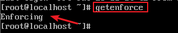

# 基本SELinux安全概念

## 一.什么是SELINUX 

https://blog.51cto.com/13885935/2155037

### 1.selinux的历史
SELINUX 
( 安全增强型 Linux ) 是可保护你系统安全性的额外机制。是美国国家安全局（NSA）对于强制访问控制的实现，是 Linux历史上最杰出的新安全子系统。NSA是在Linux社区的帮助下开发了一种访问控制体系，在这种访问控制体系的限制下，进程只能访问那些在他的任务中所需要文件。SELinux 默认安装在 `Fedora` 和 `Red Hat Enterprise Linux` 上，也可以作为其他发行版上容易安装的包得到。

### 2.什么是selinux

`selinux是linux系统内核级加强型防火墙`

### selinux作用：

（在使用ftp访问时体现）

`1、`限制程序访问，程序访问文件必须有匹配的上下文

`2、`.限制程序功能，把程序不安全功能屏蔽

## 二、selinux的常用命令

1,查看selinux的状态
```
getenforce
```


### 1.selinux的状态有三种：
- enforcing(1)   ##强制   
- permissive(0)  ##警告   
-  disabled      ##关闭

### 2.selinux状态的更改

```
vim /etc/sysconfig/selinux

SELINUX=XXX
```


### 3.  ##selinux的开启和关闭

开启和关闭需要重启，加载配置

```
reboot
```

## 三、seinux影响程序功能（selinux开启情况下，lftp可以写和上传文件）

### 第一步：修改配置文件，让匿名用户拥有可上传和可下载的权限

>增加组和权限，将`/var/ftp/pub/添加到ftp组下`，并赋予其组有写的权限

在最后添加以下两行可以实现的内容

```
vim /etc/vsftpd/vsftpd.conf

anon_upload_enable=YES        ##匿名用户可上传

anon_world_readable_only=NO   ###参数为no时匿名用户可下载
```
彩蛋：╰（‵□′）╯咋挖撸多

### 第二部：赋予权限
```
chgrp ftp /var/ftp/pub

chmod 775 /var/ftp/pub
```
### 第三步：setsebool 打开ftp匿名用户`write`功能（-P表示`永久修改`）

```
getsebool -a | grep ftp

setsebool -P ftpd_anon_write on

chcon -t public_content_rw_t  /var/ftp/pub/

systemctl restart vsftpd
```

<H2>   ` BUT此方法为临时更改，重启selinux后会失效，若要永久改变，可采用下文日志中插件提供的解决办法`

以httpd举例</h2>

## 四、监控selinux的错误信息

```
lftp 目标IP

cd pub

rm passwd
```

>当发生错误信息会在/var/log/messages里显示，并且安装有`setroubleshoot-server`的机器还会告诉你如何解决报错问题

>所有的报错信息在/var/log/audit/audit.log里，但是只会报错，不会告诉你怎么解决

## 补充：setroubleshoot安装与配置（支持centos 6.0以下）

https://blog.51cto.com/promot/1657485

setroubleshoot是查看SElinux日志报错的命令

>注意:
>>1 所有操作之前需要在配置文件里面需要将SElinux的状态改为`enforcing`<br>
2.在根目录和在 /var/www/html/下新的文件或文件夹，其安全性文本的type是不一样的.

### 1.安装setroubleshoot 也要安装httpd vsftp

```
yum install setroubleshoot
yum install httpd* -y
```
### 2.重启httpd服务

```
systemctl restart httpd
```
### 3.访问阿帕奇网页目录下的一个网页

通过elinks 来访问此文件 elinks 192.168.200.184 （以本机测试为例），因为不会成功，所以最终会显示一个 deny的报错回传信息 为了收集这个报错信息，需要这样处理

### 4.查看报错

因为对系统 操作的所有日志报错广场均是在`/var/log/messages ` 我们只需grep出 setroubleshoot那一行即可看到报错的真实内容


