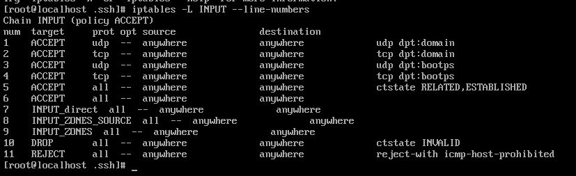
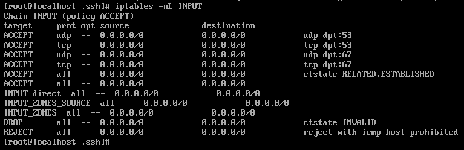

# linux防火墙`iptable`s常用命令与基础知识

https://blog.51cto.com/yangshufan/2056496
https://blog.csdn.net/shuaiant/article/details/284397
https://blog.csdn.net/pingweicheng/article/details/80483107
https://www.cnblogs.com/Klanti/p/9141815.html
https://blog.csdn.net/weixin_41843699/article/details/90454321

## 什么是iptables
简单的说：
　要在网上传输的数据会被分成许多小的数据包，我们一旦接通了网络，会有很多数据包进入，离开，或者经过我们的计算机。首先我们要弄明白，`防火墙`将怎么对待这些数据包。这些数据包会经过一些相应的规则链，比如要进入你的计算机的数据包会首先进入INPUT链，从我们的计算机发出的数据包会经过 `OUTPUT`链，如果一台计算机做一个网络的网关，可能会有很多数据经过这台计算机，那么这些数据包必经`FORWARD`链。明白了这些“链”的概念我们才能进一步学习使用`iptables`。<br>
`接下来我们讲学习基础使用`

## 1.iptables常用命令

### 先关闭firewall防火墙，两个不需要同时开启

```
 systemctl stop firewalld.service #停止firewall
 systemctl disable firewalld.service #禁止开机启动
```
###  查看是否已经安装了`iptables`以及`iptables`版本号

```
iptables -V   (注意：V是大写字母V）
```


###  关闭或启动或重启iptables

```
systemctl stop/start/restart iptables
```
### 安装iptables防火墙

```
 yum -y install iptables-services
```

### 查看iptables规则

```
iptables -L -n
```
### 配置文件的位置

```
 ll /etc/sysconfig/iptables-config
-rw-------. 1 root root 2374 4月 13 2018 /etc/sysconfig/iptables-config

### 启动服务，并设置开机自启动
```
```
 systemctl start iptables.service
```
```
 systemctl enable iptables.service
Created symlink from /etc/systemd/system/basic.target.wants/iptables.service to /usr/lib/systemd/system/iptables.service.
```
### 字段说明：
```
target：处理的动作

prot：协议

source:数据包的源IP地址

destination：数据包的目标IP地址
```

# 2.iptables结构

## 2.1 `iptables`的表与链

`iptables`具有`Filter`，`NAT`，`Mangle`，`Raw`四种内建表

## 2.2 `Filter`表

### filter表示iptables的默认表，它具有三种内建链：

```
input chain  - 处理来之外部的数据
output chain - 处理向外发送的数据
forward chain- 将数据转发到本机的其它网卡上
```

## 2.3 `NAT`表

`NAT有三种内建的链`：

```
prerouting  - 处理刚到达本机并在路由转发前的数据包，它会转换数据包中的目标IP地址
```
  ---`(destination ip address),通常用于DNAT(destination NAT)。`

```
postrouting - 处理即将离开本机数据包，它会转换数据包中的源目标IP地址(source ip address),通常SNAT(source NAT)
```
```
output        - 处理本机产生的数据包
```

## 2.4 `Mangle`表

Mangle表用于`指定如何处理数据包`，它能改变TCP头中的Qos位，Mangle表具有5个内建链:
```
prerouting
output
forward
input
postrouting
```

## 2.5 `Raw`表

raw表用户处理异常，它具有2个内建链:
```
prerouting chain
output chain
```

## 2.6 `iptables`规则

```
rules包括一个条件和一个目标（target）

如果满足条件就执行目标target中规则或者特定值

如果不满足条件，就判断下一条Rules
```

## 3.1  5个规则链

### 在处理数据包时，根据防火墙规则的不同介入时机，默认划分为五个不同的规则链，具体如下：

```
*INPUT：处理入站数据包

*OUTPUT：处理出站数据包

*FORWARD：处理转发数据包

*POSTROUTING链：在进行路由选择后处理数据包

*PREROUTING链：在进行路由选择前处理数据包
```

# 2. 数据包过滤的匹配顺序

   <h3> iptables管理着四表五链，各种规则依次存放在链中，那么当一个数据包到达防火墙时，优先使用哪个表，哪个链中的规则？

## 1.1规则表之间的顺序
 当数据包抵达防火墙时，应用的顺序为

    
    *raw——mangle——nat——filter（如果规则同时存在）

## 1.2规则链之间的顺序

    规则链之间的应用顺序取决于数据包的流向，具体如下：

> 1）`入站数据流向`：（`PREROUTING——INPUT`）当外界的数据包到达防火墙时，首先`被PREROUTING链处理`，然后进行路由选择，如果`数据包的目标地址是本机`，那么就将其传递给`INPUT链`进行处理，通过以后交给上层的应用程序进行响应<

> 2）`转发数据流向`：（PREROUTING——FORWARD——POSTROUTING）当外界的数据包到达防火墙时，首先`被PREROUTING链处理`，然后进行路由选择，如果数据包的`目标地址是其他外部地址`，则将其传递给`FORWARD链`进行处理，最后交给`POSTROUTING链`进行处理

>3）`出站数据流向`：（OUTPUT——POSTROUTING)`防火墙本机向外部发送数据包时`，首先被`OUTPUT链`处理，然后进行路由选择，再交给`POSTROUTING链`进行处理


# 3.iptables命令基本语法    

## 1基本的命令格式如下：

```
iptables  [-t 表名] 管理选项  [链名]  [匹配条件]  [-j 控制类型]
```
其中

>表名、链名：指定iptables命令所操作的表和链，未指定时默认使用filter表

>管理选项：表示iptables规则的操作方式，如增加、删除、插入、查看等

>匹配条件：指定要处理的数据包特征，不符合指定条件的数据包将不会处理

>控制类型：指定数据包的处理方式，如允许、拒绝、丢弃等，常用的几种控制类型如下
>>`表名、链名`：指定iptables命令所操作的表和链，未指定时默认使用filter表<br>
`管理选项`：表示iptables规则的操作方式，如增加、删除、插入、查看等<br>
`匹配条件`：指定要处理的数据包特征，不符合指定条件的数据包将不会处理<br>
`控制类型`：指定数据包的处理方式，如允许、拒绝、丢弃等，常用的几种控制类型如下

## 2.iptables命令的基本操作


### （1）添加新的规则    

```
*-A：在链的末尾追加一条规则

*-I：在链的开头（或指定序号）插入一条规则
```
如：
```
 iptables -A INPUT -p tcp -j ACCEPT         //在filter表INPUT链的末尾添加一条规则，允许TCP协议的数据包通过
 ```
 ```
 iptables -I INPUT -p udp -j ACCEPT         //在filter表INPUT链的首行添加一条规则，允许UDP协议的数据包通过 
 ```
 ```
 iptables -I INPUT 2 -p icmp -j ACCEPT      //在filter表INPUT链的第二行添加一条规则，允许icmp协议的数据包通过
```

### （2）查看规则列表

```
*-L：列出所有的规则条目，如未指定链名，则列出表中所有链

*-n：以数字形式显示地址、端口等信息

*-v：以更详细的方式显示规则信息

*--line-numbers：查看规则时，显示规则的序号
```
```
iptables -L INPUT --line-numbers         //查看filter表INPUT链的所有规则，并显示规则序号
```


```
iptables -nL INPUT                  //以数字形式查看filter表INPUT链的所有规则
```


### （3）删除、清空规则

-D：删除链内指定序号（或内容）的一条规则

*-F：清空所有的规则

```
[root@localhost ~]# iptables -D INPUT 3           //删除filter表INPUT链的第三条规则
```
```
[root@localhost ~]# iptables -F INPUT             //清空filter表INPUT链所有的规则
```
```
[root@localhost ~]# iptables -F                   //清空filter表
```
```
[root@localhost ~]# iptables -t nat -F            //清空nat表
```
```
[root@localhost ~]# iptables -t mangle -F         //清空mangle表
```
```
[root@localhost ~]# iptables -t raw -F            //清空raw表
```

### （4）设置默认策略

```
*-P：为指定的链设置默认规则
```

    当找不到任何一条策略匹配数据包的规则时，将执行默认策略，默认策略的控制类型为ACCEPT、DROP

```
[root@localhost ~]# iptables -P FORWARD DROP      //将filter表FORWARD链的默认策略设为丢弃
```
```
[root@localhost ~]# iptables -P OUTPUT ACCEPT     //将filter表OUTPUT链的默认策略设为允许
```
 当使用-F清空链时，默认策略不受影响；若要修改默认策略，必须通过-P重新设置

# 3. 规则的匹配条件

    根据数据包的各种特性，结合iptables模块，匹配条件的设置包括三大类：通用匹配、隐含匹配、显式匹配

## （1）通用匹配

    也称为常规匹配，可以独立使用，不依赖于其他条件和扩展模块，包括协议匹配、地址匹配、网络接口匹配

## 1）协议匹配：

>“-p 协议名”，用来检查数据包所使用的网络协议，如tcp、udp、icmp、all（所有IP数据包）等
```
[root@localhost ~]# iptables -I INPUT -p icmp -j DROP                //丢弃通过icmp协议访问本机的数据包
```
```
[root@localhost ~]# iptables -A FORWARD ! -p icmp -j ACCEPT             //允许转发除了icmp协议之外的数据包
```

## 2）地址匹配：

>“-s 源地址”“-d 目标地址”，用来检查数据包的源地址和目标地址，不建议使用主机名、域名（解析过程影响效率）
```
[root@localhost ~]# iptables -A FORWARD -s 192.168.1.11 -j REJECT        //拒绝转发源地址为192.168.1.11的数据
```
```
[root@localhost ~]# iptables -I INPUT -s 10.20.30.0/24 -j DROP           //丢弃源网段为10.20.30.0/24访问本机的数据
```
## 3）网络接口匹配：

>“-i 入站网卡”“-o 出站网卡”，用来检查数据包从防火墙的哪一个接口进入或发出

```
[root@localhost ~]# iptables -A INPUT -i eth1 -s 192.168.0.0/16 -j DROP     //丢弃从外网访问本机且防火墙为私有地址的数据包
```
```
[root@localhost ~]# iptables -A INPUT -i eth1 -s 10.0.0.0/8 -j DROP
```
```
[root@localhost ~]# iptables -A INPUT -i eth1 -s 172.16.0.0/12 -j DROP
```
## （3）显式匹配

    要求有额外的内核模块提供支持，必须手动以“-m 模块名称”的形式调用相应的模块，然后设置匹配条件。
    
>常见的显式匹配包括多端口匹配、IP范围匹配、MAC地址匹配、状态匹配
```
[root@localhost ~]# lsmod | grep xt_                //查看相关的内核扩展模块
```

>*1）多端口匹配：“-m multiport --sport 源端口列表”“-m multiport --dport 目的端口列表”，多端口以逗号分隔
```
[root@localhost ~]# iptables -A INPUT -p tcp -m multiport --dport 25,80,110,143 -j ACCEPT     //允许本机开放25、80、110、143端口，以便提供电子邮件服务
```
> 2）*IP范围匹配：“-m iprange --src-range IP范围”“-m iprange --drc-range IP范围”，检查数据包的源、目的IP地址范围
```
[root@localhost ~]# iptables -A FORWARD -p tcp -m iprange --src-range 192.168.4.21-192.168.4.28 -j ACCEPT    //允许转发192.168.4.21与192.168.4.28之间的TCP数据包
```
> 3）*MAC地址匹配：“-m mac --mac-source MAC地址”，用于检查数据包的源MAC地址，只适用于网络内部
```
[root@localhost ~]# iptables -A INPUT -m mac --mac-source 00:0c:29:c0:55:3f -j DROP     //禁止其MAC地址
```
> *4）状态匹配：“-m state --state 连接状态”，基于iptables的状态跟踪机制用来检查数据包的连接状态，如NEW（与任何连接无关的）、ESTABLISHED（响应请求或以建立连接的）、RELATED（与已有连接有相关性的）
```
[root@localhost ~]# iptables -I INPUT -p tcp -m state --state NEW -p tcp ! --syn -j DROP    //禁止转发与正常TCP连接无关的--syn请求数据包，如伪造的网络攻击数据包
```
```
[root@localhost ~]# iptables -P INPUT DROP               //只开放本机的web服务，但对发给本机的TCP应答数据包予以放行，其他入站数据包都丢弃
```
```
[root@localhost ~]# iptables -I INPUT -p tcp -m multiport --dport 80 -j ACCEPT
```
```
[root@localhost ~]# iptables -I INPUT -p tcp -m state --state ESTABLISHED -j ACCEPT
```