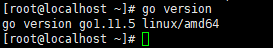

# GO环境的安装

## go环境的安装

        yum install -y golang


>这样安装之后通过命令行输入go就可以看到相关的信息。输入`go env`查看环境信息：

## 环境配置

- 1）查看是否存在`.bash_profile`, 如果不存在则新建`.bash_profile`文件

        vi /etc/profile

- 2) 添加环境变量，在文件后追加文本：

```
# GOROOT
export GOROOT=/usr/lib/golang
# GOPATH
export GOPATH=/root/Work/programmer/go/gopath/
# GOPATH bin
export PATH=$PATH:$GOROOT/bin:$GOPATH/bin

```

> 需要立即生效，在终端执行如下命令：

        source /etc/profile


## 检测go是否安装成功

        go version




