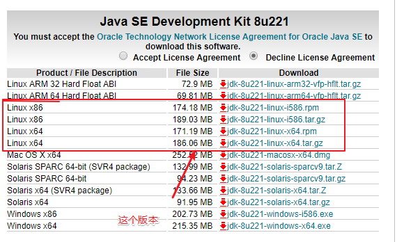

# Jenkins的搭建和java环境安装

https://blog.csdn.net/miss1181248983/article/details/82840006

## 1.下载地址

         http://www.oracle.com/technetwork/java/javase/downloads/jdk8-downloads-2133151.html



把安装包复制到Linux的目录下，具体工具可以使用xshell，这里不再赘述。

## 2 通过Xshell连接到虚拟机，执行如下命令，解压文件：

```
cd (文件目录)
 tar zxvf 安装的java压缩包名称
```


## 3 使用Vi编辑器，设置环境变量


    sudo vi /etc/profile

>在文件最后，添加如下内容：       
```
#Java Env
export JAVA_HOME=/usr/jdk1.8.0_221
export CLASSPATH=.:$JAVA_HOME/lib/dt.jar:$JAVA_HOME/lib/tools.jar
export PATH=$PATH:$JAVA_HOME/bin
```
## 然后退出vi编辑器，使环境变量设置立即生效

       source /etc/profile

## 查看jdk是否安装成功，安装了什么版本

        java -version


一、安装java环境

centos7安装java环境比较简单，我是通过virtualBox安装的最小的centos7，安装完毕后设置好IP，要能够访问外网，我上一篇文章里详细讲了如何通过centos7设置IP访问外网。好了，废话不多说，直接上命令:

yum -y install java-1.8.0-openjdk java-1.8.0-openjdk-devel

yum命令需要联网 该操作就是从网上下载jdk8到你的centos7并且安装到默认目录。

我们在Windows系统内用eclipse开发还需要设置JAVA_HOME、CLASSPATH、PATH环境变量，同样的在centos7里面也一样，安装完毕之后，

将下面的三行添加到 /etc/profile 中:

export JAVA_HOME=/usr/lib/jvm/java-1.8.0-openjdk-1.8.0.121-0.b13.el7_3.x86_64

export CLASSPATH=.:$JAVA_HOME/jre/lib/rt.jar:$JAVA_HOME/lib/dt.jar:$JAVA_HOME/lib/tools.jar

export PATH=$PATH:$JAVA_HOME/bin

保存关闭后，执行:source /etc/profile #让设置立即生效。

这里稍微说明一下/etc/profile文件就是centos7的环境变量配置文件。这个文件是每个用户登录时都会运行的环境变量设置，如果仅仅是修改是不会立即生效的，需要重新登录的时候才能生效，通过命令:source /etc/profile可以让刚才的设置立即生效。

至此，java环境安装完毕，和windows下一样，运执行命令:java -version

会出现以下信息:

openjdk version "1.8.0_121"

OpenJDK Runtime Environment (build 1.8.0_121-b13)

OpenJDK 64-Bit Server VM (build 25.121-b13, mixed mode)

说明java环境安装成功!


