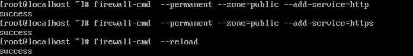
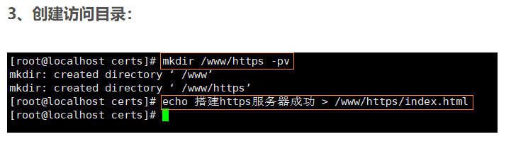

# Linux的配置

## Linux配置https服务

更新源：
CentOS 5
wget -O /etc/yum.repos.d/CentOS-Base.repo http://mirrors.aliyun.com/repo/Centos-5.repo

或者

curl -o /etc/yum.repos.d/CentOS-Base.repo http://mirrors.aliyun.com/repo/Centos-5.repo

 

 

CentOS 6
wget -O /etc/yum.repos.d/CentOS-Base.repo http://mirrors.aliyun.com/repo/Centos-6.repo

或者

curl -o /etc/yum.repos.d/CentOS-Base.repo http://mirrors.aliyun.com/repo/Centos-6.repo

 

 

CentOS 7
wget -O /etc/yum.repos.d/CentOS-Base.repo http://mirrors.aliyun.com/repo/Centos-7.repo

或者

curl -o /etc/yum.repos.d/CentOS-Base.repo http://mirrors.aliyun.com/repo/Centos-7.repo


### 1.1.1安装mod_ssl httpd

让协议通过80端口和443端口



嫌麻烦也关闭防火墙 这里不推荐：
```
 systemctl stop firewalld.service
```

关闭SELinux：
```
 setenforce 0
 ```

```
 yum install mod_ssl –y
  yum install httpd -y
```
>安装完成之后可以使用命令： `rpm -ql mod_ssl` 查看安装包释放了哪些文件在哪里。这里需要注意的是：`/etc/httpd/conf.d/ ssl.conf `，这个就是我们的SSL配置文件。


### 1.1.2安装自签名证书：

①切换到安装证书的目录： ``cd /etc/pki/tls/certs/`` <br>
②开始安装自签名证书： `make zhengshu.crt`
`(没什么要求的就照着打)`


### 如果安装成功，会在当前目录看到以下证书文件：
输入 
```
ll | grep zhengshu
``` 
 查看结果如下：


## 2.1.1、定义虚拟主机配置文件

```
<Directory /www/https>
        AllowOverride none
        Require all granted
</Directory>
<VirtualHost 192.168.112.132:443>
        ServerName 192.168.112.132
        DocumentRoot /www/https
        SSLEngine on 　　　　　　　　　　　　　　　　　　　　　　		　　认证引擎
        SSLProtocol all -SSLv2 -SSLv3 　　　　　　　　　　　　　	所对应的协议版本
        SSLCipherSuite HIGH:3DES:!aNULL:!MD5:!SEED:!IDEA 　　	　
        　支持的加密算法
        SSLCertificateFile /etc/pki/tls/certs/zhengshu.crt 　	　
        　携带的证书文件
        SSLCertificateKeyFile /etc/pki/tls/certs/zhengshu.key 　	
        当前服务器的私钥文件
</VirtualHost>
```

### 2.1.3 创建访问目录

```
mkdir /www/https -pv
echo skjhdifwf > /www/https/index.html
```



### 2.1.4 重启http服务

输入密码
```
systemctl restart httpd.service
```


### 2.1.5检查httpd服务：

```
systomctl status httpd.server -l
```
