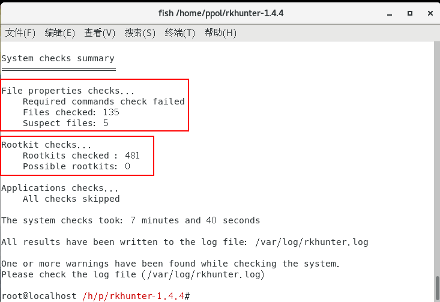

# Rootkit查杀

## chkrootkit  

网址：http://www.chkrootkit.org

如何安装:
```
[root@1 ~]# wget -c ftp://ftp.pangeia.com.br/pub/seg/pac/chkrootkit.tar.gz

[root@1 ~]# yum install -y gcc gcc-c++ make glibc-static

[root@1 ~]# tar zxvf chkrootkit.tar.gz

[root@1 ~]# cd chkrootkit-0.50/

[root@1 chkrootkit-0.50]# make sense

[root@1 chkrootkit-0.50]# cd

[root@1 ~]# cp -r chkrootkit-0.50/ /usr/local/chkrootkit
```
## 查看帮助
```
[root@1 ~]# /usr/local/chkrootkit/chkrootkit -h
```
使用方法：
```
/usr/local/chkrootkit/chkrootkit -p (文件目录)
```

## rkhunter
```
Wget https://nchc.dl.sourceforge.net/project/rkhunter/rkhunter/1.4.4/rkhunter-1.4.4.tar.gz

tar -zxvf rkhunter-1.4.4.tar.gz

cd rkhunter-1.4.4

./installer.sh --install
```
## 开始检测

```
rkhunter -c  \\开始检测

```
## 更新Rkhunter (病毒库)

> 运行RKH更新通过运行以下命令来填充数据库属性。
```
 /usr/local/bin/rkhunter --update
 /usr/local/bin/rkhunter --propupd
```


>Rkhunter做出的检查结果

/var/log/rkhunter.log生成日志文件。

```
rkhunter --check
cat /var/log/rkhunter.log
```


