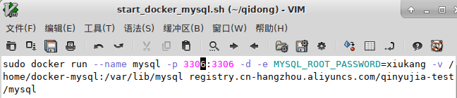
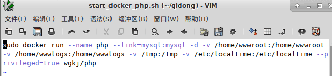
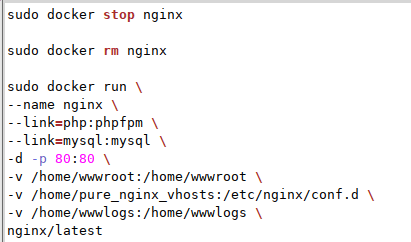

# 一键安装

## 一 编写启动脚本
现在系统中新建一个文件夹，用于专门存放启动脚本。

分别是：
```
start_docker_mysql.sh，start_docker_nginx.sh，start_docker_php.sh
```
你也可以随便命名，比如
`
你打球真像蔡徐坤.sh`

### mysql的安装

在`start_docker_mysql.sh`中<br>
>写入内容：<br>

```
sudo docker run --name mysql -p 3306:3306 -d -e MYSQL_ROOT_PASSWORD=xiukang -v /home/docker-mysql:/var/lib/mysql registry.cn-hangzhou.aliyuncs.com/qinyujia-test/mysql
！
```


### php安装。

>在start_docker_php.sh中写入一下内容： 
```
sudo docker run --name php --link=mysql:mysql -d -v /home/wwwroot:/home/wwwroot -v /home/wwwlogs:/home/wwwlogs -v /tmp:/tmp -v /etc/localtime:/etc/localtime --privileged=true wgkj/php
```


### nginx的脚本。

>在start_docker_nginx.sh中写入一下内容： 

```
sudo docker stop nginx

sudo docker rm nginx

sudo docker run \
--name nginx \
--link=php:phpfpm \
--link=mysql:mysql \
-d -p 80:80 \
-v /home/wwwroot:/home/wwwroot \
-v /home/pure_nginx_vhosts:/etc/nginx/conf.d \
-v /home/wwwlogs:/home/wwwlogs \
nginx/latest
```


## 二、添加nginx 配置文件。

>在启动nginx 脚本中可以看到在/home/pure_nginx_vhosts这个目录是存在nginx.conf的文件，我们采用多站点运行方式得话， 所有配置文件需要统一放这个目录下，如下： 
```
server {
    listen       80;
    server_name  localhost;
        root   /home/wwwroot/default/;
        index  index.html index.htm index.php;

    error_page   500 502 503 504  /50x.html;
    location = /50x.html {
        root   /home/wwwroot/default;
    }

    location ~ \.php$ {
        fastcgi_pass   php:9000;
        fastcgi_index  index.php;
       fastcgi_param SCRIPT_FILENAME $document_root$fastcgi_script_name;
        include        fastcgi_params;
    }
}
```

## 三、启动后的调试

在nginx配置完后，咱们就需要配置项目文件了，从启动nginx 的脚本中，我们将
`/home/wwwroot/`目录统一设置为项目目录，`/home/wwwlogs/`目录统一设置为日志目录，项目中的日志，docker的日志均可放这里。
在


